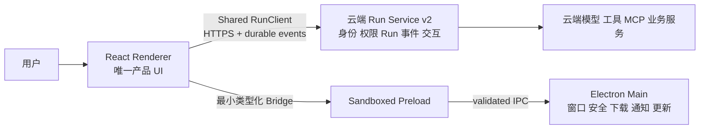
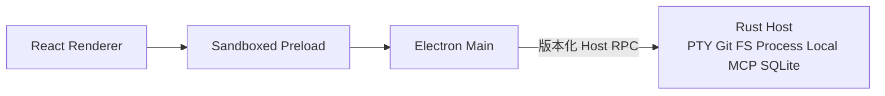

# Client Platform 架构

> 本文写稳定架构边界，不写具体包版本。精确快照见 [VERSION_BASELINE.md](./VERSION_BASELINE.md)。

## 1. 当前实现

截至 2026-08-13：

- `src/` 是浏览器中的 React/Vite 应用，`npm run build` 生成根目录 `dist/`；Web 仍是唯一生产产品。
- Monaco、Lexical、Mermaid、PDF/DOCX/PPTX/XLSX 预览、图与画布等重型能力按 Web 运行时工作。
- 聊天和 Agent 流式入口复用 Web SSE 运行时；浏览器直接访问云端 API。
- `desktop/` 已实现 CLP-DESK0 安全壳：Electron main 在 ready 前注册 `app://bundle/` 安全 scheme 并开启全局 sandbox，BrowserWindow 使用 context isolation/sandbox、禁用 Node integration/webview/任意导航，session 默认拒绝权限、设备与下载。
- DESK0 preload 只暴露版本为 `1` 的静态 capability bridge；除 `desktop=true` 外，updater/notifications/localAgent/PTY/localMCP 均显式为 unsupported，没有通用 IPC。
- main/preload 通过独立 Rolldown 构建，renderer 从根 `dist/` 按 allowlist 组装到 staging；electron-builder/ASAR/fuses 配置和验证器已存在。Web 构建不依赖这些产物。
- strict CSP 在 macOS packaged smoke 中拒绝了 renderer 引用的 Google Inter 外部 CSS，应用使用 fallback 字体继续工作。这是待本地打包字体的 renderer 资产问题，不通过扩大 `style-src`/`font-src` 第三方域解决。
- 项目仍没有 Shared `RunClient`、桌面认证/凭据存储、自动更新、原生 sidecar、本地 PTY/MCP、Windows 安装包实测或签名发布链路。
- API origin 仍存在编译期绝对地址与相对 `/api` 混用，桌面试点前必须收口为统一 runtime config。
- 当前 Web 仍把 access/refresh credential 写入 `localStorage`；这是 `CLP-P0` 必须消除的现状，不是目标认证设计。
- 当前 MultiRAG OAuth callback 在 EIM-I6 建立显式 provider-subject binding 前固定 fail closed，不按邮箱登录、注册或合并账号。

因此，DESK0 只证明安全宿主和供应链边界开始成型；以下 Shared Client、认证、durable Run、更新、签名与 Host 仍是**目标方案**。

## 2. MVP 目标上下文

MVP 核心原则是：先把 Run 做成云端可恢复的权威状态，再让 Web 与 Electron 薄壳复用同一个 Shared Client；不以本地 Runtime 作为客户端成立的前提。

## 3. Beta 可选扩展

Rust Host 是 MVP 后的独立 Beta 增量，不属于 MVP 架构关键路径：

只有用户任务明确需要本地 workspace、PTY、Git、本地进程或本地 MCP，且 MVP 的稳定性、发布和观测门禁已经建立后，才启用这条路径。

## 4. 组件与进程职责

### Renderer

- 继续承载现有路由、页面、组件、设计令牌、i18n、流式 UI、Monaco 和文档预览。
- 通过固定 `PlatformPort` 使用 `capabilities/auth/openExternal/downloads/notifications/updates/runs`；浏览器实现可以返回 unsupported，而不是散落 `if (electron)`。
- 云端 API 默认仍走 HTTPS/SSE，不把所有网络请求代理进 Electron main。
- 把模型、工具、文件内容视为不可信输入，继续使用现有 SafeHtml、URL allowlist 和 iframe sandbox。

Renderer 不拥有文件系统、进程、PTY、密钥、更新或 Host transport 权限。

### Sandboxed Preload

- 使用 `contextBridge` 暴露固定方法，一项能力对应一个方法。
- 只做参数整形、结构化克隆边界和事件退订；不做业务、网络、文件或数据库操作。
- 不暴露通用 `send(channel, payload)`、整个 `ipcRenderer` 或 Electron event。
- 源码可以拆分，发布产物必须 bundle 为单个 CommonJS 文件。

### Electron Main

- 作为 composition root，负责应用生命周期、窗口、安全策略、自定义协议、菜单、深链、更新与 Host 监管。
- 统一创建 BrowserWindow，集中管理 permission、navigation、new-window、external URL 和 IPC sender 校验。
- MVP 不启动 Rust Host；只处理窗口、认证接入、下载、通知、更新等薄壳能力。
- Beta 启用 Host 时再负责启动、握手、监控和终止；main 自身仍不实现 PTY、SQLite、MCP 编排或大文件处理。
- main event loop 上只允许短、异步、可取消的工作；CPU/阻塞 IO 不得进入该进程。

### Rust Host（Beta，可选）

- 承载 PTY、Git、文件系统、进程树、本地 MCP、任务日志和本地 SQLite 等桌面能力。
- `host-core` 只依赖领域接口；平台和存储分别作为 adapter。
- 所有长任务都有 operation id、取消、超时、终态和恢复策略。
- sidecar 与桌面应用一起签名、发布和更新，不能在首次运行时下载未验证 executable。

### 云端 Run Service v2 与后端

- 继续拥有用户、租户、授权策略、业务实体、云端 Agent/MCP 和模型调用的权威状态。
- Run Service v2 持久化 Run、事件序列、交互等待和终态，支持创建、查询、订阅、取消与提交交互。
- 对客户端暴露版本化 API 与可观测 trace id；客户端不复制权限判断，也不把浏览器连接当作 Run 生命周期。
- 后端升级由后端仓锁定，本文档集只记录兼容窗口和联调目标。

## 5. 关键数据流

### 云端聊天与 Agent 流

Web 与桌面 Renderer 都通过同一个 `RunClient` 访问 Run Service v2：`createRun/getRun/subscribe/cancelRun/submitInteraction`。订阅断开后以服务器事件序列恢复投影，Renderer 重载不终止云端 Run。远程 schema 只链接 MultiRAG 后端真相源，本仓不复制一份会漂移的服务端 schema。

### 认证与最小本地状态

- 密码登录与系统浏览器 OIDC Authorization Code + PKCE 是并行入口，最终都归一为同一 canonical Principal/session。
- Web 的 rotation refresh token 只使用 `HttpOnly + Secure + SameSite` cookie；Desktop 的 refresh token 由 Electron `safeStorage` 加密后写入受限 app-data，access token 只驻留内存。
- Desktop OIDC 只通过系统浏览器和 loopback callback 接收一次性 code/state；页面、deep link、URL、日志和 telemetry 都不得携带 token。
- OIDC 必须等待 EIM-I6 显式 provider-subject binding；禁止用相同邮箱静默合并账号。
- 除加密 refresh credential 外，本地只持久化恢复所需的最小元数据，例如 `run_id`、事件 cursor、投影版本和 UI 偏好；不保存 prompt、对话、tool payload/result 或模型输出副本。

### 本地命令与 PTY（Beta）

Renderer 发起低频 command，经 preload/main 校验后由 Host 创建 operation。高频 stdout/PTY 数据完成一次授权握手后使用有序流通道，按帧批量发送，带 sequence、backpressure、cancel 和 terminal event；禁止每个 chunk 单独 `invoke`。

### 文件访问

Renderer 只能得到用户选择后的 opaque handle 或最小元数据。真实路径、目录遍历防护、符号链接策略和 OS 权限在 Host 边界处理。除明确导出外，不把任意本地路径返回模型或云端。

### 有副作用的工具调用

遵循 `prepare -> confirmation -> re-authorize -> execute -> terminal result`。确认必须绑定 principal、工具、参数摘要、过期时间和一次性 nonce；未知执行结果不能静默重放。

## 6. 本地资源协议

生产 renderer 使用类似 `app://bundle/` 的自定义 standard + secure scheme，不使用 `file://`：

- scheme 必须在 `app.ready` 前注册，handler 在 ready 后注册。
- 启用相对资源、Fetch 和 V8 code cache 所需的最小 privilege。
- `bypassCSP`、扩展权限和不需要的 Service Worker 默认关闭。
- handler 只服务 staging 中的 renderer allowlist，规范化路径并拒绝目录穿越。
- 只有 HTML navigation 可做 SPA fallback；缺失 JS/CSS/worker/Monaco 资源必须返回 404。

## 7. 失败与恢复

跨进程操作统一至少区分：`completed`、`cancelled`、`timed_out`、`interrupted`、`unauthorized`、`host_unavailable`、`incompatible_protocol`。EOF 不是成功；Host 崩溃时所有未终态 operation 必须明确进入 interrupted。

MVP 启动顺序建议：

1. 注册安全 scheme 与全局 sandbox。
2. Electron ready 后安装 session/IPC/protocol policy。
3. 创建 renderer，使 Web UI 可先显示。
4. Shared Client 恢复认证与仍在运行的 Run 投影。
5. 桌面 capability 未就绪时 UI 显示降级状态，不阻塞云端 Run 路径。

Beta 才在窗口可交互后延迟启动 Host，并完成版本、capability、build hash 握手。

## 8. 性能策略

- 不复制或重写现有复杂 renderer，以保持 Chromium 渲染一致性和现有懒加载收益。
- main/preload bundle 为小而固定的入口；非首屏模块延迟加载。
- MVP 没有 Host 启动成本；Beta Host 按能力延迟启动，普通 Web/云端工作流不等待 PTY、Git 索引或 SQLite warm-up。
- 长列表、日志和 token 流采用虚拟化、批处理和背压；不把每个事件写入 React state 或 Query cache。
- 所有性能声明以 packaged artifact 的多轮冷/热启动和真实重负载基准为准，门槛见 [TESTING_SECURITY.md](./TESTING_SECURITY.md)。

## 9. 可替换边界

Electron 是当前 MVP 薄壳基线，不是永久不可替换的产品承诺。只要 Renderer Bridge、Beta Host RPC 和 `PlatformPort` 保持独立，将来可以：

- 用其他桌面壳替换 Electron，而不重写业务 UI；
- 将 Rust Host 独立为 CLI/服务；
- 在特定高价值原生界面引入 GPUI/系统原生视图，而不是一次性重写全部产品。

重评必须由统一 benchmark、平台兼容和真实产品范围触发，不能仅凭安装包大小或框架宣传结论。
