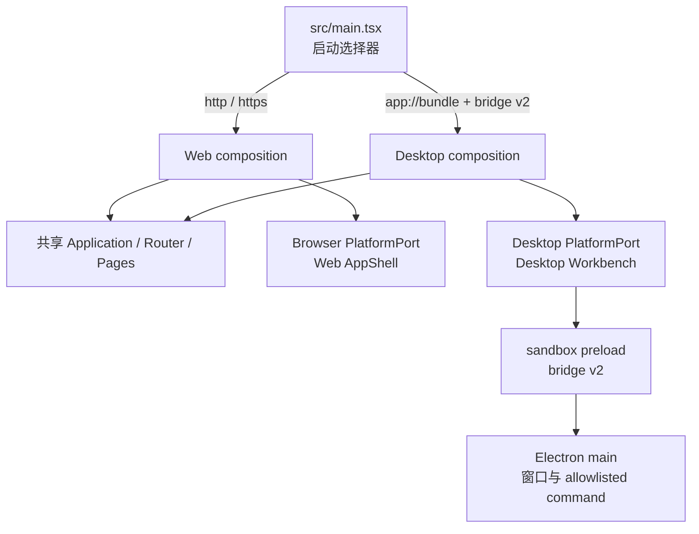

# CLP-DX1 Desktop Experience Foundation

> 状态：Accepted，实施中；2026-08-13。本文冻结第一阶段内部体验版的产品信息架构、composition、命令合同、验收证据和非目标。它不表示 durable Run、桌面认证或发布链路已经完成。

## 1. 目标与成功定义

CLP-DX1 的目标是在不重写 React、不等待 Run Service v2/EIM 的前提下，让当前安全 Electron 壳形成可辨识、可操作、可继续演进的桌面产品基础：

- Web 与 Desktop 共享同一套路由、页面、状态模型、设计令牌和业务组件，但使用不同 composition root。
- Desktop 使用“任务优先混合式”工作台：Activity Rail、上下文侧栏和现有产品工作区。
- 统一命令注册表驱动命令面板、桌面工具栏、快捷键和 Electron 原生菜单。
- 当前只展示真实 Conversation；在服务端 durable Run 投影可用前，不展示伪造的 `Running`、`Needs attention`、`Ready` 或恢复状态。
- Renderer 仍处于浏览器权限模型中；体验差异不能突破 DESK0 的 sandbox、context isolation、CSP、导航和 staging 边界。

内部体验版成功必须同时满足：

1. 用户在登录和进入主工作区后都能明确区分 Web 与 Desktop composition。
2. Web 路由、布局和构建保持独立且无视觉/行为退化。
3. Desktop 能通过键盘、命令面板、Activity Rail 和原生菜单到达同一真实产品动作。
4. `conversation.new` 只创建/重置现有 Conversation 工作流，不产生伪 Run、后台执行或恢复承诺。
5. bridge 缺失、版本不兼容或命令不在 allowlist 时 fail closed，不静默降级为 Web。

## 2. 可借鉴模式与采用边界

| 来源                                                                                                                                                                                                                                                                                                         | 采用的公开模式                             | 明确不采用                                              |
| ------------------------------------------------------------------------------------------------------------------------------------------------------------------------------------------------------------------------------------------------------------------------------------------------------------ | ------------------------------------------ | ------------------------------------------------------- |
| [OpenCode Desktop composition](https://github.com/anomalyco/opencode/blob/cc4b45612974f735ddec46009ede07729511fba4/packages/desktop/src/renderer/index.tsx) 与 [Platform context](https://github.com/anomalyco/opencode/blob/cc4b45612974f735ddec46009ede07729511fba4/packages/app/src/context/platform.tsx) | Web/Desktop 分入口、共享应用与平台注入     | 复制其完整可选平台 API 或编码类本地能力                 |
| [OpenCode command context](https://github.com/anomalyco/opencode/blob/cc4b45612974f735ddec46009ede07729511fba4/packages/app/src/context/command.tsx) 与 [desktop menu](https://github.com/anomalyco/opencode/blob/cc4b45612974f735ddec46009ede07729511fba4/packages/app/src/desktop-menu.ts)                 | 稳定命令 ID 同时服务面板、快捷键和菜单     | 向 preload 暴露通用 `execute(commandId)` 或任意 channel |
| [Goose AppLayout](https://github.com/aaif-goose/goose/blob/589ac048e0dae9e4877c8e43aa7227f98c85569a/ui/desktop/src/components/Layout/AppLayout.tsx)                                                                                                                                                          | Activity Rail、上下文侧栏、主工作区        | 用隐藏 React 页面维持流式任务，或手写像素拖拽实现       |
| [VS Code Source Organization](https://github.com/microsoft/vscode/wiki/source-code-organization)                                                                                                                                                                                                             | Desktop/Web 不同入口共享 common workbench  | 首期复制完整 service、extension、context-key 体系       |
| [Codex App Server](https://github.com/openai/codex/blob/main/codex-rs/app-server/README.md) 与 [VS Code Agent Host](https://code.visualstudio.com/docs/agents/concepts/agent-host)                                                                                                                           | 稳定 ID、能力协商、Runtime 为状态真相源    | 在 DX1 猜 Run wire，或把 Renderer/store 当任务真相源    |
| [Codex App](https://openai.com/index/introducing-the-codex-app/)、[Cursor Agents](https://cursor.com/docs/agent/agents-window)、[Devin Agent Command Center](https://docs.devin.ai/desktop/agent-command-center)                                                                                             | 后续任务中心关注多任务、关注态、恢复和通知 | 在真实 Run Service 之前用静态 UI 冒充这些能力           |

上述来源只证明公开源码或产品文档中可观察的模式。不得由界面相似推断商业产品未公开的进程、协议、持久化或性能数据；完整证据边界见 [REFERENCES.md](./REFERENCES.md)。

## 3. Composition 与信任边界



启动规则固定为：

- `http:` / `https:` 选择 Web composition，不读取或依赖 Desktop bridge。
- `app://bundle/` 只选择 Desktop composition，并要求 bridge version 精确匹配 `2`。
- `app:` 下 bridge 缺失、shape 错误或版本不匹配时显示脱敏兼容性错误；不得退回 Web composition。
- 未批准的 scheme 不进入产品应用。
- 平台选择只发生在 entrypoint/composition 层；`pages/components/stores` 禁止检查 `window.multiRagDesktop`、`isElectron` 或导入 Electron/Node。

DX1 的 `PlatformPort` 只表达当前真实能力和命令来源。`auth/runs/downloads/openExternal/notifications/updates` 仍按 [CONTRACTS.md](./CONTRACTS.md) 的后续阶段扩展，不在这一阶段加入空实现或可选方法森林。

## 4. Desktop 信息架构

```text
Desktop Workbench
├── Activity Rail
│   ├── 工作
│   ├── 发现
│   ├── 知识
│   ├── 构建
│   ├── 工具
│   └── 设置 / 账号
├── Context Panel（可折叠、可调整宽度）
└── Existing Product Workspace（共享 Router Outlet）
```

Activity Rail 映射固定为：

| 分组 | 入口                     | 当前真实语义                               |
| ---- | ------------------------ | ------------------------------------------ |
| 工作 | Home、最近对话、新建对话 | 现有 Conversation 工作流；不是 durable Run |
| 发现 | Explore、Search          | 复用现有路由                               |
| 知识 | Knowledge、Memory        | 复用现有路由                               |
| 构建 | Agents、Studio           | 复用现有路由                               |
| 工具 | AI Tools、MCP            | 复用现有路由；不表示本地 MCP               |
| 底部 | Settings、账号           | 复用现有设置和账号入口                     |

工作台约束：

- 上下文侧栏使用 `react-resizable-panels`，不新增手写 pointer resize。
- Desktop 最小窗口宽度 `960px` 时仍使用桌面工作台，不切换到 Web Mobile Sheet。
- 保留系统原生标题栏和窗口按钮，不在 DX1 引入 frameless/custom title bar。
- 当前 Conversation 列表可以显示真实历史和现有状态；不存在服务端事实的任务分组只显示清晰的未来能力空态，不创建 mock 数据。
- Run Service v2 与 Shared Client 接入后，任务中心才能增加 `Needs attention / Running / Ready / Recent` 投影。

## 5. 认证 composition

认证逻辑继续共享同一表单、store 和 API：

- Web frame 保留现有营销轮播与登录表单。
- Desktop frame 使用紧凑居中布局，不加载营销轮播。
- Desktop 外观差异不能复制登录 mutation、错误映射或表单 schema。
- 本阶段不改变现有 credential `localStorage` 行为，也不宣称已实现 refresh rotation、`safeStorage` 或 OIDC；这些仍由 CLP-P0/EIM 合同收口。
- 所有新增或接触的用户可见文案同步进入 `zh-CN` / `en-US` locale；产品 UI 语言不影响账号、模型回复或协议参数。

## 6. 命令模型与原生菜单

DX1 固定以下产品命令 ID：

| 命令 ID               | 默认快捷键                         | 当前行为                                |
| --------------------- | ---------------------------------- | --------------------------------------- |
| `palette.open`        | `Cmd/Ctrl+K`                       | 打开命令面板                            |
| `conversation.new`    | `Cmd/Ctrl+N`                       | 重置现有 Conversation 工作流并导航 Home |
| `view.sidebar.toggle` | `Cmd/Ctrl+B`                       | 展开/折叠 Desktop 上下文侧栏            |
| `navigation.home`     | 无                                 | 导航 Home                               |
| `navigation.search`   | 无                                 | 导航 Search                             |
| `navigation.settings` | `Cmd/Ctrl+,`                       | 导航 Settings                           |
| `navigation.back`     | macOS `Cmd+[`, Windows `Alt+Left`  | history back                            |
| `navigation.forward`  | macOS `Cmd+]`, Windows `Alt+Right` | history forward                         |

命令注册表是单一真相源：

- 同一命令 handler 由 `cmdk` 命令面板、Desktop toolbar、Renderer shortcut 和 Electron menu 复用。
- 命令 ID 必须唯一；重复注册在开发和测试中直接失败。
- route-scoped 注册必须返回 disposer，卸载后不能残留旧 handler。
- 普通快捷键在 `input`、`textarea`、`select`、`contenteditable` 和组合输入过程中不得触发。
- 命令面板关闭后恢复打开前的焦点；执行一个动作只能调用 handler 一次。

Electron menu 使用两类固定动作：

1. Cut/Copy/Paste/Select All/Quit/Minimize 等由 Electron native role 处理。
2. 产品命令只发送编译期 allowlist 中的 `DesktopCommandId`；main/preload 不接受 Renderer 提供任意命令字符串。

生产菜单不暴露 reload、force reload 或 DevTools。Renderer Bridge v2 只有 main → preload → Renderer 的命令通知；preload 过滤命令、剥离 Electron event 并返回幂等 unsubscribe，禁止通用 `send/invoke/on(channel)`。

## 7. 最小持久化与隐私

DX1 只允许持久化：

- 当前 Activity Rail 选择；
- 上下文侧栏展开状态；
- 经边界校验后的侧栏宽度；
- 既有非敏感 UI 偏好。

不得新增持久化：Conversation 正文、prompt、模型输出、tool payload/result、token、API key、完整本地路径或虚构 Run projection。状态 key 需要版本前缀和无效值回退；宽度必须夹在批准的最小/最大范围。

## 8. 工作包、估算与提交边界

| 工作包                     |     基础工程量 |
| -------------------------- | -------------: |
| 文档与合同                 |       2–3 人日 |
| Composition / PlatformPort |       3–5 人日 |
| Desktop Workbench / Auth   |       5–7 人日 |
| Command / Native Menu      |       3–5 人日 |
| 测试、打包与性能证据       |       5–6 人日 |
| **CLP-DX1 合计**           | **18–26 人日** |

建议提交保持可独立审计：

1. 先独立收口 DESK0 网络策略/CSP/登录可达性修复。
2. 纯文档提交冻结 DX1 合同和账本。
3. Composition/PlatformPort 与 import boundary。
4. Desktop Workbench 与认证 frame。
5. 命令注册表、preload bridge v2 与原生菜单。
6. 测试、packaging verifier 和退出证据。

## 9. 验收证据

DX1 退出报告必须包含：

- Web 登录、Desktop 紧凑登录、Desktop 工作台三张同 commit 截图。
- 960px 窗口、侧栏折叠/恢复、中文/英文、键盘导航和焦点恢复证据。
- HTTP/Web、`app://bundle` Desktop、bridge 缺失/错版 fail-closed 的自动化测试。
- palette、toolbar、shortcut、native menu 调用同一 handler 且单次执行的自动化测试。
- preload 不泄露 Electron event、非法命令拒绝、unsubscribe 生效和 bridge/build manifest version 一致性测试。
- `data-client-runtime="desktop"` 的 packaged smoke；只等待 DOM ready 不算通过。
- 实际命令、commit、artifact hash、设备/OS、通过/失败和未验证平台。

完整命令和安全门禁见 [TESTING_SECURITY.md](./TESTING_SECURITY.md)。DX1 记录启动、RSS、空闲 CPU 和首个命令面板打开耗时作为趋势基线，但不以未完成的 durable Run fixture 冒充 CLP-DESK/REL 全量性能验收。

## 10. 明确非目标

DX1 不修改 MultiRAG 后端、Run Service schema、EIM/Channel Principal 或团队角色语义，也不包含：

- durable Run、后台运行、断线回放或多 Run 状态；
- refresh rotation、Desktop `safeStorage`、OIDC + PKCE；
- 通知、下载、自动更新、单实例、deep link 或多窗口；
- frameless/custom title bar、Tauri PoC；
- Rust Host、本地文件、Git、PTY 或本地 MCP；
- macOS/Windows 正式签名、公证和公开发布。
