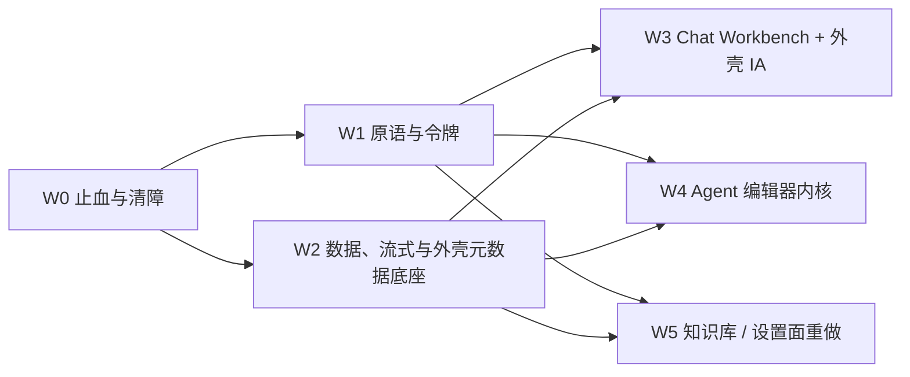

# 前端 UI/UX 与组件现代化深度调研报告

- 日期：2026-10-05
- 审计对象：`E:/project/web`（前端主仓）；对照后端 `MultiRAG/`（本地快照 2026-08-30）与上游 `ragflow/`（2026-08 克隆）
- 读者：需要据此排期大重构的技术负责人
- 证据约定：前端路径相对仓库根 `E:/project/web`；后端以 `MultiRAG/` 开头（即 `E:/project/MultiRAG`）；上游以 `ragflow/` 开头（即 `E:/project/ragflow`）。证据一律写成代码文本 `路径:行`，范围只写起始行，不做超链接：跨仓的相对路径和 `path:line` 形式的 href 在多数 Markdown 查看器里都无法解析。
- 行号基线：以提交 `4c1c4f1`（HEAD）为准。工作区里还有未提交的改动，会让 `ApiKeysPage.tsx` 和 `dialog.tsx` 的行号偏移，详见 §0.3。

---

## 0 范围与方法

### 0.1 审计范围与复核结果

本次共 9 个审计领域、199 条 finding。每条 finding 都经过独立复核：复核者打开同一文件同一行，给出 confirmed / partial / refuted / unverified 判定、修正后严重度和说明。

| 领域        | 主题                     | finding | confirmed | partial | 修正后 high |  medium |    low |
| ----------- | ------------------------ | ------: | --------: | ------: | ----------: | ------: | -----: |
| shell       | 应用外壳、导航与信息架构 |      21 |        16 |       5 |           5 |      13 |      3 |
| chat        | 对话与会话体验           |      22 |        16 |       6 |           6 |      14 |      2 |
| studio      | Agent / 工作流画布       |      22 |        17 |       5 |          10 |       9 |      3 |
| knowledge   | 知识库、文档与记忆       |      22 |        14 |       8 |           3 |      14 |      5 |
| settings    | 设置、管理与配置         |      24 |        12 |      12 |           7 |      13 |      4 |
| design      | 设计系统与组件库         |      25 |        13 |      12 |           5 |      15 |      5 |
| stack       | 渲染与依赖栈、数据层     |      19 |         8 |      11 |           3 |       9 |      7 |
| interaction | 横切交互与 UX 状态       |      20 |        16 |       4 |           4 |       9 |      7 |
| contract    | 前后端能力与契约         |      24 |        12 |      12 |           4 |      13 |      7 |
| **合计**    |                          | **199** |   **124** |  **75** |      **47** | **109** | **43** |

- refuted 和 unverified 都是 0 条。不过有不少 partial finding 里的子论断被复核推翻，这些子论断不作为事实使用，统一列在附录 B。
- 严重度调整：复核阶段 36 条下调，5 条上调。上调的是 shell-14、shell-21、chat-17、chat-21、settings-10，上调原因都是复核时发现了更严重的证据（例如 admin token 跨会话残留、编辑 MCP 会清空已保存 headers）。本次修订又把 interaction-13 由 medium 下调为 low：原证据里会"直接建出资源"的两个输入框都在零导入的死文件中（见 §3.8），上表已按修订后的值统计。
- 本报告的叙述只采用 confirmed 和 partial。partial 按复核说明改写后使用，严重度一律取修正值。

### 0.2 外部调研

| 调研                         | 覆盖                                                                                                                                                                                                                         | 用途                                      |
| ---------------------------- | ---------------------------------------------------------------------------------------------------------------------------------------------------------------------------------------------------------------------------- | ----------------------------------------- |
| 商业 AI 产品 UX（2025–2026） | ChatGPT、Claude.ai、Claude Code、Gemini、Perplexity、M365 Copilot、Kimi、DeepSeek、豆包、千问、元宝+ima、飞书知识问答、Notion AI、Cursor，加 Ant Design X、AI Elements、MCP Apps、AG-UI/A2UI、ChatKit/assistant-ui，共 19 项 | 对话、项目、Agent、企业后台的默认交互模式 |
| 开源 AI 平台前端             | Dify、RAGFlow、FastGPT、MaxKB、LobeHub、Open WebUI、LibreChat、Cherry Studio、AnythingLLM、Flowise、Langflow、n8n、Coze Studio、Onyx、Khoj、Jan，加 5 个库/规范                                                              | 技术栈对照与可借鉴的工程约定              |
| AI 前端组件生态              | shadcn/ui、Base UI/Radix/React Aria、AI SDK UI、AI Elements、assistant-ui、prompt-kit、CopilotKit+AG-UI、Ant Design X、Streamdown、A2UI、MCP Apps、json-render，共 12 项                                                     | 技术雷达                                  |
| 专业领域 UX                  | Dify、n8n、Coze、Langflow、ComfyUI、Flowise、RAGFlow、xyflow、FlowGram、FastGPT、MaxKB、Onyx、Glean、LlamaCloud、LangSmith、Langfuse、Phoenix、OpenAI Agent Builder，共 18 项                                                | 画布、知识库、可观测性的目标形态          |

所有外部结论的出处 URL 见附录 C。

### 0.3 本次没有做的事（验证边界）

- 后端没有运行，没有做登录后的真实页面走查，也没有截图。所有 UI 结论都来自静态代码阅读。
- 没有做运行时性能测量。渲染次数、包体积、网络延迟都是静态推断，或者引用仓库已有的预算基线（`scripts/bundle-size-budget.json`）。本地 `node_modules` 缺失或处于变动状态，没有完成本地构建。少数第三方库行为（如 `@ant-design/x` 的 `Actions.Copy`）是读线上包源码推断的。
- 后端快照（2026-08-30）比前端（2026-10-05）旧。约 14 个前端端点与上游 RAGFlow 新版 REST 一致但本地快照里没有，这些不算缺陷。
- 证据基线是 HEAD `4c1c4f1`。工作区另有一组未提交改动（下称 WIP），集中在 API Key 管理和 Dialog 的 Escape 处理。本次修订读过这些改动的内容，但没有运行它们的测试：
  - `src/pages/settings/ApiKeysPage.tsx`：从 HEAD 的 3,732 行降到 3,567 行。行 key 改用 `token`；两处 `window.confirm` 和 createPortal 手写菜单都已删除，改用 `ApiKeyRowActions`（基于 Radix 的 ActionMenu）和 `ApiKeyActionDialog`（基于 ConfirmationDialog）。因为删掉了约 165 行，本报告引用的 ApiKeysPage 行号只在 HEAD 成立，例如 `mainMode === 'interface'` 在工作区已经移到 1880 行。
  - 新增 `src/hooks/use-api-token-request.ts`：重新生成改为"先建后删"（49–70 行）。新 key 创建失败时旧 key 不受影响；撤销旧 key 失败时抛 `ApiTokenRevokeError`，界面提示旧令牌仍然有效。
  - 新增 `src/pages/settings/components/api-key-action-dialog.tsx`（109 行）、`api-key-row-actions.tsx`（59 行）和测试 `src/pages/settings/__tests__/api-keys-page-row-identity.test.tsx`。
  - `src/locales/zh-CN/settings.ts`、`src/locales/en-US/settings.ts` 新增 `settings.apiKeys.*` 文案，中英同步。
  - `src/components/ui/dialog.tsx`：Escape 处理改为 `event.key === 'Escape' && !event.defaultPrevented`，138 行之后的行号整体 +1。效果是：嵌在手写 Dialog 里的 Radix 层（菜单、Radix AlertDialog）消费掉 Escape 后，外层不再跟着关闭。但两个嵌套的手写 Dialog 都不调用 `preventDefault`，按一次 Esc 仍会一起关闭。
  - `scripts/file-size-baseline.json`：ApiKeysPage 的基线收紧为 3,567。
- 据此，以下条目在正文中标为"**WIP 已处理，待合并验证**"：settings-01（行身份）；settings-03 中轮换顺序的部分；settings-12 与 interaction-03 中 ApiKeys 确认框的部分；interaction-07 与 settings-22 中 API Key 手写 portal 菜单的部分；design-01 中"嵌在手写 Dialog 里的 Radix 层的 Esc 处理"。WIP 合并后，全仓原生 `confirm` 从 8 处降到 6 处（NewEnvironmentManager 2、知识库列表 2、文档页 1、admin 1）。
- WIP 漏了一处：删除和重新生成只失效 `apiTokenKeys.list()`，没有失效 Agent 分享用的 `agentQueryKeys.deliveryToken()`（`src/pages/agent/hooks/use-agent-delivery-token.ts:13`，staleTime 60 秒）。删除或重新生成第一个 key 后，分享链接最多会继续沿用旧 beta 60 秒。这一条已写进 W0 验收。
- 外部调研中凡是标注"待调研确认"的说法，正文同样标注，不当作事实。

---

## 1 执行摘要

### 1.1 总判断

**栈不旧，旧的是"没有收口"。** React 19.3、Vite 8、Tailwind 4.3、Zustand 5、TanStack Query 5.104 这几项核心版本与 Dify 的 catalog 一致，已经在第一梯队。真正需要大改的是三件事：

1. 对话、画布、知识库三条主线都是各入口从零拼装，没有共享内核；
2. 使用面最大的共享原语（Dialog/Select/Menu/Tabs）和设计令牌是临时手写的，也没有任何闭环校验；
3. 前后端流式契约里存在会直接把回答写坏的 bug。

建议顺序是：先收口共享底座（原语、令牌、流式与数据层），再按主线迁移页面。同时成批删除死代码和演示代码，分两类：一类不依赖任何迁移、可以立即删除，约 1.1 万行；另一类是仍在使用、要等替代实现上线后才能删的代码，约 1.2–1.3 万行（明细与触发条件见 §6；需要产品决策的环境子系统约 3 千行不计在内）。

### 1.2 最需要大改的 12 个主题

| #   | 主题                    | 问题本质与影响                                                                                                                                                                                                                                                                          | 方向                                                                                                             | 关键 ID                                          |
| --- | ----------------------- | --------------------------------------------------------------------------------------------------------------------------------------------------------------------------------------------------------------------------------------------------------------------------------------- | ---------------------------------------------------------------------------------------------------------------- | ------------------------------------------------ |
| 1   | 对话主线没有身份        | Home 自由对话、MCP 实验场、Explore 的会话都只在内存里，没有 URL，刷新就丢；自由模式下"新对话"是空操作；6 套聊天实现、7 个 composer 行为各不相同。平台主入口实际上是一次性 playground。                                                                                                  | 以 Agent runtime-chat 为种子建 Chat Workbench，路由改为 `/chat/:id`，删除 MCP 实验场                             | shell-01/02、chat-01/02/05，ARCH-8               |
| 2   | 流式契约 bug 损坏回答   | 共享 reducer 把后端权威的 final 帧追加到增量文本后面，带引用的回答会整段重复；流内错误帧被吞，失败显示成空答案；Agent 的 session 模式过滤掉 `user_inputs`/`workflow_finished`；历史引用刷新后全部丢失。                                                                                 | final 帧改为整体替换，引入 failed 终态；后端补发终态并在消息里嵌入引用                                           | contract-01/02/03/05，ARCH-7                     |
| 3   | 信息架构按后端模块切    | 一级入口（4 个 rail 项 + "更多"菜单 6 项 + MCP Playground）互相重叠（两处跟应用聊天、三处 MCP、构建资产散落 3 个分区）；三份导航数据源已经漂移；路由没有元数据；画布被外壳挤掉约 264px。                                                                                                | 单一导航清单 + route handle；收敛为对话/发现/工作室/知识四区；编辑器改沉浸式                                     | shell-03/04/05/10/12，ARCH-9                     |
| 4   | 共享原语是临时手写      | Dialog（53 个导入方）、Select（50）、Tabs（18）、Menu（15）都不是 Radix：没有焦点陷阱，Escape 会穿透关掉所有层，没有键盘导航和 ARIA；Select 还会静默忽略 `disabled`，渠道编辑因此能切换 provider 并清空凭证。                                                                           | 保持导出 API 不变，按"叶子先、Dialog 后"的顺序改写为 Radix                                                       | interaction-01/02、design-01/03/04/05            |
| 5   | 设计令牌没有闭环        | 749 个颜色 token 里 35% 零引用；Badge 状态色、Input 错误色、`bg-destructive` 指向未定义变量而静默失效；一份 MCP 页面专用 CSS 把全站根字号改成 14px；82 个 `animate-in` 类动效 token（12 个文件）全部不生效。                                                                            | 原始色阶 + 约 50 个语义 token；在测试中加入"引用必须已定义"的校验                                                | design-06/07/08/09/24，ARCH-5                    |
| 6   | Agent 编辑器没有内核    | 自动保存每约 20 秒写一次库并把服务端 DSL 回写本地，可能吞掉用户编辑；撤销/重做未接线；24 处订阅整个 store 加全局 mousemove 引发渲染风暴；算子元数据散落在 12 个文件。                                                                                                                   | 重建编辑器内核：manifest、命令层、zundo 历史、保存调度器、schema 表单、停靠面板                                  | studio-01…06/09/10/12                            |
| 7   | 知识库流程断裂          | 创建时强制 naive 解析，看不到真实分段预览（后端 `/preview_chunks` 没接）；上传是单请求假进度，部分成功被误报为全部失败，用户重试会产生重复文档；文档页把加载失败显示成"暂无文档"。                                                                                                      | 创建向导 + 实时分段预览、逐文件上传队列、解析状态中心、列表状态机                                                | knowledge-01/02/03/04                            |
| 8   | 设置面的正确性缺陷      | API Key 菜单总是作用到本页第一行（删错 key，还会让 Agent 分享链接失效；WIP 已处理，待合并验证）；admin JWT 登出不清除；MCP 超时把秒当毫秒传；编辑 MCP 会静默清空已保存的 Authorization header。                                                                                         | 先修这四个正确性问题，再按模板重建 API Key、模型供应商、MCP 三个配置面                                           | settings-01/08/10/14                             |
| 9   | 双组件体系和依赖冗余    | antd/antd-x 只为聊天组件引入，却带来约 400 处 `!important` 覆盖；Markdown 有 3 种解析器、6 个调用面各自拼配置；约 20 个运行时依赖零引用；221KB 的 iconfont.js 同步阻塞加载。                                                                                                            | 先删依赖，再统一 Markdown 门面；Workbench 完成后决定是否移除 antd                                                | design-11、chat-13/14、stack-01/02/16            |
| 10  | 状态反馈缺少合同        | 通用 hook 里有 21 处把 `isFetching` 映射成 `isLoading`（算上 agent query 等共约 36 处），失败被当作空态；确认交互有 6 种实现，含 8 处原生 confirm（WIP 合并后为 6 处，见 §0.3）；全仓没有未保存离开拦截；99 个 mutation 里乐观更新 0 处；`toast.error` 拼接原始 `error.message` 12 处。 | 统一列表状态机、`useConfirm`、`useUnsavedChangesGuard`，mutation 反馈分级                                        | interaction-03/04/08/09、stack-12/18             |
| 11  | i18n 与 a11y 系统性欠债 | 非 locale 代码中约 3,601 行中文字面量（317 个文件，审计口径；复核口径含 console 和数据映射，为 3,860 行 / 349 个文件），原语默认文案就是中文，会漏到英文 share/widget；引用角标键盘不可达；全局隐藏滚动条；Button 焦点环只有 1px；列表卡片只能用鼠标点。                                | 原语先修；把现有扫描脚本改成全量扫描 + 基线棘轮；jsx-a11y 按目录升级为 error                                     | interaction-06/07、chat-15/19、design-13/14/22   |
| 12  | 演示和假数据进了生产    | 首页推荐卡是"冰毒坠河""某公司疑似暴雷"等热点并热链 Unsplash；工具箱评分 4.8、下载 12.3k 是编的；Memory 统计写死 1280 条 / 45.6MB；Explore 点赞只弹 toast（违反 ENG-6"不存在假成功"的验收，属于回归）；Prompt 编辑页"已同步"是固定文案。                                                 | 立即删除，S 级，可单独提交止血。删除首页推荐卡会推翻 ENG-6 已记录的"保留并修复"决定，理由见 shell-06，需同步账本 | shell-06/17、knowledge-19、contract-08、stack-06 |

### 1.3 应当保留的基础（不要推倒）

| 资产                                                     | 位置                                                                                                                                         | 保留理由                                                                                                                                                                                                                                                                                                                                                                                             |
| -------------------------------------------------------- | -------------------------------------------------------------------------------------------------------------------------------------------- | ---------------------------------------------------------------------------------------------------------------------------------------------------------------------------------------------------------------------------------------------------------------------------------------------------------------------------------------------------------------------------------------------------- |
| 共享 SSE transport                                       | `src/lib/streaming/transport.ts:14`                                                                                                          | 基于 eventsource-parser，abort 时能立即 cancel reader，并区分 JSON 错误响应和事件流。修 reducer 语义即可，不要重写。                                                                                                                                                                                                                                                                                 |
| StreamingXMarkdown + MarkdownCodeBlock + Shiki CodeBlock | `src/components/chat/streaming-x-markdown.tsx:13`、`src/components/chat/MarkdownCodeBlock.tsx:80`、`src/components/chat/CodeBlock.tsx:32`    | 已做 rAF 合帧、Mermaid strict 模式、未闭合 token 占位、Shiki JS 引擎。作为唯一的聊天渲染内核。                                                                                                                                                                                                                                                                                                       |
| Agent runtime-chat 家族                                  | `src/pages/agent/components/runtime-chat/runtime-chat-message-list.tsx:102`、`src/pages/agent/explore/hooks/use-explore-session-chat.ts:362` | 4 个面在复用；停止时保留部分内容并调用服务端 cancel；有流归属测试。是 Chat Workbench 的种子。                                                                                                                                                                                                                                                                                                        |
| TraceWorkbench                                           | `src/pages/agent/features/trace-workbench/index.tsx:43`                                                                                      | 已经是 span 树 + 详情 Tabs 的结构，可作为统一执行视图的基座。                                                                                                                                                                                                                                                                                                                                        |
| DSL 序列化层                                             | `src/pages/agent/operators/serializers.ts`                                                                                                   | 集中、有测试，是 operator manifest 的边界层。                                                                                                                                                                                                                                                                                                                                                        |
| 文档切片工作区（新基线）                                 | `src/pages/knowledge/document-chunks`、`src/pages/knowledge/document-chunks/hooks/use-chunk-list-state.ts:14`                                | 防抖与路由归属绑定、PageToolbar、Radix Sheet、`<nav aria-label>` 分页。其他页面向它看齐。                                                                                                                                                                                                                                                                                                            |
| 文档变更请求的归属模式                                   | `src/hooks/use-document-request.ts:365`                                                                                                      | 提交时锁定原始 datasetId/docIds，结束后精确失效缓存。应推广。                                                                                                                                                                                                                                                                                                                                        |
| 命令注册表                                               | `src/lib/commands/registry.ts`、`src/lib/commands/command-provider.tsx:172`                                                                  | 可撤销注册，桥接桌面原生菜单。在此基础上扩展，不另起一套。                                                                                                                                                                                                                                                                                                                                           |
| 路由错误恢复                                             | `src/pages/error/route-error-kind.ts`、`src/components/routing/route-recovery-page.tsx`                                                      | 已按错误类型分类、提供恢复动作、做焦点管理。下沉到布局级 errorElement 时复用。                                                                                                                                                                                                                                                                                                                       |
| mutation 错误中央映射                                    | `src/lib/query-client.ts:47`、`src/lib/mutation-error-feedback.ts:35`                                                                        | 用 Global/Local/Silent 区分归属，刻意不回显原始 message。需要解决的是"局部 onError 会短路它"。                                                                                                                                                                                                                                                                                                       |
| skills 域的 API 模板                                     | `src/api/skills.ts:26`、`src/api/skill-core.ts:25`                                                                                           | zod 边界校验 + AbortSignal + Idempotency-Key。是 ARCH-2 的落地样板。                                                                                                                                                                                                                                                                                                                                 |
| Radix 版确认框与弹层                                     | `src/components/ui/confirmation-dialog.tsx:19`、`src/components/ui/modal-primitives.tsx:10`                                                  | pending 期间锁 Esc、关闭后归还焦点。是替换手写 Dialog/AlertDialog 的模板。                                                                                                                                                                                                                                                                                                                           |
| Channels 表单                                            | `src/pages/settings/channels/components/channel-form-sheet.tsx:76`                                                                           | 服务端 manifest 驱动、RHF+zod、密钥只写。是供应商和 MCP 表单重写的模板。**作为模板前，先修 provider 锁定**：本仓最严重的 Select disabled 缺陷就在这个文件，`src/pages/settings/channels/components/channel-form-sheet.tsx:318` 传给 Select 的 `disabled` 被吞掉，编辑时能切换 provider 并把凭证重置为新 provider 的默认值，而 `src/api/channel.ts:344` 的更新请求又不带 provider（interaction-02）。 |
| iframe 沙箱约定                                          | `src/pages/agent/form/html-report/report-frame.tsx:76`、`eslint.config.js:461`                                                               | 模型生成的 HTML 用 `sandbox="allow-scripts"`、不带 `allow-same-origin`，并由 `security/no-unsafe-iframe-sandbox` 规则在 lint 中强制。这是以后做 MCP Apps 宿主的基础。                                                                                                                                                                                                                                |
| Agent 运行事件的脱敏                                     | `MultiRAG/agent/canvas.py:532`                                                                                                               | `node_finished` 的 inputs/outputs 在后端经过 `redact_sensitive_data`。trace 展示和日志导出应把它当作合同保持住（见 §4.5）。                                                                                                                                                                                                                                                                          |
| 主题与令牌出口                                           | `public/theme-init.js`、`src/lib/design-tokens/token-values.ts`、`src/themes/tailwind.css`                                                   | 消除 FOUC、兼容桌面 CSP；类型安全的令牌访问；Tailwind 4 CSS-first 生成。                                                                                                                                                                                                                                                                                                                             |
| 组合框                                                   | `src/components/ui/select-with-search.tsx:16`                                                                                                | Popover + cmdk、带 combobox 语义，可直接升格为官方 Combobox。                                                                                                                                                                                                                                                                                                                                        |
| 上传传输与组件                                           | `src/api/upload-transport.ts:21`、`src/components/ui/file-uploader`                                                                          | 已有 XHR 进度、AbortSignal、单文件重试。问题出在调用方喂了假进度。                                                                                                                                                                                                                                                                                                                                   |
| 工程棘轮                                                 | `scripts/file-size-baseline.json`、`scripts/bundle-size-budget.json`、`eslint-rules/`                                                        | 已证明治理可以落成门禁。新的 i18n/a11y/令牌规则也照这个模式做。                                                                                                                                                                                                                                                                                                                                      |

---

## 2 行业基线

### 2.1 主流 AI 产品已经默认具备的交互模式

差距分级：**大** = 缺失或机制性错误；**中** = 有雏形但分叉或不完整；**小** = 基本对齐。

| 模式                                                                                                   | 代表产品（来源）                                                                                                                                                                                                                                                                                     | 本项目现状                                                                                                                                                                                                                                                                                                                                                                                                                        | 差距                                         |
| ------------------------------------------------------------------------------------------------------ | ---------------------------------------------------------------------------------------------------------------------------------------------------------------------------------------------------------------------------------------------------------------------------------------------------- | --------------------------------------------------------------------------------------------------------------------------------------------------------------------------------------------------------------------------------------------------------------------------------------------------------------------------------------------------------------------------------------------------------------------------------- | -------------------------------------------- |
| 对话有稳定 URL；发送首条消息时创建会话；侧栏历史与 URL 双向同步                                        | ChatGPT `/c/<id>`、Claude `/chat/<uuid>`、Open WebUI `/c/<id>`（shell-01 复核；URL 形态属于产品公开可见的常识，未附专门来源）                                                                                                                                                                        | Home、Explore、MCP Chat 的会话只在内存；只有 Agent 运行页用 `?sessionId=` 承载会话（shell-01）                                                                                                                                                                                                                                                                                                                                    | 大                                           |
| 侧栏常驻"新建 / 搜索 / 库 / 项目 / 自动化 / 定制目录 / 最近对话"                                       | ChatGPT Library 与 Scheduled、Claude Customize、Gemini My Stuff（[The Decoder](https://the-decoder.com/chatgpt-simplifies-file-management-with-new-toolbar-and-library-tab/)、[Claude 目录](https://support.claude.com/en/articles/14328846-browse-skills-connectors-and-plugins-in-one-directory)） | 历史只挂在 Home 分区；自由模式没有新对话入口；"更多"菜单与二级面板重复（shell-02/04）                                                                                                                                                                                                                                                                                                                                             | 大                                           |
| 单一工作面 + 能力路由，不再按模式拆页面                                                                | Claude 把 Cowork 合入 chat、ChatGPT 撤掉 Atlas（[Claude 博客](https://claude.com/blog/cowork-is-now-claude)）                                                                                                                                                                                        | Home 自由模式、MCP 实验场、Explore、Search 四个对话面并存（shell-03、chat-02）                                                                                                                                                                                                                                                                                                                                                    | 大                                           |
| Composer：`+` 菜单收纳附件/工具/模式，选中后显示可移除 chip；`@` 和 `/` 限定范围；生成中可以继续写草稿 | ChatGPT、Claude、Gemini Skills、ima `@知识库`（[aiuxplayground](https://aiuxplayground.com/teardowns/chatgpt/composer)）                                                                                                                                                                             | 7 个 composer；首页不能传附件；技能/应用选择器是手写弹层（chat-10、shell-09）                                                                                                                                                                                                                                                                                                                                                     | 大                                           |
| 思考过程默认折叠、显示耗时、按强度分档                                                                 | Claude extended thinking、ChatGPT Instant/Thinking、DeepSeek（[Claude 帮助](https://support.claude.com/en/articles/10574485-using-extended-thinking)）                                                                                                                                               | 有 4 份 think 解析；标题硬编码中文；不显示耗时（chat-12）                                                                                                                                                                                                                                                                                                                                                                         | 中                                           |
| 引用可核查：行内角标、悬停卡、来源侧栏、跳到原文段落、按权限作答                                       | Perplexity、飞书知识问答、ima（[Perplexity 拆解](https://aiuxplayground.com/teardowns/perplexity/citations/)、[飞书](https://www.feishu.cn/content/article/7576220782670466238)）                                                                                                                    | 引用组件已共享，但角标键盘不可达；刷新后历史引用丢失；匿名分享页"查看原文"跳到登录页（chat-19、contract-05、chat-18）                                                                                                                                                                                                                                                                                                             | 大                                           |
| 工具调用以可展开的步骤时间线呈现                                                                       | ChatGPT 开发者模式、Claude、Kimi Agent（[OpenAI 开发者模式](https://developers.openai.com/api/docs/guides/developer-mode)）                                                                                                                                                                          | 有 3 套在用的工具调用展示（chat-12）                                                                                                                                                                                                                                                                                                                                                                                              | 中                                           |
| 停止或出错时保留已生成内容，内联重试，编辑后重发或分支                                                 | ChatGPT 分支对话、LibreChat、LobeHub（[LobeHub 分支](https://lobehub.com/changelog/2024-11-27-forkable-chat)）                                                                                                                                                                                       | 出错路径会用固定文案覆盖已生成内容；只有 Explore 能重新生成；没有编辑后重发（chat-04/11、contract-06）                                                                                                                                                                                                                                                                                                                            | 大                                           |
| Agent 人在回路：计划审批、工具审批、自主度分档                                                         | ChatGPT agent、Claude Code permission modes、LibreChat 0.8.8、Dify Human Input（[Claude Code](https://code.claude.com/docs/en/permission-modes)、[LibreChat](https://www.librechat.ai/changelog/v0.8.8)）                                                                                            | Explore 写了 `user_inputs` 表单分支，但 session 模式下事件被过滤，走不到；没有工具审批卡（contract-03）                                                                                                                                                                                                                                                                                                                           | 大                                           |
| 反馈闭环：点踩可填原因，按消息 ID 落库                                                                 | ChatGPT、Dify；RAGFlow 上游点踩提交 `{thumbup:false, feedback}`（`ragflow/web/src/components/feedback-dialog.tsx:61`）                                                                                                                                                                               | Explore 点赞/点踩只弹 toast，违反 ENG-6"不存在假成功"的验收，属于回归；后端 feedback 接口和 chunk 权重学习从未被调用（contract-08）                                                                                                                                                                                                                                                                                               | 中                                           |
| 全局 ⌘K：跳转对象 + 执行动作 + 搜索实体                                                                | Dify 1.17 Go to Anything、Linear（[Dify 1.17.0](https://github.com/langgenius/dify/releases/tag/1.17.0)）                                                                                                                                                                                            | 只有 8 条静态命令；Web 端没有可见入口；在输入框里打不开（shell-07）                                                                                                                                                                                                                                                                                                                                                               | 中                                           |
| 工作流调试：单节点运行 + Last run、可编辑的变量检查器 / pin data、运行时逐节点着色                     | Dify 1.5 Variable Inspector、n8n Pin data、Langflow Inspection Panel（[Dify](https://docs.dify.ai/en/cloud/use-dify/debug/variable-inspect)、[n8n](https://docs.n8n.io/build/work-with-data/pin-and-mock-data)）                                                                                     | 单步调试有两个入口且保存语义不同，可能用旧 DSL 调试；结果只是原始 JSON；trace 无法定位到画布节点（studio-10）                                                                                                                                                                                                                                                                                                                     | 大                                           |
| 画布：连线松手即搜索、连线上插入节点、撤销重做、快捷键、发布前 Checklist                               | Dify、n8n、ComfyUI、xyflow 示例（[Dify Lesson 5](https://docs.dify.ai/en/learn/tutorials/workflow-101/lesson-05)、[ComfyUI](https://docs.comfy.org/interface/settings/lite-graph)）                                                                                                                  | 节点选择器不可搜索也不可键盘操作；撤销未接线；没有 checklist（studio-02/07/12）                                                                                                                                                                                                                                                                                                                                                   | 大                                           |
| 版本：草稿 → 发布（命名 + 说明）→ 恢复到草稿 → 可视化 diff                                             | Dify、n8n 2.13、Coze（[n8n diff](https://github.com/n8n-io/n8n/pull/26060)）                                                                                                                                                                                                                         | 发布说明被丢弃；版本列表只读；自动保存每约 20 秒刷一个版本快照（studio-01/13）。可视化 diff 已补进 §3.3 目标形态和 W4 第 9 包                                                                                                                                                                                                                                                                                                     | 大                                           |
| 知识库导入向导 + 对真实文档实时预览分段                                                                | Dify、FastGPT、MaxKB（[Dify 分段](https://docs.dify.ai/en/guides/knowledge-base/create-knowledge-and-upload-documents/chunking-and-cleaning-text)）                                                                                                                                                  | 创建时强制 naive；"预览"是静态 SVG 示意图；后端 `/preview_chunks` 没接（knowledge-01）                                                                                                                                                                                                                                                                                                                                            | 大                                           |
| 解析状态机 + 批量失败恢复 + 进度横幅                                                                   | Onyx Resolve All、Glean 同步指标（[Onyx changelog](https://docs.onyx.app/changelog)）                                                                                                                                                                                                                | 失败原因藏在 8px 圆点后面；状态枚举有 5 份副本、2 套配色（knowledge-03/16）                                                                                                                                                                                                                                                                                                                                                       | 中                                           |
| 检索测试工作台：参数只对本次生效、分数拆解、命中直达切片                                               | RAGFlow v0.27.2、Dify 召回测试 Records（[RAGFlow 检索测试](https://ragflow.io/docs/retrieval_testing)）                                                                                                                                                                                              | 参数藏在覆盖抽屉里；结果不能回到切片；检索失败显示为"未找到结果"（knowledge-09）                                                                                                                                                                                                                                                                                                                                                  | 中                                           |
| trace 树 + 自适应时间轴；运行对比与回放                                                                | Langfuse Responsive Timeline、LangSmith 瀑布图、Phoenix Replay（[Langfuse](https://langfuse.com/changelog/2026-08-28-responsive-timeline)）                                                                                                                                                          | 执行轨迹有 5 套视图，互不相通（studio-10）                                                                                                                                                                                                                                                                                                                                                                                        | 大                                           |
| 模型供应商：卡片、凭证状态、连通性测试、模型列表管理、默认模型                                         | Dify、LobeHub、Cherry Studio（[Dify 供应商](https://docs.dify.ai/en/cloud/use-dify/workspace/model-providers)）                                                                                                                                                                                      | 不能删除单个模型；编辑入口是死代码；再次打开时凭证为空，保存直接覆盖（settings-05/06）                                                                                                                                                                                                                                                                                                                                            | 大                                           |
| 企业后台：按角色控制导航与能力、连接器白名单、审计                                                     | ChatGPT Enterprise RBAC、Claude Enterprise（[OpenAI RBAC](https://help.openai.com/en/articles/11750701-role-based-access-controls-for-chatgpt-enterprise)）                                                                                                                                          | 管理组对所有人可见，需要二次登录；admin JWT 登出时不清除（settings-14）                                                                                                                                                                                                                                                                                                                                                           | 大                                           |
| 分享与嵌入：每个应用都有公开链接和 iframe/script 嵌入                                                  | Dify WebApp；RAGFlow 上游对话应用的分享页与 widget（`ragflow/web/src/pages/next-chats/share`、`ragflow/web/src/pages/next-chats/widget`）                                                                                                                                                            | 只有 Agent 有 share/widget；对话应用没有；搜索分享只接通了思维导图（contract-19）                                                                                                                                                                                                                                                                                                                                                 | 中                                           |
| 未保存离开保护或自动保存状态提示                                                                       | n8n Save/Publish 分离（[n8n 2.0](https://blog.n8n.io/introducing-n8n-2-0/)）；Notion 自动保存的说法没有来源，不作为依据                                                                                                                                                                              | 全仓 `useBlocker`/`beforeunload` 为 0（interaction-08）                                                                                                                                                                                                                                                                                                                                                                           | 中                                           |
| 工具结果以交互 UI 内嵌（MCP Apps，沙箱 iframe）                                                        | Claude、ChatGPT、VS Code（[ext-apps](https://github.com/modelcontextprotocol/ext-apps)）                                                                                                                                                                                                             | 已用 x-card 渲染 A2UI 卡片；还没有 MCP Apps 宿主                                                                                                                                                                                                                                                                                                                                                                                  | 中                                           |
| 中文场景：显式"深度思考/联网搜索"开关，`@知识库` 提问，知识范围选择                                    | DeepSeek、元宝、ima（[ima](https://www.36kr.com/newsflashes/3290695520384391)）                                                                                                                                                                                                                      | Explore 有 Thinking/联网开关，但按钮缺 `aria-pressed`，"Thinking"写死英文（chat-19、chat-15）。缺少 `@知识库` 和知识范围选择：Home composer 只能选应用和 MCP（`src/pages/home/components/SkillPanel/SkillPanel.tsx:38`）；Explore 的知识库选择只存在于持久化的 ChatSettingsPanel 里（`src/pages/explore/ExplorePage.tsx:2159`、`src/components/chat/ChatSettingsPanel.tsx:757`），而这个面板改的是应用配置本身（chat-17）         | 中                                           |
| 项目 / 空间：指令 + 知识源 + 对话 + 项目级记忆 + 成员                                                  | ChatGPT Projects、Claude Projects（[ChatGPT Projects](https://help.openai.com/en/articles/10169521-projects-in-chatgpt)、[Claude Projects RAG](https://support.claude.com/en/articles/11473015-retrieval-augmented-generation-rag-for-projects)）                                                    | 后端没有"当前 tenant/工作区"上下文，`async_current_tenant_id` 直接把登录用户 id 当作 tenant_id（`MultiRAG/api/utils/api_utils.py:423`）；知识库、对话、Agent 各自独立（ARCH-9）                                                                                                                                                                                                                                                   | 大，需后端                                   |
| Skills 调用层：在 composer 里用 `/` 或 `+` 调用技能，消息上标注"已使用技能"                            | Gemini Skills、Claude Customize 目录（[Gemini Skills](https://blog.google/products-and-platforms/products/gemini/automate-tasks-with-skills/)、[Claude 目录](https://support.claude.com/en/articles/14328846-browse-skills-connectors-and-plugins-in-one-directory)）                                | 对话面只在思维链里渲染 `kind==='skill'` 节点（`src/components/chat/AgentThoughtChain.tsx:64`），没有 `/` 或 `+` 入口；`src/pages/agent` 中"skill"零引用；"技能"一词已被首页的 MCP 选择器占用（`src/pages/home/components/SkillPanel/SkillPanel.tsx:38`，见 shell-09）                                                                                                                                                             | 大                                           |
| 记忆透明：可查看可编辑、按项目隔离、无痕对话、回答下标注用到的记忆                                     | Claude Memory、ChatGPT 回答下的 Sources（[Claude Memory](https://claude.com/blog/memory)、[ChatGPT 记忆来源](https://reconn-ai.com/news/chatgpt-memory-sources-ai-visibility/)）                                                                                                                     | memory 只作为 Agent 检索节点的数据源（`src/pages/agent/form/retrieval/memory-select-field.tsx:19`），Home、Explore 和 `components/chat` 中零引用                                                                                                                                                                                                                                                                                  | 待产品定义                                   |
| 深度研究：澄清 → 可编辑计划 → 可中断执行 → 全屏报告                                                    | ChatGPT、Gemini、M365 Researcher（[Gemini Deep Research](https://support.google.com/gemini/answer/15719111?hl=en)）                                                                                                                                                                                  | Search 只有摘要和思维导图；"深度检索"是拼在 query 前面的中文假前缀（chat-20）                                                                                                                                                                                                                                                                                                                                                     | 大，或待产品决策                             |
| 节点级错误策略：超时、重试、默认值、失败分支                                                           | Dify、Coze（[Dify 错误处理](https://docs.dify.ai/en/cloud/use-dify/build/predefined-error-handling-logic)）                                                                                                                                                                                          | 后端 `ComponentBase` 对所有组件都支持 `max_retries`、`delay_after_error`、`exception_method`（`MultiRAG/agent/component/base.py:44`、`MultiRAG/agent/component/base.py:536`；运行时分支见 `MultiRAG/agent/canvas.py:634`），前端只在 Agent 节点高级设置里暴露（`src/pages/agent/form/agent/components/agent-advanced-settings.tsx:90`、`:111`、`:158`）                                                                           | 中；后端已就绪，进 manifest capability 和 W4 |
| Token / 成本可视：按 span 显示 token、成本、缓存命中                                                   | LangSmith、Langfuse（[LangSmith 成本](https://docs.langchain.com/langsmith/cost-tracking)）                                                                                                                                                                                                          | trace-workbench 只显示耗时（`src/pages/agent/features/trace-workbench/components/trace-span-detail.tsx:63`、`trace-span-row.tsx:87`）；后端 `node_finished` 只带 `elapsed_time`，没有 usage（`MultiRAG/agent/canvas.py:528`）                                                                                                                                                                                                     | 大，需后端补 usage                           |
| 敏感数据脱敏：trace 默认不采集或遮蔽输入输出                                                           | OpenAI Agents SDK、n8n 2.16（[OpenAI tracing](https://openai.github.io/openai-agents-python/tracing/)）                                                                                                                                                                                              | 后端已有 `redact_sensitive_data`（`MultiRAG/agent/canvas.py:532`），是优势，列入 §1.3 和 §4.5 合同                                                                                                                                                                                                                                                                                                                                | 小                                           |
| 长任务 / 定时任务中心                                                                                  | ChatGPT Scheduled、Gemini scheduled actions（[ChatGPT Scheduled](https://itbrief.com.au/story/openai-expands-chatgpt-scheduled-tasks-with-new-hub)）                                                                                                                                                 | Agent 侧没有调度界面，只有数据源同步有周期任务                                                                                                                                                                                                                                                                                                                                                                                    | 缺失                                         |
| 富产物（Artifacts）：对话内产物块、面板预览、版本、导出                                                | Claude Artifacts、ChatGPT 写作块（[Claude Artifacts](https://support.claude.com/en/articles/9547008-publish-and-share-artifacts)）                                                                                                                                                                   | Agent 产物在 Markdown 里以图片或链接形式内联，可下载或新窗口打开（`src/components/chat/MarkdownArtifact.tsx`）；未见产物面板和版本                                                                                                                                                                                                                                                                                                | 待评估                                       |
| 模板依赖检查：使用模板前检查缺失的模型、工具、凭证                                                     | ComfyUI 模板、Dify Marketplace（[ComfyUI 模板](https://docs.comfy.org/interface/features/template)）                                                                                                                                                                                                 | 模板卡片只有描述和节点数，没有依赖清单（`src/pages/agents/templates.tsx:164`，studio-19）                                                                                                                                                                                                                                                                                                                                         | 待评估                                       |
| 流式 Markdown 性能手法：代码围栏闭合后再渲染重组件、流式期间节流高亮、Mermaid 结果缓存                 | Dify（[PR #39284](https://github.com/langgenius/dify/pull/39284)）                                                                                                                                                                                                                                   | 已有：StreamingXMarkdown 的 rAF 合帧、未闭合 token 占位、流式期间 Shiki 高亮 delay 120ms（`src/components/chat/CodeBlock.tsx:51`）、Mermaid 校验结果缓存（无上限 Map，`src/components/chat/MarkdownCodeBlock.tsx:71`）。缺：`streamStatus === 'loading'` 时仍把未闭合的源码交给 `<Mermaid>` 渲染（`src/components/chat/MarkdownCodeBlock.tsx:122`），没有"围栏闭合后再渲染重组件"的门槛，也没有渲染结果的 LRU。写进 §3.7 门面验收 | 中                                           |

### 2.2 开源同类项目技术栈对照

| 项目                         | 框架                                                       | 组件库 / 原语                                                                                            | 样式                         | Markdown / 高亮                                        | 画布                             | 状态 / 数据                                 |
| ---------------------------- | ---------------------------------------------------------- | -------------------------------------------------------------------------------------------------------- | ---------------------------- | ------------------------------------------------------ | -------------------------------- | ------------------------------------------- |
| Dify                         | Next.js 16.3（另有 vinext/vite-plus 实验脚本）+ React 19.3 | 自研 dify-ui（Base UI 1.8 + CVA）                                                                        | Tailwind 4.3.3               | streamdown 2.6 + shiki 4.4                             | reactflow 11.11（旧包名）+ elkjs | Zustand 5 + Jotai + Query 5 + oRPC 生成契约 |
| RAGFlow（本地 dev-20260814） | Vite 7 + React 18                                          | shadcn（18 个 Radix 包），已移除 antd                                                                    | Tailwind 3                   | react-markdown 9 + react-syntax-highlighter            | @xyflow/react 12.3               | Zustand 4 + Query 5（强制 key factory）     |
| LobeHub                      | Next 16 外壳 + Vite 8 SPA 主应用，React 19.2               | @lobehub/ui（antd 6 + antd-style + Base UI）                                                             | antd-style                   | react-markdown 10 + shiki 4 + @lobehub/streamdown      | @xyflow/react 12.11              | Zustand 5 + SWR + tRPC                      |
| LibreChat                    | Vite 8 + React 18                                          | Radix + Ariakit（@librechat/client）                                                                     | Tailwind 3.4                 | react-markdown 9 + rehype-highlight                    | —                                | Recoil → Jotai + Query 4                    |
| Cherry Studio                | Electron 44 + electron-vite + Vite 8 + React 19            | @cherrystudio/ui（Radix + CVA，已从 antd 迁出）                                                          | Tailwind 4.3                 | streamdown 2.5 + shiki 3                               | @xyflow/react 12.4               | SWR + DataApi(IPC)                          |
| Langflow                     | Vite 7 + React 19.2                                        | shadcn（17 个 Radix 包）                                                                                 | Tailwind 3.4                 | react-markdown 9 + react-syntax-highlighter            | @xyflow/react 12.3 + elkjs       | Zustand 4 + Query 5                         |
| Onyx                         | Next 16 + React 19.2                                       | Opal（Radix）                                                                                            | Tailwind 4.3（禁用 `dark:`） | react-markdown 9 + rehype-highlight                    | —                                | Zustand 5 + SWR                             |
| FastGPT                      | Next 16 + React 18                                         | Chakra v2                                                                                                | Chakra + Tailwind 3          | react-markdown 9 + react-syntax-highlighter            | reactflow 11                     | Zustand 4 + Query 4                         |
| Jan                          | Tauri 2 + Vite 6 + React 19                                | Radix                                                                                                    | Tailwind 4.1                 | react-markdown 10 + streamdown（fork）+ shiki 3        | —                                | Zustand 5                                   |
| n8n                          | Vue 3 + Vite                                               | @n8n/design-system（Element Plus + reka-ui）                                                             | Sass                         | markdown-it + highlight.js                             | @vue-flow/core 1.48              | Pinia                                       |
| Coze Studio                  | Rsbuild + React 18                                         | coze-design（Semi）                                                                                      | Tailwind 3.3                 | 未核实                                                 | FlowGram                         | Zustand 4                                   |
| Open WebUI                   | SvelteKit + Svelte 5                                       | bits-ui                                                                                                  | Tailwind 4                   | marked + shiki/highlight.js                            | —                                | —                                           |
| Flowise（2026-08 已归档）    | Vite 5 + React 18                                          | MUI 5                                                                                                    | Emotion                      | react-markdown 8                                       | reactflow 11                     | Redux                                       |
| **本项目**                   | Vite 8 + React 19.3                                        | `components/ui`（Radix 与手写混合）+ `components/vendor/ui`（第二套 shadcn）+ antd 6 + @ant-design/x 2.9 | Tailwind 4.3 + antd cssinjs  | x-markdown + react-markdown + markdown-it；react-shiki | @xyflow/react 12.9 + @antv/g6    | Zustand 5 + Query 5.104                     |

从对照表能读出的结论：

- React 阵营 2026 年的主流组合是：React 19 + Tailwind 4 + Radix 或 Base UI 原语 + 一个自建设计系统包（CVA + `cn()` + CSS 变量令牌）+ Zustand 5 + Query/SWR + @xyflow/react 12 + Shiki + 流式 Markdown 渲染器（[Dify AGENTS.md](https://raw.githubusercontent.com/langgenius/dify/main/web/AGENTS.md)、[Onyx AGENTS.md](https://raw.githubusercontent.com/onyx-dot-app/onyx/main/web/AGENTS.md)）。本项目的核心版本已经对齐，差距在于"设计系统包"没有成形：Radix、手写原语、vendor/ui、antd 四套并存。
- 以 antd 为主干的只剩 LobeHub。RAGFlow 在 2026-03 移除了 antd（[PR #13830](https://github.com/infiniflow/ragflow/pull/13830)），Cherry Studio 也已迁出（[CLAUDE.md](https://raw.githubusercontent.com/CherryHQ/cherry-studio/main/CLAUDE.md)）。调研范围内没有其他开源平台在用 Ant Design X，社区可参考的实现很少。
- 不需要 SSR 的项目都选 Vite SPA。LobeHub 把主应用迁回了 Vite 8 SPA，Dify 也在并行试验 Vite 路线。本项目同时要服务 Electron 壳和外嵌 widget，没有迁 Next 的理由（见 §7）。
- 头部项目都在仓库里写 AI 编码规则，明确 UI 分层、禁止的导入和令牌规则（Dify、Onyx、LibreChat、Cherry、RAGFlow）。本项目的 AGENTS.md 已经同样完整，缺的是用 lint 把规则强制执行。

### 2.3 技术雷达

**Adopt（采用，作为默认）**

| 技术                                                                                              | 理由                                                                                                                             | 来源 / 关联                                                                                                |
| ------------------------------------------------------------------------------------------------- | -------------------------------------------------------------------------------------------------------------------------------- | ---------------------------------------------------------------------------------------------------------- |
| React 19 + Vite 8 SPA（保持现状）                                                                 | 需要同时服务 Electron 和 widget，不需要 SSR；LobeHub 把主应用迁回了 Vite SPA                                                     | [LobeHub AGENTS.md](https://raw.githubusercontent.com/lobehub/lobehub/main/AGENTS.md)                      |
| Tailwind CSS 4 + CSS 变量令牌                                                                     | 主流项目已普遍迁到 4；本项目已是 4.3.3                                                                                           | [Dify catalog](https://raw.githubusercontent.com/langgenius/dify/main/pnpm-workspace.yaml)                 |
| Radix 原语作为 `components/ui` 唯一底层                                                           | shadcn 声明 Radix 继续完整支持、不必迁移；本仓已安装 26 个 Radix 包                                                              | [shadcn 2026-07](https://ui.shadcn.com/docs/changelog/2026-07-base-ui-default)；interaction-01             |
| TanStack Query 5，统一用 `queryOptions`，区分 `isPending`/`isFetching`，分页用 `keepPreviousData` | 官方推荐写法；本仓通用 hook 里 21 处用 isFetching 冒充 isLoading（算上 agent query 等共约 36 处）                                | stack-12                                                                                                   |
| Zustand 5，只放 UI 状态和流式运行态                                                               | 符合仓库规则；Dify 与 Onyx 同选                                                                                                  | AGENTS.md                                                                                                  |
| @xyflow/react 12，升级到 12.11.x，配合 React Flow UI 组件                                         | React 阵营的事实标准；12.11.x 修了拖拽和 MiniMap 的性能问题；React Flow UI 组件可按令牌改造                                      | [whats-new](https://reactflow.dev/whats-new)、[React Flow UI](https://reactflow.dev/ui)                    |
| Shiki 4（JS 正则引擎、按需加载语言）                                                              | 主流项目已普遍采用；本仓 react-shiki 已在用                                                                                      | [Shiki regex engines](https://shiki.style/guide/regex-engines)                                             |
| @ant-design/x-markdown + StreamingXMarkdown 作为唯一的聊天渲染内核                                | ARCH-8 已经确定的边界；已有流式 tail 和 escapeRawHtml；不依赖 antd                                                               | [x-markdown](https://x.ant.design/x-markdowns/introduce)；chat-13                                          |
| @ant-design/x-card（A2UI v0.9）承载声明式卡片                                                     | 只渲染 catalog 中预先批准的组件，符合企业安全要求                                                                                | [x-card](https://x.ant.design/x-cards/introduce)、[A2UI](https://github.com/a2ui-project/a2ui)             |
| Lexical（提示词与变量编辑器），尽快迁到 Extension API                                             | 变量 chip 已经实现；0.51 起 `LexicalComposer` 已标记废弃                                                                         | [Lexical releases](https://github.com/facebook/lexical/releases)                                           |
| react-hook-form + zod（固定字段）；dynamic-form（schema 字段集合）                                | 规则已写在 `docs/agent-guidance/frontend.md:175`，需要的是让存量执行                                                             | settings-17                                                                                                |
| Agent Skills（SKILL.md）作为技能库格式                                                            | Claude、Gemini、Notion、Cursor 已采用                                                                                            | [agentskills.io](https://agentskills.io/)                                                                  |
| cmdk、react-resizable-panels 4、sonner（只经 `@/lib/toast` 导入）                                 | 已在依赖中，都在维护                                                                                                             | [cmdk](https://github.com/dip/cmdk)、[resizable-panels](https://github.com/bvaughn/react-resizable-panels) |
| tw-animate-css                                                                                    | shadcn 的 Tailwind v4 说明写明"deprecated `tailwindcss-animate` in favor of `tw-animate-css`"；引入后现有 82 个动效类 token 生效 | [shadcn Tailwind v4](https://ui.shadcn.com/docs/tailwind-v4)；design-24                                    |
| knip（未使用文件与导出检测，CI 门禁）                                                             | 可立即删除的死代码约 1.1 万行，需要防止回潮                                                                                      | [knip](https://github.com/webpro-nl/knip)；chat-07、studio-15、stack-03                                    |

**Trial（小范围试点）**

| 技术                                                            | 试点范围与理由                                                       | 来源 / 关联                                                                              |
| --------------------------------------------------------------- | -------------------------------------------------------------------- | ---------------------------------------------------------------------------------------- |
| use-stick-to-bottom                                             | 对话视口的粘底滚动；零依赖、区分用户滚动                             | [GitHub](https://github.com/stackblitz-labs/use-stick-to-bottom)；chat-09                |
| @tanstack/react-virtual 3.16+（端锚定）                         | 切片、日志、trace 树、超长会话；已在用 TanStack Table                | [TanStack Virtual chat](https://tanstack.com/blog/tanstack-virtual-chat)；interaction-11 |
| zundo（Zustand temporal 中间件）                                | 画布撤销重做；partialize 只保留业务字段，拖拽结束才提交              | [zundo](https://github.com/charkour/zundo)；studio-02、stack-15                          |
| elkjs 或 @dagrejs/dagre（二选一，懒加载）                       | 画布"整理节点"；trace 图展开模式                                     | [Workflow Editor 模板](https://reactflow.dev/ui/templates/workflow-editor)；studio-22    |
| React Compiler（annotation 模式）                               | 先在聊天渲染、画布热点组件试；不能替代修复整 store 订阅              | [React Compiler 1.0](https://react.dev/blog/2025/10/07/react-compiler-1)                 |
| MCP Apps 宿主（ext-apps app-bridge 或 @mcp-ui/client）          | MCP 工具 UI；需要独立源的 sandbox proxy 和后端校验工具可见性         | [ext-apps](https://github.com/modelcontextprotocol/ext-apps)                             |
| AI Elements（按组件拷贝改造，不整体引入）                       | Confirmation、Reasoning、Tool、InlineCitation、Plan/Queue 的交互参考 | [AI Elements](https://elements.ai-sdk.dev/)                                              |
| OpenAPI 生成类型 + 契约门禁（ARCH-2）                           | 先从 chat sessions 和 agent run 开始                                 | contract-23                                                                              |
| radix-ui 单包                                                   | 把 30 多个 `@radix-ui/react-*` 合并成一个，减少版本漂移              | [shadcn 2026-02](https://ui.shadcn.com/docs/changelog/2026-02-radix-ui)                  |
| Storybook 或 Ladle                                              | 作为组件目录和视觉回归入口，替代生产路由 `/theme-demo`               | design-19                                                                                |
| Recharts（shadcn chart 模式）作为唯一的仪表盘图表库             | ECharts 只保留在 html-report 沙箱里                                  | stack-08                                                                                 |
| 自托管字体（@fontsource-variable/inter 拉丁子集）或改用系统字体 | 桌面端 CSP 会拦截 Google Fonts                                       | design-18                                                                                |

**Assess（评估，暂不落地）**

| 技术                                     | 评估要点                                                                                                                 | 来源                                                                                                    |
| ---------------------------------------- | ------------------------------------------------------------------------------------------------------------------------ | ------------------------------------------------------------------------------------------------------- |
| AG-UI 1.0                                | 定义了子代理、中断恢复、状态增量、token 用量；Python SDK 已到 1.0；前提是后端愿意对齐。前端先让内部 parts 模型能映射到它 | [AG-UI 1.0](https://www.copilotkit.ai/blog/ag-ui-1.0)、[events](https://docs.ag-ui.com/concepts/events) |
| AI SDK UI Message Stream v1              | 作为后端线协议的另一候选；非 JS 后端只需加一个响应头                                                                     | [stream protocol](https://ai-sdk.dev/docs/ai-sdk-ui/stream-protocol)                                    |
| Base UI                                  | 只考虑 Radix 缺失的复杂原语（Combobox、OTPField），不做全量迁移                                                          | [Base UI releases](https://base-ui.com/react/overview/releases)                                         |
| Streamdown                               | 作为非聊天文档渲染的候选；借鉴它的 CJK 强调修正和链接白名单                                                              | [streamdown](https://github.com/vercel/streamdown)、[CJK 插件](https://streamdown.ai/docs/plugins/cjk)  |
| shadcn chat components / MessageScroller | 借鉴锚定回合、前插历史时保持位置的语义；包还在 0.3.x                                                                     | [shadcn 2026-06](https://ui.shadcn.com/docs/changelog/2026-06-chat-components)                          |
| Yjs / Loro 实时协作                      | 需要后端协同服务；先做异步评论                                                                                           | [Dify 1.14.1](https://dify.ai/blog/dify-1.14.1-workflows-become-a-team-asset)                           |
| React Aria                               | 只在复杂日期时间和本地化格式化场景考虑                                                                                   | [React Aria i18n](https://react-spectrum.adobe.com/react-aria/internationalization.html)                |

**Hold（不采用或停止扩大）**

| 技术                                                                                                                              | 理由                                                                                                                                                                                                                                                                                                                                                                                                                                                                                                                                                                | 来源 / 关联                                                                           |
| --------------------------------------------------------------------------------------------------------------------------------- | ------------------------------------------------------------------------------------------------------------------------------------------------------------------------------------------------------------------------------------------------------------------------------------------------------------------------------------------------------------------------------------------------------------------------------------------------------------------------------------------------------------------------------------------------------------------- | ------------------------------------------------------------------------------------- |
| 迁移到 Next.js                                                                                                                    | 见 §7                                                                                                                                                                                                                                                                                                                                                                                                                                                                                                                                                               | [LobeHub AGENTS.md](https://raw.githubusercontent.com/lobehub/lobehub/main/AGENTS.md) |
| antd 作为通用组件库                                                                                                               | 只出现在 8 个非测试文件，却维持着整套 cssinjs 运行时；不再扩大，在 Workbench 迁移中退出                                                                                                                                                                                                                                                                                                                                                                                                                                                                             | design-11、stack-04                                                                   |
| @ant-design/x 的聊天 UI 层（Bubble、Bubble.List、Sender、Conversations、Attachments、Prompts、Welcome、Think）——**有条件的 Hold** | 本项与外部调研结论不一致：AI 组件生态调研给的是 Adopt（迭代活跃、覆盖面全、中文友好），开源平台调研给的是"保留并隔离"。本报告偏离这两个结论，理由来自本仓代码：为了融入令牌写了约 400 处 `!important`，依赖 `.ant-*` 内部类名，Explore 与 MCP 的覆盖块逐行重复（chat-14、design-11）。这里的 Hold 只表示"不再扩大使用面"。是否在 Workbench 中整体替换，由决策门决定：W0 用 `npm run build:analyze` 量出 vendor-antdx chunk 和 cssinjs 运行时的体积；W3 中期结合 Workbench 原型里仍需要的覆盖样式数量，决定"替换"还是"隔离在 `patterns/chat` 适配层"（见 §5 决策表） | chat-14、design-11；[Ant Design X changelog](https://x.ant.design/changelog)          |
| assistant-ui、CopilotKit、AI SDK `useChat` 整体替换                                                                               | 与 antd-x 和自研流式层职责重叠；后端是 Python                                                                                                                                                                                                                                                                                                                                                                                                                                                                                                                       | [assistant-ui runtimes](https://www.assistant-ui.com/docs/runtimes/pick-a-runtime)    |
| FlowGram、Vue Flow 替换画布                                                                                                       | 迁移成本高；@xyflow/react 已是 React 阵营标准                                                                                                                                                                                                                                                                                                                                                                                                                                                                                                                       | [FlowGram](https://github.com/bytedance/flowgram.ai)                                  |
| react-markdown、markdown-it 作为第二、第三渲染引擎                                                                                | 收敛到一个门面；文档类场景要保留"不可信内容"的安全约束                                                                                                                                                                                                                                                                                                                                                                                                                                                                                                              | stack-02                                                                              |
| @uiw/react-md-editor                                                                                                              | Studio 系统提示词改用 Lexical 内核后移除                                                                                                                                                                                                                                                                                                                                                                                                                                                                                                                            | stack-05                                                                              |
| vaul、next-themes、input-otp、react-day-picker 等零引用依赖                                                                       | vaul 已不维护；主题控制器自己写约 60 行即可                                                                                                                                                                                                                                                                                                                                                                                                                                                                                                                         | stack-01、design-12、[vaul](https://github.com/emilkowalski/vaul)                     |
| @lobehub/icons                                                                                                                    | 仓库已有 72 个厂商 SVG，只缺构建期解析                                                                                                                                                                                                                                                                                                                                                                                                                                                                                                                              | stack-16                                                                              |
| eslint-plugin-i18next（新依赖）                                                                                                   | 扩展现有的 `scripts/check-agent-i18n-hardcoded.mjs` 成本更低                                                                                                                                                                                                                                                                                                                                                                                                                                                                                                        | settings-16                                                                           |

---

## 3 现状诊断（按主题）

每个主题按"根因 → 关键 finding → 目标形态"组织。表中的结论已按复核意见修正，严重度为修正值。完整索引见附录 A。

### 3.1 信息架构与外壳

**根因**

一级导航和路由是跟着后端模块和开发时间线一点点长出来的，三个基础设施始终没有建：

- 没有单一的导航清单；
- 路由没有元数据（分区、标题、面包屑、权限、是否沉浸式）；
- 会话身份不进 URL。

结果是 Web 外壳、桌面外壳、命令系统各自推断"当前在哪"，并且已经互相漂移。

**关键 finding**

| ID                  | 结论                                                                                                                                                                                                                                      | 严重度        | 证据                                                                                                                                                                                                                     | 建议                                                                                                                                                                                                                                                                                                                                                                                                                                                                                                                                                                     | 工作量                   |
| ------------------- | ----------------------------------------------------------------------------------------------------------------------------------------------------------------------------------------------------------------------------------------- | ------------- | ------------------------------------------------------------------------------------------------------------------------------------------------------------------------------------------------------------------------ | ------------------------------------------------------------------------------------------------------------------------------------------------------------------------------------------------------------------------------------------------------------------------------------------------------------------------------------------------------------------------------------------------------------------------------------------------------------------------------------------------------------------------------------------------------------------------ | ------------------------ |
| shell-01            | 会话身份由内存决定，不进 URL。Home 自由对话完全不落库，MCP Chat 的会话只存在内存，Explore 不能深链。仓内唯一的正面例子是 Agent 运行页，它已经用 `?sessionId=` 承载会话                                                                    | high          | `src/stores/home.ts:24`、`src/pages/home/hooks/useHomeChat.ts:431`、`src/pages/MCPChatPage.tsx:235`、`src/pages/agent/explore/hooks/use-explore-url-params.ts:9`、`MultiRAG/api/apps/conversation_app.py:442`            | 新增 `/chat` 和 `/chat/:conversationId`，要避开 `/chats/*`（已被 widget 占用）。首条消息成功后用 `navigate(replace)` 写入 id，但不能让流式组件因 key 变化而重挂载。后端需要提供跨 dialog 的分页会话列表，以及自由模式的持久化（二选一：给 enhanced_chat_sse 加会话，或建一个系统级"默认助手" dialog）                                                                                                                                                                                                                                                                    | XL（需后端）             |
| shell-02            | 默认自由模式下"新对话"是空操作。应用模式下侧栏和 `@` 面板有小入口，自由模式下一个都没有。`Ctrl+N` 被浏览器保留；焦点在输入框时所有快捷键都被跳过                                                                                          | high          | `src/lib/commands/command-provider.tsx:84`、`src/stores/home.ts:125`、`src/pages/home/hooks/useHomeChat.ts:151`、`src/lib/commands/command-provider.tsx:184`                                                             | 最小修复（S）：自由模式调用 `clearMessages`，或用 key 重挂载 HomePage，再加一个常驻按钮。长期改为 `navigate('/chat')`；快捷键改成 ⌘/Ctrl+Shift+O（避开浏览器保留的 Ctrl+N；"与 ChatGPT Web 的新对话快捷键一致"这一说法没有来源，待调研确认），并允许它在输入框内生效                                                                                                                                                                                                                                                                                                     | S / 依赖 shell-01        |
| shell-03、studio-16 | 顶层目的地重叠：Home 与 Explore 都能跟应用聊天；MCP Chat 与 Home 自由模式调用同一个端点；Studio 的描述是"应用和智能体"，列表里却只有对话应用；`/search` 被放在"探索"分区；MCP 分布在 3 处                                                 | high / medium | `src/pages/MCPChatPage.tsx:822`、`src/pages/home/utils/mcp-agent-stream.ts:28`、`src/pages/studio/StudioPage.tsx:96`、`src/components/layout/workbench-navigation.tsx:110`、`src/components/layout/sidebar-config.ts:84` | 收敛为对话、发现、工作室、知识四区，见下方目标形态。注意两点修正：AI 工具箱属于面向终端用户的功能，应放进"发现/应用"，只有 MCP 服务器、数据源、渠道进"集成"；合并 MCP Chat 时要把它的文件上传能力一起带过来                                                                                                                                                                                                                                                                                                                                                              | XL（ARCH-9）             |
| shell-04            | 会话历史只挂在 Home 分区；同一分区的兄弟页面之间，二级面板会在"链接列表"和"页面自定义内容"之间跳变；"更多"菜单与二级面板内容重复。（复核修正：`/search` 仍可经"更多"进入，模板页有返回按钮，面板可以折叠）                                | medium        | `src/components/layout/Sidebar.tsx:25`、`src/components/layout/workbench-navigation.tsx:163`、`src/pages/explore/components/explore-sidebar.tsx:180`                                                                     | 改成单栏、带文字标签、可折叠为 rail 的结构，"最近对话"全局常驻。页面级导航放进内容区的页内 rail（保留 ContextRail），不再整块顶替全局侧栏。**与现行规则冲突**：`docs/agent-guidance/frontend.md:87` 规定"Web 的一级图标栏保持固定，仅二级面板折叠"，并要求路由经 `useRegisterSecondaryNavigation` 把内容交给壳层二级面板。采纳前须按 §4.6 提出规则变更，并经 ARCH-10 评审                                                                                                                                                                                                | L（含规则变更）          |
| shell-05            | Web 和桌面两套外壳加命令映射，共三份导航数据源，已经出现可证实的漂移：Skills 没有同步到桌面端。桌面外壳不挂 Provider，导致 5 个页面各自背着一套桌面 fallback 导航。（复核修正：桌面端目前是内部体验版；Activity Rail 是已接受的设计决策） | medium        | `src/components/layout/Layout.tsx:28`、`src/components/layout/desktop/desktop-navigation.ts:50`、`src/lib/commands/navigation.ts:4`、`src/pages/settings/SettingsLayout.tsx:206`                                         | 建立单一的 `navigation-manifest`，Web 侧栏、移动 Sheet、桌面 Activity Rail、命令面板、面包屑都从它派生。在 DesktopWorkbench 里也挂 WorkbenchNavigationProvider，删掉 5 处 fallback，保留 rail 外框。迁移时处理已持久化的 `desktopActivity` 偏好。**这会改动两条已有决定**：`docs/agent-guidance/frontend.md:87` 的"没有该 provider 的独立或 Desktop 布局保留本地导航"，以及 `docs/client-platform/DESKTOP_EXPERIENCE.md` §4 已固定的 Activity Rail 映射（导航清单必须覆盖其中的工作 / 发现 / 知识 / 构建 / 工具分组）。须按 §4.6 列为规则变更提案，经 ARCH-10 评审后实施 | L（ARCH-10，含规则变更） |
| shell-12            | 路由缺少元数据。分区靠 `startsWith` 推断，兜底是 home，所以 `/document/:id/preview` 等页面会高亮"首页"并显示 Home 会话面板。ROUTES 有 34 个键，9 个全仓零引用。`navigate('/…')` 字面量 36 处，分布在 23 个文件。全站没有 `document.title` | medium        | `src/components/layout/workbench-navigation.tsx:95`、`src/constants/index.ts:7`、`index.html:9`                                                                                                                          | 路由 `handle` 携带 `{section,titleKey,crumb,immersive,permission}`，外壳用 `useMatches()` 派生分区、面包屑和标题（app 已用 `createBrowserRouter`，见 `src/lib/router.tsx:585`）。提供带类型的路径构造函数，加 lint 规则禁止新增字面量路径                                                                                                                                                                                                                                                                                                                                | M                        |
| shell-10            | 画布、应用编排三栏、Pipeline 结果页都嵌在全局外壳里，导航占掉约 264px，外层还有内边距                                                                                                                                                     | medium        | `src/lib/router.tsx:472`、`src/components/layout/app-shell.tsx:49`、`ragflow/web/src/routes.tsx:372`                                                                                                                     | 在 Layout 内部按 `handle.immersive` 跳过 rail 和面板。不能照搬上游把路由移出 Layout，否则会丢掉 AuthGuard 和命令面板                                                                                                                                                                                                                                                                                                                                                                                                                                                     | S–M                      |
| shell-11            | 顶栏只有一个折叠按钮。面包屑有 6 种自制实现，返回入口至少 4 种做法。MCP 与 `/system` 两个重定向入口会丢掉 `returnTo`                                                                                                                      | medium        | `src/components/layout/app-top-bar.tsx:36`、`src/pages/settings/SettingsLayout.tsx:42`、`src/lib/router.tsx:484`                                                                                                         | 面包屑从路由 handle 派生，两套外壳共用。Settings 的"返回工作区"在内存 UI store 中记录最近一次非 `/settings` 路径，不要依赖 `location.state`                                                                                                                                                                                                                                                                                                                                                                                                                              | M                        |
| shell-13            | 错误边界和 404 都挂在根路由，任何页面出错时整个外壳一起消失；chunk 加载失败只能整页刷新。另外 `*` 路由在 AuthGuard 之外，未登录用户访问未知路径看到的是 404，而不是登录页                                                                 | medium        | `src/lib/router.tsx:578`、`src/components/routing/route-recovery-page.tsx:118`                                                                                                                                           | 在 Layout 下加一个无 path 子路由挂 errorElement，内嵌变体不再渲染 `<main>`；已登录区域的 `*` 移进 Layout 的 children。share 和 widget 两个顶层路由各自配 errorElement，避免落到不带主题的根恢复页。监听 `vite:preloadError` 自动刷新一次。这是 ENG-7 的后续工作                                                                                                                                                                                                                                                                                                          | S                        |
| shell-07            | 命令面板只有 8 条静态命令；`ProductCommandId` 是封闭 enum；Web 端没有可见入口；在输入框里打不开                                                                                                                                           | medium        | `src/lib/commands/command-provider.tsx:74`、`src/lib/commands/types.ts:1`、`src/components/layout/desktop/desktop-toolbar.tsx:63`                                                                                        | 命令 id 改为按命名空间的字符串，提供 `useRegisterCommand`，接入实体搜索（复用 Query 缓存和服务端 keywords）。只对 ⌘K 白名单豁免可编辑区域，Monaco 等编辑器内的快捷键仍然编辑器优先                                                                                                                                                                                                                                                                                                                                                                                       | M                        |
| shell-14            | 设置导航不看权限，所有人都能看到"管理"组，点进去还要再登录一次。admin JWT 存在 localStorage，主会话登出时不清除（详见 3.5）                                                                                                               | high          | `src/pages/settings/SettingsLayout.tsx:111`、`src/stores/auth.ts:186`                                                                                                                                                    | 见 settings-14                                                                                                                                                                                                                                                                                                                                                                                                                                                                                                                                                           | M                        |
| shell-21            | Studio 的"编辑"用 `window.location.href` 整页刷新，还把 name、description 和 base64 图标拼进 URL。共有 4 处拼同样的 URL；按 nginx 默认配置推断，带图标的应用可能触发 414/431                                                              | medium        | `src/pages/studio/StudioPage.tsx:152`、`src/pages/studio/components/CreateAppModal.tsx:71`、`src/pages/studio/create-app/hooks/use-create-app-save.ts:141`                                                               | 新增 `buildStudioAppEditorPath(id)`，URL 只传 id；保存后用 `navigate(replace)` 代替 `history.replaceState`；保留旧链接的重定向                                                                                                                                                                                                                                                                                                                                                                                                                                           | S                        |
| shell-20            | 品牌有四种叫法：沧溟 AI / AI平台 / MR / MultiRAG；Web 侧栏没有品牌区。工作区切换在前端单独做不到，因为后端没有"当前 tenant"上下文                                                                                                         | low           | `index.html:9`、`src/components/layout/desktop/activity-rail.tsx:29`、`MultiRAG/api/utils/api_utils.py:423`                                                                                                              | 统一品牌配置（共享 JSON 或 env，由 index.html 注入，桌面打包也读同一份）；工作区切换归 ARCH-9                                                                                                                                                                                                                                                                                                                                                                                                                                                                            | S                        |

另有几条与 IA 相关、但放在其他主题里叙述：shell-15（列表页绕过模板，见 3.6）、shell-16（开发口吻文案，见 3.8）、shell-17（工具箱假市场，见 3.5）、shell-18/19（死路由与死常量，见 §6）。

**目标形态**

```
侧栏（Web 与桌面共用同一份导航清单；桌面保留 Activity Rail 外框）
├─ 品牌 / 工作区（工作区切换待 ARCH-9 后端上下文）
├─ [新对话]  ⌘/Ctrl+Shift+O（与 ChatGPT 是否一致待调研确认）
├─ 搜索  ⌘K（命令 + 对象：会话、知识库、Agent、设置项）
├─ 对话      /chat、/chat/:id（合并 Home、Explore 工作区、MCP Chat）
├─ 发现      应用与模板市场、AI 工具（自动填表等）
├─ 工作室    对话应用 / Agent / Pipeline / 搜索应用，同一列表按类型筛选，统一创建入口（空白 / 模板 / 导入）
├─ 知识      知识库、记忆库、技能库
├─ 最近对话  按今天 / 昨天 / 近 7 天分组，全局常驻
└─ 账户菜单  主题、语言、设置（账户 / 工作区 / 集成与开发者 / 管理）、退出
```

- 上面"单栏、带文字标签"的侧栏和"桌面不再保留本地 fallback 导航"，都与 `docs/agent-guidance/frontend.md:87` 和 `docs/client-platform/DESKTOP_EXPERIENCE.md` §4 的现行约定冲突，落地前须先通过 §4.6 的规则变更（ARCH-10 评审）。不改规则时的保守版本是：保留固定图标栏 + 二级面板，只把"最近对话"挂成所有分区共享的二级面板段落。
- 路由 `handle` 是唯一的元数据来源，驱动高亮分区、面包屑、`document.title`（格式为"页面 · 品牌"）、权限门控和沉浸式布局。share、widget 等顶层路由的标题单独处理。这套外壳元数据底座已从 W3 前移到 W2（见 §5），因为 W4 的沉浸式编辑器和 W5 的设置页 handle、`?chunk=` 深链都依赖它。
- 编辑器类路由（Agent 画布、应用编排、Pipeline 结果）进入沉浸式布局：只有一条顶栏，包含返回、名称、保存状态、运行和发布。
- 错误在布局级隔离：子页面出错只替换内容区，导航保持可用。

### 3.2 对话体验与聊天实现分叉

**根因**

每个对话入口都从零拼装四样东西：消息模型、composer、渲染、流控制，并且把 antd X 的 `Bubble.List` items 直接当成了消息模型。流状态绑在页面组件上。后端会话接口是 deprecated 的整段覆写模型，所以消息 ID 和引用都由客户端掌控（见 3.9）。

**关键 finding**

| ID                | 结论                                                                                                                                                                                                                                                                                                     | 严重度        | 证据                                                                                                                                                                                                                                                                                                                                  | 建议                                                                                                                                                                                                                                                                                                                                                                                                                                                                                                                                                                                                                                                                                                                                                                                                                                                                                                                                                                                                                                                                 | 工作量             |
| ----------------- | -------------------------------------------------------------------------------------------------------------------------------------------------------------------------------------------------------------------------------------------------------------------------------------------------------- | ------------- | ------------------------------------------------------------------------------------------------------------------------------------------------------------------------------------------------------------------------------------------------------------------------------------------------------------------------------------- | -------------------------------------------------------------------------------------------------------------------------------------------------------------------------------------------------------------------------------------------------------------------------------------------------------------------------------------------------------------------------------------------------------------------------------------------------------------------------------------------------------------------------------------------------------------------------------------------------------------------------------------------------------------------------------------------------------------------------------------------------------------------------------------------------------------------------------------------------------------------------------------------------------------------------------------------------------------------------------------------------------------------------------------------------------------------- | ------------------ |
| chat-01           | 6 套在用的聊天实现，至少 6 种 UI 消息形态（`config/chat.ts` 只是请求 DTO，不算），7 个 composer；思考、工具、引用、操作栏、滚动、终态在 4–6 处各写一遍                                                                                                                                                   | high          | `src/pages/home/components/ChatSection.tsx:232`、`src/pages/MCPChatPage.tsx:514`、`src/pages/explore/ExplorePage.tsx:846`、`src/pages/agent/components/runtime-chat/runtime-chat-message-list.tsx:102`、`src/pages/search/detail/components/search-summary-card.tsx:41`、`src/pages/studio/create-app/components/preview-pane.tsx:43` | 建 Chat Workbench（模块划分见 §4.3）。展示层放在 `components/patterns/chat`，headless controller 放 `src/lib` 和 hooks，不新建顶层目录。以 runtime-chat 为种子上移，同时保持 share/widget 的 locale 与嵌入约束                                                                                                                                                                                                                                                                                                                                                                                                                                                                                                                                                                                                                                                                                                                                                                                                                                                       | XL（ARCH-8）       |
| chat-02           | MCP 实验场的能力已被首页 MCP 模式覆盖，但质量最差：会话只在内存，停止时整段回答消失，带死代码和 `console.log`，`mcp_timeout` 后端从不读取                                                                                                                                                                | high          | `src/pages/MCPChatPage.tsx:219`、`src/pages/MCPChatPage.tsx:1427`、`MultiRAG/api/apps/llm_app.py:662`                                                                                                                                                                                                                                 | 整体删除，约 3.45k 行。**注意**：`mcp-chat-reference.css` 在全局定义了根字号 14px 和 `--radius`（见 design-06），必须先把这两项迁到令牌层再删，否则全站尺寸会放大约 14%。首页补上附件上传；`/mcp-chat` 重定向到首页；同步修改 ARCH-8 的验收口径                                                                                                                                                                                                                                                                                                                                                                                                                                                                                                                                                                                                                                                                                                                                                                                                                      | M                  |
| chat-04           | 出错路径会用固定文案覆盖已生成内容（Home 两种模式、Explore、MCP 都是）；只有 MCP 停止时会吞掉内容。重新生成只有 Explore 有，Home、Agent、MCP 都没有。Home 应用模式建会话失败后，`isLoadingHistory` 一直为 true，之后的发送全部被静默丢弃。另有一个顺序 bug 导致应用开场白从不加载                        | high          | `src/pages/home/hooks/useHomeChat.ts:236`、`src/pages/home/hooks/useHomeChat.ts:369`、`src/pages/explore/ExplorePage.tsx:665`、`src/pages/home/hooks/useHomeChat.ts:253`                                                                                                                                                              | 立即修：在 catch/finally 里复位 `isLoadingHistory`，修正 253/256 行的调用顺序。在 controller 中定义类型化终态；任何终态都保留已有 parts，错误作为单独的 error part 追加并带"重试"按钮；流开始前就失败时，按 Explore 的做法回滚消息并回填输入                                                                                                                                                                                                                                                                                                                                                                                                                                                                                                                                                                                                                                                                                                                                                                                                                         | M（ARCH-7）        |
| chat-05           | 流状态绑在页面组件上：切走页面后流仍在消耗 token。在 Home 默认 MCP 模式和 Search 下，结果再也回不到界面；应用模式下后端会在流结束时落库，用户返回后会重新拉取历史，所以不会丢。Explore 切换会话时不 abort，旧答案会写进新会话的最后一条回复（必现的串写）；还有一处 `setTimeout(500)` 会抹掉刚发出的消息 | high          | `src/pages/explore/ExplorePage.tsx:1162`、`src/pages/explore/ExplorePage.tsx:746`、`src/pages/search/detail/hooks/useSearchExecution.ts:84`、`ragflow/web/src/pages/next-chats/chat-stream/store.ts:1`                                                                                                                                | 新建 `chat-runtime` store，按 conversationId 保存进行中的 parts、状态和 AbortController（内存态，不进 Query cache）；已持久化的历史用 Query 以 conversationId 为 key 做 hydrate。"路由卸载时不取消"与 ARCH-7 现行验收冲突，也要对照 `docs/agent-guidance/runtime.md:53`（页面卸载或订阅 key 改变时清理旧订阅；持久 Run 和跨页面 owner 依后端实际能力处理，见平台合同）。按 `docs/client-platform/CONTRACTS.md` §4，durable Run 的 owner 是 `RunClient`（`createRun`/`subscribe(runId, cursor)`/`cancelRun`），HTTP/流连接本身不是 Run 生命周期，而 v1 会话流目前不是 durable Run。因此过渡期的规则是：只有应用级 `chat-runtime` store 托管的流可以跨路由存活，它是唯一持有 AbortController 的 owner（同一标签页的内存态，刷新即失，流记为 interrupted）；页面级流仍在卸载时取消。采纳时同步改写 ARCH-7 验收和 runtime.md:53 的说明；Run v2 上线后 owner 交给 `RunClient`，store 只保留投影。首页默认 MCP 模式要落库，需要后端支持（`/chat/completions` 在无 chat_id 时不落库，也没有 `mcp_ids`）。W0 先做低成本止血：切换会话时 abort 当前流、删掉 `setTimeout(500)` | L（需后端）        |
| chat-08           | 渲染粒度是整张消息表而不是单条消息。Explore 每个 chunk 都会为全部消息重建引用组件类型；Agent 只影响带引用的消息；Home 被自定义比较器挡住了（这个比较器实际是在给工厂打补丁）。"偶尔最后几个字不刷新"没有证据，复核不予采纳                                                                               | medium        | `src/pages/explore/ExplorePage.tsx:846`、`src/components/chat/ReferenceMarker.tsx:249`、`src/pages/home/components/chat-markdown-renderers.tsx:52`                                                                                                                                                                                    | 消息组件按 id memo；引用角标改成单一的稳定组件，通过 ReferenceContext 读取数据；删除 `createReferenceMarkerComponent` 和两份自定义比较器。虚拟化与 chat-09 的统一视口一起做                                                                                                                                                                                                                                                                                                                                                                                                                                                                                                                                                                                                                                                                                                                                                                                                                                                                                          | M                  |
| chat-09           | 有 4 种自动滚动策略。Home 每次变化都强制吸底，用户在流式期间无法上滚阅读；MCP 叠了三套机制；Search 新一轮结果出来后不滚动；没有任何面提供"回到底部"                                                                                                                                                      | medium        | `src/pages/home/components/ChatSection.tsx:100`、`src/pages/MCPChatPage.tsx:249`、`ragflow/web/src/hooks/logic-hooks.ts:417`                                                                                                                                                                                                          | 统一 Conversation 视口（use-stick-to-bottom，或移植上游的 useScrollToBottom）：只保留一个滚动容器，用户上滚后停止跟随，显示回到底部按钮                                                                                                                                                                                                                                                                                                                                                                                                                                                                                                                                                                                                                                                                                                                                                                                                                                                                                                                              | M（复核由 S 上调） |
| chat-10           | composer 有 7 份实现：IME 守卫不一致，附件、粘贴、拖拽能力不一致。生成中禁止输入的只有 Home 和 Agent。拖拽和粘贴逻辑在 MCP 与 Explore 之间逐行重复                                                                                                                                                       | medium        | `src/pages/home/components/ChatInputBox.tsx:111`、`src/pages/agent/components/runtime-chat/runtime-chat-composer.tsx:74`、`src/pages/MCPChatPage.tsx:312`                                                                                                                                                                             | 统一 ChatComposer：IME 守卫上移到 `src/lib`；上传通过适配器 props 注入（Agent 和 share 用 canvas 直传）；流式中只禁用发送，不禁用输入。草稿只放内存，不写 localStorage（`docs/agent-guidance/runtime.md:98` 禁止持久化 prompt）                                                                                                                                                                                                                                                                                                                                                                                                                                                                                                                                                                                                                                                                                                                                                                                                                                      | M                  |
| chat-11           | 反馈是假的；只有 Explore 能重新生成；没有编辑后重发；TTS 默认显示且不受应用开关控制，匿名访客点了必然失败；`Actions.Copy` 一次点击复制两次。会话进行中，前端给 assistant 另生成 id，和服务端 id 对不上                                                                                                   | medium        | `src/pages/explore/ExplorePage.tsx:1066`、`src/components/chat/MessageActionsFooter.tsx:62`、`MultiRAG/api/db/services/conversation_service.py:89`                                                                                                                                                                                    | ActionBar 能力由各面注入；从 SSE 帧中回填服务端消息 id；反馈接 RESTful feedback 接口（见 contract-08）；编辑先做成"截断后重发"                                                                                                                                                                                                                                                                                                                                                                                                                                                                                                                                                                                                                                                                                                                                                                                                                                                                                                                                       | M                  |
| chat-12           | 4 份 think 解析，3 套工具调用展示；ThinkWrapper 默认标题写死中文，不显示耗时                                                                                                                                                                                                                             | medium        | `src/pages/MCPChatPage.tsx:151`、`src/components/chat/ThinkWrapper.tsx:45`、`src/pages/home/components/ChatSection.tsx:274`                                                                                                                                                                                                           | 由 reducer 产出带 startedAt/endedAt 的 reasoning part；统一 ReasoningPart 和 ToolPart（Agent trace 作为它的详情视图）；ToolCallRenderer 要等 MCP 迁移后再删                                                                                                                                                                                                                                                                                                                                                                                                                                                                                                                                                                                                                                                                                                                                                                                                                                                                                                          | M                  |
| chat-17           | ChatSettingsPanel（1072 行）在聊天页里直接改写应用的持久配置，而且映射有损：保存任意一项都会把原本关闭的采样参数写成开启；元数据过滤的 auto/semi_auto 会被重置；非 owner 保存会被后端拒绝                                                                                                                | high（上调）  | `src/hooks/use-chat-settings.ts:101`、`src/hooks/use-chat-settings.ts:216`、`MultiRAG/api/apps/restful_apis/chat_api.py:599`                                                                                                                                                                                                          | 聊天里只保留"本次会话"Popover（模型、预设、知识范围、推理和联网开关），不写回应用；应用配置只在 Studio 编辑。**前提**：先把元数据过滤迁入 Studio，Studio 目前没有这个配置                                                                                                                                                                                                                                                                                                                                                                                                                                                                                                                                                                                                                                                                                                                                                                                                                                                                                            | L（ARCH-9）        |
| chat-18           | 匿名分享面复用了登录态才有的能力："查看原文"跳到登录页，有两个入口；TTS 必然失败；向访客暴露文档 ID、数据集 ID 等内部标识；水印读不到 email                                                                                                                                                              | medium        | `src/components/chat/ReferenceDetailSheet.tsx:243`、`src/components/chat/ReferenceMarker.tsx:201`、`src/lib/router.tsx:385`                                                                                                                                                                                                           | Workbench 接收能力配置（`canOpenSource`、`sourceHref`、`tts`、`showInternalIds`）。share/widget 传入匿名能力集；share token 文档预览需要后端新增，短期只展示片段                                                                                                                                                                                                                                                                                                                                                                                                                                                                                                                                                                                                                                                                                                                                                                                                                                                                                                     | S                  |
| chat-20           | Search 的"语义输入/检索范围"是伪功能：只是把中文前缀拼进 query，还会一路污染检索和相关问题。语音识别写死 zh-CN，且 Chrome 的实现会把音频发到 Google 云端                                                                                                                                                 | medium        | `src/pages/search/detail/components/search-composer.tsx:229`、`src/pages/search/detail/SearchDetailPage.tsx:93`、`MultiRAG/api/apps/restful_apis/chat_api.py:753`                                                                                                                                                                     | 删除；改为接回 `useSearchExecution` 已经支持的 `sourceMode`（`search-runtime-controls.tsx` 写好了但没人用）；语音改走后端 transcription                                                                                                                                                                                                                                                                                                                                                                                                                                                                                                                                                                                                                                                                                                                                                                                                                                                                                                                              | S                  |
| shell-06、chat-21 | 首页欢迎区是消费类资讯 Demo：5 张硬编码热点卡（含"疑似暴雷""冰毒坠河"），热链 Unsplash，375px 宽度下崩坏，用 emoji 当图标。附件入口是 ENG-6 刻意隐藏的，后端契约现成                                                                                                                                     | high / medium | `src/pages/home/constants/recommend-cards.ts:9`、`src/pages/home/components/RecommendCards.tsx:18`、`src/pages/home/components/WaveText.tsx:20`                                                                                                                                                                                       | 立即删除推荐卡和 WaveText（S，可单独提交）。**这推翻了 ENG-6 的已记录决定**：`docs/engineering-modernization-roadmap.md:550` 对推荐卡的结论是"保留并修复"，当时只修了交互（改成整卡原生 button），没有审内容。推翻理由是内容合规：卡片点名某公司"疑似暴雷"、涉及毒品类社会新闻，并热链第三方图片，这不是交互问题，修交互解决不了。需要在账本 ENG-6 下登记这次变更（见 §5）。首页改成纯对话入口加最近对话。追问建议需要后端新接口：现有 `/chat/recommendation` 只把问题改写成扩展检索问法，不读回答内容                                                                                                                                                                                                                                                                                                                                                                                                                                                                                                                                                               | S + M              |
| shell-08、chat-16 | 会话列表至少 6 份实现（侧栏、Explore Topics、AppHistoryPanel、MCP ChatSidebar、Agent session-rail、session-picker），能力互不一致。同一接口用了 3 个 query key，删除后 Home 侧栏在 2 分钟内仍显示已删会话。Explore 删除不确认；"添加到工作区"按钮没有 onClick                                            | medium        | `src/components/layout/SidebarConversations.tsx:85`、`src/pages/explore/components/explore-sidebar.tsx:62`、`src/hooks/use-chat-request.ts:16`、`src/pages/explore/ExplorePage.tsx:1426`                                                                                                                                              | 以 Agent 的 session-card / session-rail 为基线提升到 patterns（它已有 AlertDialog 删除确认、搜索、筛选，要改用 `ui/alert-dialog`）；合并成一个 key；批量删除改用 `DELETE /chats/{id}/sessions`                                                                                                                                                                                                                                                                                                                                                                                                                                                                                                                                                                                                                                                                                                                                                                                                                                                                       | M                  |
| shell-09          | 首页"技能"实际是 MCP 服务器列表，与一级导航"技能库"同名不同义。弹层手写，不支持 Esc 关闭，也没有焦点管理；应用历史只能悬停展开，而且很可能被祖先的 `overflow-hidden` 裁掉（待运行时确认）                                                                                                                | medium        | `src/pages/home/components/SkillPanel/SkillPanel.tsx:38`、`src/pages/home/components/SkillPanel/SkillPanel.tsx:53`、`src/pages/home/components/SkillPanel/AppList.tsx:61`                                                                                                                                                             | 术语改为"连接器 / MCP 工具"（"工具"会和"工具箱"冲突）；用 Radix Popover + cmdk 重写；删除悬停子菜单，历史统一归侧栏                                                                                                                                                                                                                                                                                                                                                                                                                                                                                                                                                                                                                                                                                                                                                                                                                                                                                                                                                  | M                  |
| chat-22           | 默认模型都取"第一个启用的 chat 模型"，完全忽略租户在系统设置里配置的默认模型。Explore 建会话失败时只记 console，然后静默改用裸模型对话                                                                                                                                                                   | low           | `src/pages/explore/ExplorePage.tsx:443`、`src/pages/settings/model-providers/components/system-setting.tsx:113`                                                                                                                                                                                                                       | 抽 `useDefaultChatModel()`，优先级：应用绑定 > 用户上次选择（作为 UI 偏好持久化）> 租户 `llm_id` > 第一个可用模型。静默回退改为显式报错                                                                                                                                                                                                                                                                                                                                                                                                                                                                                                                                                                                                                                                                                                                                                                                                                                                                                                                              | S                  |

**应用编排与预览（Studio create-app）**

| ID                     | 结论                                                                                                                                                                                                                | 严重度 | 证据                                                                                                                                                                              | 建议                                                                                                                                                                         | 工作量      |
| ---------------------- | ------------------------------------------------------------------------------------------------------------------------------------------------------------------------------------------------------------------- | ------ | --------------------------------------------------------------------------------------------------------------------------------------------------------------------------------- | ---------------------------------------------------------------------------------------------------------------------------------------------------------------------------- | ----------- |
| studio-17、settings-21 | create-app 绕开 TanStack Query：26 个 useState 里约 7–8 个是服务端状态；知识库详情 1+N 并行请求；现成的 `useDialogApp`、`useSetDialogApp`、`useFetchMyLLMs` 都没用；默认模型忽略租户设置；目录下约 175 处中文字面量 | medium | `src/pages/studio/create-app/hooks/use-create-app-page.ts:111`、`src/hooks/use-dialog-apps.ts:94`、`src/pages/studio/create-app/hooks/use-create-app-page.ts:160`                 | 改用现有的 Query hook，配置用 RHF 管理并提供 `isDirty`；文案走 i18n。`tavily_api_key` 改为只写字段，需要后端配合                                                             | L           |
| studio-17、contract-20 | 预览区是第 6 套聊天 UI，用 markdown-it 渲染，和线上效果不一致。预览必须先保存配置，而且会建真实会话，污染作者自己的历史。保存后再改 prompt，预览会静默使用已保存的旧配置                                            | medium | `src/pages/studio/create-app/components/preview-pane.tsx:87`、`src/pages/studio/create-app/hooks/use-create-app-preview.ts:66`、`MultiRAG/api/apps/restful_apis/chat_api.py:1231` | 预览接入 Workbench。后端需要支持 `draft_config` 或 `/chats/{id}/preview`，内联草稿试运行且不落库。过渡期在后端加 `source=debug` 标记并在列表中过滤，不要在前端按名称前缀过滤 | M（需后端） |

**目标形态（用户可见部分；模块划分见 §4.3）**

- 只有一个对话面 `/chat/:id`。composer 的 `+` 菜单收纳附件、连接器（MCP）、知识库和技能，选中后显示为可移除的 chip。"深度思考"和"联网"开关外露，符合中文用户习惯。`@` 选应用或知识库，`/` 调技能模板。
- 消息由 parts 组成，包括 reasoning（折叠、显示耗时）、tool（可展开的步骤）、source（角标 + 悬停卡 + 侧栏 + 跳到切片）、error（内联重试）、awaiting-input（表单卡）、file 和 xcard。停止或出错时保留已生成内容。
- 操作栏的能力由各面配置：复制、重新生成、编辑后重发、点踩填原因、朗读（仅在开启 TTS 且非匿名面时显示）、分享。
- 一个视口：粘底跟随，用户上滚后停止，显示"回到底部"。超过约 100 条消息时启用虚拟化。
- 全局会话列表按日期分组，支持搜索、重命名、删除确认、批量删除；置顶和归档需要后端字段（待确认）。
- share 和 widget 使用匿名能力集：不显示内部 ID，不提供 TTS，来源只展示片段。

### 3.3 Agent 画布与节点表单

**根因**

画布是在 RAGFlow 上游的基础上"复制 + 叠加"出来的，一直没有一个编辑器内核。具体表现在四处：

- graph store 同时充当数据容器和领域服务（RFState 有 47 个成员，immer 中间件实际不起作用）；
- 保存是散落在 10 个文件里的副作用；
- 算子元数据没有唯一来源；
- 节点表单每个算子手写一个。

撤销、性能、校验、调试这些能力都需要命令层和元数据层支撑，所以都做不起来。

**关键 finding**

| ID                   | 结论                                                                                                                                                                                                                                                                                                                                                                                                         | 严重度        | 证据                                                                                                                                                                                                                                                                         | 建议                                                                                                                                                                                                                                                                                                                                                                                                                         | 工作量                   |
| -------------------- | ------------------------------------------------------------------------------------------------------------------------------------------------------------------------------------------------------------------------------------------------------------------------------------------------------------------------------------------------------------------------------------------------------------ | ------------- | ---------------------------------------------------------------------------------------------------------------------------------------------------------------------------------------------------------------------------------------------------------------------------- | ---------------------------------------------------------------------------------------------------------------------------------------------------------------------------------------------------------------------------------------------------------------------------------------------------------------------------------------------------------------------------------------------------------------------------- | ------------------------ |
| studio-01            | 保存模型自相矛盾：<br>① 自动保存 effect 依赖 `flowDetail`，每次保存后 invalidate，再 refetch 又重排一个 20 秒定时器，所以编辑器开着就每约 20 秒 PUT 一次；<br>② 保存成功后用服务端 DSL 回写本地图，保存往返期间的编辑会被吞掉；<br>③ DSL 里原样带着 `selected`、`measured`、`dragging`、`isHovered`，点选或悬停也会被后端当作"内容变化"，插入新版本，20 个版本槽很快被刷满；<br>④ 没有脏标记，也没有离开保护 | high          | `src/pages/agent/hooks/use-watch-agent-change.ts:37`、`src/hooks/use-agent-mutation.ts:38`、`src/pages/agent/hooks/use-set-graph.ts:17`、`src/pages/agent/operators/serializers.ts:782`、`MultiRAG/api/db/services/user_canvas_version.py:170`                               | 建唯一的保存调度器：维护 dirty/saving/error/version；所有入口统一走 `requestSave(reason)`，串行执行、合并请求；序列化前剥离 UI 字段，dirty 判断和 hash 都基于剥离后的 DSL；只在首次加载或 canvasId 变化时 hydrate，保存成功只 `setQueryData`；离开保护用 `useBlocker` + `beforeunload`，embed 路由排除（`src/pages/agent/embed/README.md:51` 禁止注册 beforeunload）。后端：自动保存写草稿、不进版本表，并用版本号做冲突检测 | L（需后端）              |
| studio-02、stack-15  | 撤销重做是从上游继承来的，但 0 个调用方；上游已经接线，本仓移植时丢了。原实现每次变化都深拷贝整张图，拖拽时不可用。（复核修正：有 Duplicate 按钮和右键"复制"；缺的是快捷键、多选子图复制、跨画布粘贴和 Ctrl+S。）右键菜单的"删除"绕过了 Begin 保护，对 Iteration/Loop 会留下孤儿子节点                                                                                                                       | high          | `src/pages/agent/use-agent-history-manager.ts:85`、`ragflow/web/src/pages/agent/index.tsx:104`、`src/pages/agent/canvas/context-menu/index.tsx:45`、`src/pages/agent/store.ts:509`                                                                                           | 用 zundo temporal 替换：partialize 时剔除 `selected`、`dragging`、`measured`、`isHovered`，拖拽结束才提交。新增 `use-canvas-shortcuts.ts`。三条删除路径统一成一个 `deleteSelection` 命令                                                                                                                                                                                                                                     | M                        |
| studio-03            | 渲染风暴：全仓 24 处订阅整个 store（18 个文件），其中逐节点、逐边的组件就有 4 处；全局 mousemove 时刻在 setState；Context value 每次渲染都是新对象；画布根组件自己也订阅整个 store。结果是任何 store 变化都会重渲染所有 NodeWrapper、边和打开着的配置表单                                                                                                                                                    | high          | `src/pages/agent/hooks/use-move-note.ts:20`、`src/pages/agent/canvas/index.tsx:297`、`src/pages/agent/canvas/node/toolbar.tsx:43`、`src/pages/agent/canvas/node/handle.tsx:60`、`src/pages/agent/store.ts:272`                                                               | 运行态迁到独立的 `useRuntimeStatusStore`。不能写进 `node.data`，否则会被序列化进 DSL 并触发自动保存。用 `eslint-rules/` 加一条规则禁止无 selector 的 `useGraphStore`；边悬停改用 CSS；表单写 store 节流 150–300ms；加 100 节点拖拽时渲染次数的性能回归用例。roadmap 不属于 ENG-11（那条讲 bundle），应新登记                                                                                                                 | L                        |
| studio-04            | store 缺少命令边界：immer 中间件形同虚设；`updateNodeName` 原地突变后返回同一引用；Switch 的目标同时存在 edges 和 form 里，靠手工同步；删除路径有三条，规则各不相同；6 个死 action                                                                                                                                                                                                                           | medium        | `src/pages/agent/store.ts:24`、`src/pages/agent/store.ts:660`、`src/pages/agent/store.ts:613`、`src/pages/agent/canvas/node/toolbar.tsx:47`                                                                                                                                  | 拆成 graph-slice、graph-commands（纯函数）、editor-ui-slice 三部分。Switch 的 `to` 在序列化时从 edges 派生，同时为旧 DSL 设计迁移。与 studio-03 一起做：修好过度订阅后，原地突变导致的"名称不刷新"会暴露出来                                                                                                                                                                                                                 | L                        |
| studio-05            | 算子元数据散落在 12 个文件：registry 里的 `category` 在其他地方零消费；初值表有两份且已经分歧；"可调试"有三个来源，toolbar 和表单头判断不一致；节点面板、工具面板、死掉的 NodeSelectorPanel 一共三四套分类。另有一个推断出的数据串扰：初值没有 clone，新建的 Switch 共享常量对象，连线时原地改写，第二个 Switch 会继承第一个的目标（建议补回归测试确认）                                                     | high          | `src/pages/agent/operators/registry.ts:36`、`src/pages/agent/hooks/use-add-node.ts:90`、`src/pages/agent/operators/defaults.ts:66`、`src/pages/agent/utils.ts:347`、`src/pages/agent/store.ts:589`                                                                           | 建唯一的 operator manifest，用 `satisfies Record<Operator, OperatorManifest>` 保证完备，内容包括 type、category、icon（lucide 组件）、i18n key、`defaultForm()` 工厂、formSchema、capabilities（debuggable、copyable、singleton、restrictedParent）、outputs、validate。节点面板、表单、调试入口、图标全部从 manifest 派生                                                                                                   | L                        |
| studio-06            | 234 个表单文件没有统一驱动：45 个独立的 RHF+zod 实例；`.optional()` 出现 421 次，必填类约束约 16–23 处；17 个工具各有"节点版"和"工具版"两套表单；默认值写在 JSX 的 `?? 常量` 里，并已漂移（如 google 的 num 在常量里是 12，节点表单兜底是 10）。现成的 `ToolConfigForm` 声明式外壳和 `FormBindingProvider` 都没有推广                                                                                        | high          | `src/pages/agent/form/wikipedia/index.tsx:26`、`src/pages/agent/form/tool/wikipedia-form/index.tsx:7`、`src/pages/agent/form/tool/tool-config-form.tsx:19`、`src/pages/agent/form/google/index.tsx:86`                                                                       | 以 tool-fields + tool-config-form 为基础，升级为 schema-form 字段注册表，支持 node 和 tool 两种显隐模式。`useNodeFormBinding` 在现有 FormBindingContext 上扩展。先迁 17 个搜索/API 类工具。默认值只来自 manifest。必填在 manifest 层单独声明，不要直接把 zod optional 改成必填，否则存量 DSL 会大面积报错。roadmap 不属于 ARCH-2                                                                                             | XL                       |
| studio-07            | 添加节点的交互落后：300px 的手风琴下拉里平铺 33 个算子，不能搜索；选项是带 onClick 的 `<div>`，键盘不可达；连线上不能插入节点；不能从侧栏拖入。同一产品的工具选择器反倒已经用 cmdk 实现了                                                                                                                                                                                                                    | high          | `src/pages/agent/canvas/node/dropdown/accordion-operators.tsx:43`、`src/pages/agent/canvas/node/dropdown/operator-item-list.tsx:64`、`src/pages/agent/canvas/edge/index.tsx:133`、`src/pages/agent/form/agent/tool-command.tsx:56`                                           | 新建 `canvas/block-picker`（cmdk，按 manifest.category 分组），四个入口共用：handle 上的"+"、拖出连线后在空白处松手、连线中点的"+"、Tab 键。依赖 manifest 和 `graph-commands.insertBetween`，所以 M 的估算偏乐观                                                                                                                                                                                                             | M                        |
| studio-08            | 按 Radix 的实现推断，节点右键菜单不会弹出（Trigger 是一个 `pointer-events-none` 的空 div，且原生菜单已被 preventDefault）。修好之后，菜单里的"删除"能删掉 Begin。调试按钮依赖 DOM dataset 探测，点到按钮内边距会打开配置而不是调试                                                                                                                                                                           | medium        | `src/pages/agent/canvas/context-menu/index.tsx:63`、`src/pages/agent/canvas/index.tsx:175`、`src/pages/agent/hooks/use-show-drawer.tsx:78`                                                                                                                                   | 用 Trigger 包住整个画布容器，或改成受控的 DropdownMenu；所有动作走同一组 graph-commands；toolbar 改用 xyflow 的 NodeToolbar 并直接绑定 onClick；补上画布交互测试（当前 `canvas/` 下 0 个测试）                                                                                                                                                                                                                               | S                        |
| studio-09、studio-21 | 布局被一条常驻 320px 的仪表盘 rail 和 6 个写死 `top-20` 的固定 Sheet 挤占，Sheet 靠 `right-[620px]` / `right-1/3` 这类魔法数避让。在 ≤1800px 的宽度下，Agent 模式下面板必然互相重叠。编辑器 UI 状态分散在 13 个页面 useState、画布 useState、Context 和 store 四处；embed 页面复制了同一套状态                                                                                                               | high / medium | `src/components/page-templates/studio-page-template.tsx:26`、`src/pages/agent/hooks/use-calculate-sheet-right.ts:19`、`src/pages/agent/features/runtime-workbench/index.tsx:38`、`src/pages/agent/index.tsx:64`、`src/pages/agent/embed/embed-authorised.tsx:59`             | 删除 EditorRuntimeRail（文案几乎全是硬编码中文）。头部改为紧凑工具栏：保存状态 chip、运行、发布 SplitButton、更多菜单。右侧做单一的 `editor-dock`（ResizablePanel，按 Tab 切换配置/运行/调试/变量/版本），窄屏降级为 Sheet。新建 `editor-ui-store`，在 canvasId 变化时重置，同时服务 index 和 embed 两个页面                                                                                                                 | L                        |
| studio-10            | 执行轨迹有 5 套以上视图，互不相通：运行中、结束后、历史会话看到的是三种 UI；log-detail 用纯 div 伪造了一个 Tab。单步调试有两个入口：表单头入口会先保存，画布入口不保存，而后端调试读的是库里的 DSL，所以可能在用旧配置调试。非 Code 节点的结果只是 `<pre>` JSON；点击 span 不能定位到画布节点                                                                                                                | high          | `src/pages/agent/features/runtime-workbench/components/runtime-log-panel.tsx:12`、`src/pages/agent/features/log-detail/index.tsx:307`、`src/pages/agent/features/form-sheet/components/single-step-debug-trigger.tsx:38`、`MultiRAG/api/apps/restful_apis/agent_api.py:1043` | 以 trace-workbench 作为唯一的执行视图，支持 live 和 session 两种数据源，布局按容器宽度而不是视口断点。点击 span 调 `setCenter` 并高亮节点。节点检查器加"上次运行"Tab。单步调试只保留一个实例，所有入口都先 flush 保存。删除 runtime-thought-chain 前，要先迁移聊天内嵌轨迹、session-debug-panel、日志页等调用方                                                                                                              | XL（ARCH-7）             |
| studio-11            | 变量系统只有"插入"能力，没有生命周期：上游被删后，chip 降级成纯文本，没有错误态；底部提示写死英文并直接显示内部 id；会话变量读的是服务端缓存，每改一项都整图保存一次；改名时引用不迁移；`components/prompt-editor` 反向依赖 `pages/agent`。（复核修正：上游改名后 chip 文案会刷新）                                                                                                                          | medium        | `src/components/prompt-editor/variable-node.tsx:77`、`src/components/prompt-editor/index.tsx:306`、`src/pages/agent/global-variable-sheet/hooks.ts:69`、`src/components/prompt-editor/variable-picker-plugin.tsx:27`                                                         | 建 variable-registry（纯函数），提供可见变量计算、`findReferences`、`renameReferences`。失效引用显示错误态，并计入 checklist。会话变量并入 graph store，走统一的保存调度器。prompt-editor 目前只有 agent 一个使用方，直接移到 `src/pages/agent` 下即可，有第二个使用方时再抽注入式接口                                                                                                                                       | M                        |
| studio-12            | 没有预检，也没有节点级的配置错误态。拖线到非法目标时，`onConnectEnd` 会把它当成"拖到空白处"，弹出添加节点菜单；删除 Begin 时整批静默拒绝；运行和发布前不做任何检查                                                                                                                                                                                                                                           | high          | `src/pages/agent/hooks/use-validate-connection.ts:58`、`src/pages/agent/hooks/use-connection-drag.ts:101`、`src/pages/agent/canvas/node/node-wrapper.tsx:40`                                                                                                                 | manifest 提供 `validate()`；`use-graph-issues` 派生出节点警告角标、头部 Checklist（点击即定位）、运行/发布前的阻断。连线校验返回 `{ok, reason}`，并用 xyflow v12 的 `connectionState` 区分"目标无效"和"空白处"                                                                                                                                                                                                               | L                        |
| studio-13            | 发布说明从未持久化，版本列表只读；`useFetchVersion` 已实现但 0 个调用方；上游 RAGFlow 原有的只读画布预览和 DSL 下载在移植时被删了；版本对话框的文案全是硬编码中文                                                                                                                                                                                                                                            | high          | `src/pages/agent/index.tsx:175`、`src/pages/agent/version-dialog/index.tsx:181`、`src/hooks/use-agent-query.ts:181`、`ragflow/web/src/pages/agent/version-dialog/index.tsx:128`                                                                                              | 版本历史放进 editor-dock：区分发布版和自动快照，提供只读 ReactFlow 预览、"恢复为草稿"（纯前端即可，可撤销）、下载 DSL。后端：新增独立的 `release_note` 字段透传给 `save_or_replace_latest(description=…)`，不要复用 `UpdateAgentRequest.description`，那个字段会覆盖 Agent 简介                                                                                                                                              | M（需后端）              |
| studio-18            | 17 个算子图标优先走 iconfont，违反"只用 lucide"的规则。iconfont.js 同步加载；sprite 中缺失的 symbol（A2UI 的 `card`、Note 的 `notebook-pen`）会渲染成空白，而且 ErrorBoundary 兜不住。7 个搜索类工具共用 Search 图标                                                                                                                                                                                         | medium        | `src/pages/agent/operator-icon.tsx:55`、`src/pages/agent/operator-icon.constants.ts:32`、`index.html:13`                                                                                                                                                                     | 只用 LucideIconMap（已经覆盖全部算子），第三方工具用本地品牌 SVG。iconfont 的整体退出见 3.7                                                                                                                                                                                                                                                                                                                                  | S（单改算子）/ M（整体） |
| studio-22            | 没有 MiniMap、自动布局、吸附；Switch 和 Categorize 的 handle 位置靠魔法数计算，内容一变就错位；笔记按钮的 onClick 挂在 svg 上，键盘按 Enter 不触发                                                                                                                                                                                                                                                           | medium        | `src/pages/agent/canvas/index.tsx:309`、`src/pages/agent/canvas/node/use-build-switch-handle-positions.ts:30`、`src/pages/agent/canvas/node/agent-node.tsx:94`                                                                                                               | 加 MiniMap（用令牌配色）；`use-auto-layout`（动态 import 的 @dagrejs/dagre）；handle 放进各分支行的相对定位容器，由 DOM 实测位置；改用 ControlButton 并补 aria-label                                                                                                                                                                                                                                                         | M                        |
| studio-19、studio-20 | 模板卡片已经显示描述和节点数，但缺少节点、模型、工具清单和画布预览；templates.tsx 整页没有接 i18n。Agent 列表的 KPI 和排序只基于当前页（与 ENG-9 同类）；导入 JSON 时没有 try/catch                                                                                                                                                                                                                          | low           | `src/pages/agents/templates.tsx:164`、`src/pages/agents/index.tsx:100`、`src/pages/agents/index.tsx:136`                                                                                                                                                                     | 模板预览 Sheet 复用 studio-13 的只读画布；KPI 按 ENG-9 处理；导入改用 zod 校验                                                                                                                                                                                                                                                                                                                                               | M / S                    |

studio-14（i18n）见 3.8，studio-15（死代码）见 §6，studio-16（IA）见 3.1，studio-17（create-app）见 3.2。

**目标形态：编辑器内核**

```
operators/manifest/*        唯一的算子定义（满足 Record<Operator, Manifest>）
  ├─ defaultForm() 工厂、formSchema（node 模式 / tool 模式）、capabilities、outputs、validate()、icon（lucide）、i18n key
  └─ capabilities.errorPolicy：重试次数、重试间隔、出错处理（中断 / 默认值 / 跳转），对应后端已有的
     max_retries、delay_after_error、exception_method（目前只有 Agent 节点暴露）
stores/
  ├─ graph-slice            nodes/edges + applyChanges（只保留业务字段）
  ├─ graph-commands         addNode / connect / insertBetween / deleteSelection / duplicateSubgraph（纯函数，带单测）
  ├─ history (zundo)        partialize 只保留业务字段；在拖拽结束等语义点提交
  ├─ editor-ui-store        activeDockPanel / selection / debugNodeId / runtimeView / contextMenu
  ├─ runtime-status-store   按 nodeId 保存运行态（不进 DSL）
  └─ persistence            dirty / saving / error / version；requestSave(reason) 串行加合并；离开时 flush
derived/
  ├─ variable-registry      作用域、类型、findReferences / renameReferences
  └─ graph-issues           checklist、节点警告角标、发布阻断
ui/
  ├─ block-picker (cmdk)    handle「+」、拖线松手、连线中点「+」、Tab
  ├─ editor-dock            配置 | 上次运行 | 单步调试 | 变量 | 版本（预览 / 恢复 / 可视化 diff）（可调宽，宽度存为 UI 偏好）
  │                         diff：两个只读 ReactFlow 并排，增删改节点按状态令牌着色，修改的节点用 Monaco DiffEditor 对比 JSON
  ├─ schema-form            字段注册表 + useNodeFormBinding
  └─ trace-workbench        live/session 统一；span ↔ 画布节点双向定位
```

外部对照：Dify 的 Variable Inspector 与 Last run（[文档](https://docs.dify.ai/en/cloud/use-dify/debug/variable-inspect)）、n8n 的 Pin data（[文档](https://docs.n8n.io/build/work-with-data/pin-and-mock-data)）、xyflow 的 NodeStatusIndicator 与 Add Node On Edge Drop（[UI](https://reactflow.dev/ui/components/node-status-indicator)、[示例](https://reactflow.dev/examples/nodes/add-node-on-edge-drop)）、Dify 的 Checklist 与节点错误策略（[文档](https://docs.dify.ai/en/cloud/use-dify/build/predefined-error-handling-logic)）。

### 3.4 知识库与文档流程

**根因**

除了 2026-10-04 重做的切片工作区，其余页面都停留在"RAGFlow 早期移植 + 逐页手写"的阶段。三个主要表现：

- 流程按实现拆开：创建、导入、配置、解析分在互不衔接的入口里；
- 已有的后端能力没接上：`/preview_chunks`、`/check_embedding`、`include_parsing_status`、`owner_ids`；
- 列表状态没有合同：失败和空态混为一谈。

**关键 finding**

| ID                         | 结论                                                                                                                                                                                                                                                                                                                        | 严重度       | 证据                                                                                                                                                                                                                         | 建议                                                                                                                                                                                                                                                                                                                    | 工作量       |
| -------------------------- | --------------------------------------------------------------------------------------------------------------------------------------------------------------------------------------------------------------------------------------------------------------------------------------------------------------------------- | ------------ | ---------------------------------------------------------------------------------------------------------------------------------------------------------------------------------------------------------------------------- | ----------------------------------------------------------------------------------------------------------------------------------------------------------------------------------------------------------------------------------------------------------------------------------------------------------------------- | ------------ |
| knowledge-01               | 创建时写死 `parser_id: 'naive'`；分块配置只能对着静态 SVG 示意图调参；后端的 `/preview_chunks` 前端没有接；`/knowledge/import` 是硬编码中文的占位页。（复核修正：两个创建入口用的是同一个表单，`/knowledge/create` 是孤儿路由；ChunkMethodModal 可以逐文档改解析器，但同样没有预览）                                        | high         | `src/pages/knowledge/create/use-create-knowledge.ts:78`、`src/pages/knowledge/settings/ParserVisualizationPanel.tsx:11`、`MultiRAG/api/apps/document_app.py:3091`、`src/pages/knowledge/KnowledgeImportPage.tsx:16`          | 做成四步向导：基础信息 → 添加数据 → 分块设置 + 实时预览 → 提交并跳到解析视图。`preview_chunks` 支持直传文件，所以可以先预览、再建库。大文件用 batch 或页码范围限页预览，接口放进领域 API。删除导入占位页和孤儿路由                                                                                                      | L            |
| knowledge-02               | 上传是一个 multipart 请求塞最多 32 个、每个最大 1GB 的文件，进度只有 0 和 100 两档。后端逐文件落库，但只要有一个失败就整体返回错误；前端于是把整批标成失败，用户点"上传剩余"会把已经入库的文件再传一遍，生成 `xxx(1).pdf`，单文件重试也不触发解析                                                                           | high         | `src/pages/knowledge/documents/document-upload-modal.tsx:129`、`src/api/knowledge-rest.ts:192`、`MultiRAG/api/apps/restful_apis/document_api.py:246`、`MultiRAG/api/db/services/file_service.py:395`                         | 新建 upload-queue：并发 3，每个文件单独调 `uploadWithProgress`（后端以 `file` 为正典字段，兼容），各自持有 AbortController。进度放页面级 Zustand（只存 UI）。弹窗关闭后在 toolbar 显示迷你面板。改成逐文件请求后，后端的部分成功语义对 Web 来说不再是必需，如果要改，应在 data 里附带 uploaded/errors，不要改成静默 200 | M            |
| knowledge-03               | 解析状态的反馈很弱：运行中和失败的入口都是一个 8px 圆点；失败不显示 `progress_msg` 摘要；状态、重试、换解析器分散在三列里，操作列横向滚动时会被滚走。（复核修正：操作列有 Play 重试；筛选面板有各状态计数；圆点可以聚焦）                                                                                                   | medium       | `src/pages/knowledge/documents/document-status-cell.tsx:60`、`src/hooks/use-document-request.ts:131`、`src/pages/knowledge/logs/LogStatsCards.tsx:21`                                                                        | 整块状态胶囊做成一个按钮，悬停用 HoverCard 显示最后 3 行日志；加 IngestionSummaryBar（复用 `logs.getSummary`）和"重试全部失败"；轻量轮询直接用后端已有的 ids/run 过滤；ProcessLogModal 与 LogDetailModal 合并                                                                                                           | M            |
| knowledge-04               | 文档页把加载失败和筛选无结果都显示成"暂无文档，去上传"。`listState` 其实已经算好了 isError、hasActiveFilters、clearAllFilters，只是没有组件消费。检索失败被当作"无结果"，还附上了阈值摘要，诱导用户去调参。知识库列表用 `isFetching` 冒充 isLoading，越界页码时会把全部知识库拉回来                                         | medium       | `src/pages/knowledge/documents/components/document-empty-state.tsx:24`、`src/pages/knowledge/search-workbench/hooks/use-search-execution.ts:177`、`src/hooks/use-knowledge-request.ts:83`                                    | 新增 `resolveListState()`（纯函数），返回 loading / error / filtered-empty / empty / content 五态。日志页已有的 LogLoadError 是仓内的现成参考。越界页码由前端回退到最后一页                                                                                                                                             | S            |
| knowledge-05               | 文档表 12 列定宽，合计约 1446px；`Column.fixed` 只在类型里声明，没有实现，操作列会被滚走；排序表头是 `<th onClick>`，键盘不可操作，方向用 ▲▼ 字符表示；`patterns/list-pagination` 已经存在却没有用                                                                                                                          | medium       | `src/pages/knowledge/documents/document-table-columns.tsx:90`、`src/components/ui/table.tsx:129`、`src/pages/knowledge/documents/components/document-list-panel.tsx:118`                                                     | 先在 `ui/table` 里实现 sticky 首尾列，排序头改成 `<button aria-sort>`（9 个调用方需要回归）。中期做 `patterns/data-table`（TanStack Table，提供表头全选、列显隐、密度）。分页上限是 100，虚拟化设为可选                                                                                                                 | L            |
| knowledge-09               | 检索测试的参数藏在覆盖层里；请求状态机是手写的，没有 abort；`setSelectedDocIds` 的 updater 里调用 runSearch，开发期 StrictMode 下会发两次请求；适配器丢掉了图片、positions 等字段；结果卡片醒目显示原始 chunk ID，没有跳回切片的入口                                                                                        | medium       | `src/pages/knowledge/KnowledgeSearchPage.tsx:122`、`src/pages/knowledge/search-workbench/hooks/use-search-execution.ts:214`、`src/pages/knowledge/search-workbench/adapters/retrieval-result.ts:23`                          | 参数改成常驻表单（可参照上游 RAGFlow 的并排布局；Dify 的参照存疑）；用 useQuery + signal 自动取消上一次请求；结果卡片显示"文档名 · 页码 · 分数条"，提供"在文档中查看"（`?chunk=` 深链）。查询历史只放内存，因为查询文本属于用户内容，不能持久化                                                                         | L            |
| knowledge-13、contract-18  | 设置页的 Pipeline 选项写死为空数组，注释说"后端暂不支持"，但后端和 `useDocumentParserPipelines` 早就支持了，导致"手动设置"保存后是一次静默的假成功。已有切片的知识库可以选新的嵌入模型，后端会硬性拒绝，但拒绝原因被 catch 吞掉，只显示通用错误。改了分块参数后不提示需要重解析，也没有离开保护                             | medium       | `src/pages/knowledge/KnowledgeSettingsPage.tsx:121`、`src/pages/knowledge/KnowledgeSettingsPage.tsx:283`、`MultiRAG/api/apps/services/dataset_api_service.py:284`、`src/hooks/use-document-parser-pipelines.ts:56`           | 复用 DocumentPipelineSelector；`toDatasetBody` 透传 `parse_type` 和 `pipeline_id`，Pipeline 模式下不发送 `chunk_method`，后端有依赖校验。`chunk_num>0` 时禁用嵌入模型字段并说明原因（是否放宽需要跨仓讨论）。保存时 diff `parser_config` 并弹出重解析提示                                                               | M / S        |
| knowledge-14               | 分块配置表单是 906 行的平铺字段库：12 处 `w-1/4` 固定标签宽度；MinerU 的默认值在 zod、默认表单、组件兜底三处重复；`components` 层反向依赖 `pages`，全仓这类反向引用有 23 处                                                                                                                                                 | medium       | `src/components/forms/KnowledgeFormFields.tsx:41`、`src/pages/knowledge/settings/configuration/naive.tsx:33`、`src/components/knowledge/ChunkMethodModal.tsx:7`                                                              | 解析器配置挪到 `components/knowledge/parser-config`，改为 schema 驱动，按 basic/advanced 分组，默认值只出现在 descriptor 里。form-row 用 container query 自适应，收编 HorizontalFormItem。加 `import/no-restricted-paths` 防回退                                                                                        | L            |
| knowledge-17、knowledge-20 | 详情的信息架构按实现拆分：日志页和处理日志弹窗讲的是同一件事；元数据以 4 种模式分布在 2 个页面，还会出现"解析方式弹窗 → 元数据弹窗 → 字段编辑弹窗"三层叠加；一个 hook 管 17 个 useState，驱动 11 个弹窗。Memory 完全没用页面模板，MemoryStatsCard 还被另外 3 个领域借用                                                     | medium       | `src/pages/knowledge/documents/components/document-page-modals.tsx:117`、`src/pages/knowledge/documents/hooks/use-document-page-modals.ts:26`、`src/pages/memory/MemoryListPage.tsx:206`                                     | 文档页内放一个"处理活动"侧栏（合并两处日志）；元数据做成 Sheet（字段模板 + 覆盖率），单文档的取值移到详情侧栏；弹窗状态写进 URL search param。Memory 迁到 ListPageTemplate 和 ConsolePageTemplate                                                                                                                       | L（ARCH-9）  |
| knowledge-19               | 首页级 KPI 失真：知识库列表的总文档数、总块数、总 Token 是当前页求和；Memory 统计写死为 1280 / '45.6 MB' / `total*0.8`；Memory 的排序只作用于当前页                                                                                                                                                                         | high         | `src/pages/knowledge/list/knowledge-list-stats.tsx:17`、`src/pages/memory/MemoryListPage.tsx:131`                                                                                                                            | 立即删除这 6 张卡片，只保留服务端 total；全局统计等后端提供 summary 聚合。归入 ENG-9                                                                                                                                                                                                                                    | S（删除）/ M |
| knowledge-21、knowledge-22 | 列表控件过时：工具栏常驻"时间格式"下拉；排序只能切升降；视图偏好不记忆；卡片菜单里的"设置"实际只能改名称；搜索没有防抖，又没有 placeholderData，每输入一个字整页闪一次。日志页同样不防抖、不轮询，还伪造了 ChangeEvent。**安全提示**：后端 `owner_ids` 不校验调用者是否属于这些租户，在前端暴露所有者筛选之前，必须先修后端 | medium / low | `src/pages/knowledge/KnowledgeListPage.tsx:55`、`src/pages/knowledge/list/use-knowledge-list-page.ts:20`、`MultiRAG/api/apps/services/dataset_api_service.py:351`、`src/pages/knowledge/logs/hooks/use-log-list-state.ts:23` | 删除时间格式下拉；排序改成下拉（字段走白名单）；搜索 `useDebouncedValue` + `keepPreviousData`；建一个共享的持久化 UI 偏好 store 统一收纳 viewMode/sort；日志在有 RUNNING 时轮询                                                                                                                                         | M / S        |
| knowledge-16               | 文档运行状态枚举有 5 份副本、2 套配色、3 套徽章，同一个"未开始"在两个页面的颜色和名称都不同；SCHEDULE 状态会回退成灰色                                                                                                                                                                                                      | medium       | `src/pages/knowledge/documents/constants.ts:6`、`src/pages/knowledge/logs/constants.ts:3`、`src/api/knowledge-rest.ts:81`                                                                                                    | 建 `lib/knowledge/document-run-status.ts` 和唯一的 RunStatusBadge。`knowledge-rest` 里的 DTO 映射保留并迁入新模块                                                                                                                                                                                                       | S            |
| knowledge-18               | 图谱视图不能搜索，也不能按类型筛选；后端只返回 pagerank 排名前 256 的节点和前 128 条边；节点上的 `source_id` 只有 chunk id，前端无法直接跳到切片                                                                                                                                                                            | low          | `src/pages/knowledge/graph/index.tsx:59`、`MultiRAG/api/apps/services/dataset_api_service.py:426`                                                                                                                            | 实体搜索要由后端支持；类型图例筛选复用 `buildTypeColorMap`；跳转到切片需要后端补 doc_id                                                                                                                                                                                                                                 | M（需后端）  |

knowledge-06/07/08/15 见 3.6 和 3.8，knowledge-10/11 见 3.9 和 §6，knowledge-12（i18n）见 3.8。

**目标形态**

```
创建向导：基础信息 → 添加数据（上传 / 网页 / 连接器）→ 分块设置 + 对样例文件实时预览 → 提交并跳到解析视图
文档页：  PageToolbar 第二行放 BulkSelectionBar；IngestionSummaryBar（解析中 n / 失败 m / 重试全部）
          DataTable（sticky 首尾列、列显隐）；状态胶囊 + HoverCard；处理活动侧栏
          上传队列迷你面板（逐文件进度、取消、只对失败项重试）
切片页：  保持现有基线，补上原文高亮联动（react-pdf-highlighter positions）
检索测试：左侧常驻参数（标注"仅本次生效"、阈值用百分比）；右侧结果（分数拆解、命中词高亮、可跳到切片）；错误单独成态
设置页：  真实的 Pipeline 选择器；嵌入模型锁定并说明原因；参数变更后提示重解析；未保存离开保护
```

外部对照：Dify 的分段预览与召回测试 Records（[文档](https://docs.dify.ai/en/guides/knowledge-base/retrieval-test-and-citation)）、RAGFlow v0.27.2 的检索高亮和 PR #19877 的命中直达（[PR](https://github.com/infiniflow/ragflow/pull/19877)）、Onyx 的 Resolve All 与重建进度横幅（[changelog](https://docs.onyx.app/changelog)）。

### 3.5 设置与管理面

**根因**

这是全仓新旧代码混得最厉害的区域。新基线已经存在：Channels、Profile、MCPServersPage。但三个核心配置面（API Key、模型供应商、MCP）仍是 RAGFlow 遗留代码或演示型代码，而且直接调用 API、手写校验、用 `window.confirm` 确认。凭证类数据没有统一的"只写不回显"约定。管理权限是一套与主会话平行的凭证，游离在认证边界之外。

**关键 finding：先修的正确性与安全问题**

| ID                    | 结论                                                                                                                                                                                                                                                                                                                                                                                                                                            | 严重度       | 证据                                                                                                                                                                                            | 建议                                                                                                                                                                                                                                                                                                                                                                                                                                            | 工作量                                                       |
| --------------------- | ----------------------------------------------------------------------------------------------------------------------------------------------------------------------------------------------------------------------------------------------------------------------------------------------------------------------------------------------------------------------------------------------------------------------------------------------- | ------------ | ----------------------------------------------------------------------------------------------------------------------------------------------------------------------------------------------- | ----------------------------------------------------------------------------------------------------------------------------------------------------------------------------------------------------------------------------------------------------------------------------------------------------------------------------------------------------------------------------------------------------------------------------------------------- | ------------------------------------------------------------ |
| settings-01           | API Key 列表用 `tenant_id` 当行身份，而同一用户的所有 token 共享 tenant_id，导致菜单无论从哪一行打开都作用于本页第一行，会删错或重新生成错。影响更大的是：Agent 分享/嵌入用的是 `tokens[0].beta`，误删第一行会让所有已发布的分享链接静默失效                                                                                                                                                                                                    | high         | `src/pages/settings/ApiKeysPage.tsx:1752`、`src/pages/settings/ApiKeysPage.tsx:3682`、`MultiRAG/api/apps/restful_apis/system_api.py:225`、`src/pages/agent/hooks/use-agent-delivery-token.ts:5` | **WIP 已处理，待合并验证**：工作区已把行 key、复制反馈和菜单都改为按 token 定位，并新增 `api-keys-page-row-identity.test.tsx`（见 §0.3）。合并时还要补两点：回归测试同时覆盖"删第 2 行不影响第 1 行"和"分享 token 来源不变"；删除或重新生成后同时失效 `agentQueryKeys.deliveryToken()`                                                                                                                                                          | S                                                            |
| settings-14、shell-14 | admin JWT 存在 `localStorage['admin_auth_token']`，主会话的 `logout()` 和 `auth:logout` 两条路径都不清除它。复核确认了两条真实风险路径：(a) 主会话因 401 结束时不会调用后端 logout，旧 admin JWT 在 1 天有效期内仍然有效；(b) 主动登出后只要在别处重新登录，后端只检查 token 前缀，共享电脑上留下的旧 admin JWT 会重新生效。另外管理组对所有人可见，需要二次登录；`adminRequest` 绕过了 APIClient                                               | high         | `src/api/admin.ts:95`、`src/stores/auth.ts:42`、`src/stores/auth.ts:186`、`src/pages/settings/admin/index.tsx:441`、`MultiRAG/admin/server/auth.py:41`                                          | **立即修**：两条登出路径和登录时都执行 `setAdminToken(null)`，改用 sessionStorage 或内存存储（长期存放位置与 SEC-1"会话凭证迁到 HttpOnly cookie"一并设计）；401 判断改为读 status。**中期**：后端改为由主会话 + `is_superuser` 授权 admin API（两边用同一个 SECRET_KEY，可行性待联调），删除 AdminLoginForm；导航按 `is_superuser` 门控。`/settings/system` 是否只对管理员开放要先确认后端口径，前端隐藏不等于权限控制。建议拆出单独的 SEC 条目 | M                                                            |
| settings-08           | MCP 测试的超时把秒当毫秒传：同一个秒级参数在三处分别传了 10、10000、30000。主表单还提供 STDIO 选项，后端直接返回 Unsupported；服务器类型常量有 4 处来源。（复核修正：前端 30 秒就会超时，不会无限转圈；后端线程挂住只发生在 initialize 之后卡住的服务器上）                                                                                                                                                                                     | medium       | `src/components/mcp/MCPServerForm.tsx:189`、`src/components/mcp/mcp-protocol-select.tsx:12`、`MultiRAG/api/apps/restful_apis/mcp_api.py:58`、`MultiRAG/common/constants.py:99`                  | 只保留与后端一致的 `MCP_TRANSPORTS = ['streamable-http','sse']`，删除 STDIO；字段统一叫 `timeoutSeconds`；后端加 `Field(gt=0, le=60)`                                                                                                                                                                                                                                                                                                           | S                                                            |
| settings-10           | 编辑 MCP 服务器时会静默清空已保存的 Authorization 等 header：列表接口不返回 headers，表单拿到的是 `{}`，提交后后端用它覆盖原值，工具也随之清空。另外表单把服务端缓存的 tools 当成可编辑变量；批量删除没有确认；导入结果按输入数报"成功"；工具测试用 `result.isError` 判断成败，而后端返回的是字符串。同一原因还导致：列表页的"测试连接"传入的 headers 是 undefined（`src/pages/settings/MCPServersPage.tsx:190`），需要鉴权的服务器必然测试失败 | high（上调） | `src/components/mcp/mcp-server-form-state.ts:10`、`src/components/mcp/MCPServerForm.tsx:222`、`MultiRAG/api/apps/restful_apis/mcp_api.py:255`、`src/pages/settings/MCPBatchPage.tsx:98`         | 编辑前先拉 detail，或改为 PATCH 语义，不提交未改动的 headers；默认值里剔除 `variables.tools`；表单改用 RHF + useFieldArray。要做到敏感 header 只写，需要后端返回 has_value 或掩码（detail 和 export 目前返回明文）                                                                                                                                                                                                                              | M                                                            |
| settings-03           | API Key 的安全模型落后：列表接口返回完整明文 token，前端遮罩只是装饰；"重新生成"是先删后建，两步之间失败会只删不建；名称长度前端放行 64、后端只允许 20；没有作用域、过期时间、最近使用时间。（复核修正：截图不会泄露，界面显示的是遮罩值）                                                                                                                                                                                                      | medium       | `MultiRAG/api/apps/restful_apis/system_api.py:229`、`src/pages/settings/ApiKeysPage.tsx:1170`、`src/pages/settings/components/create-api-key-dialog.tsx:116`                                    | 后端：列表只返回 id、name、prefix、created、last_used；完整 secret 只在创建时返回一次；提供原子 rotate。**前提**：先把"SDK secret key"和"Agent 分享 beta token"拆成两类资源，否则分享功能会坏。名称长度这个小 bug 现在就修。轮换顺序部分 **WIP 已处理，待合并验证**：工作区已改为"先建后删"，撤销失败时提示旧令牌仍有效（`src/hooks/use-api-token-request.ts:49`），但这仍不是 ENG-8 要求的"重叠轮换 + 宽限期"状态机                            | M（账本归属 ENG-8 的 API Key 安全轮换，不是 ARCH-2；需后端） |

**关键 finding：信息架构与重建对象**

| ID                                    | 结论                                                                                                                                                                                                                                                                                                                                                                                        | 严重度                 | 证据                                                                                                                                                                                                                                                                                                     | 建议                                                                                                                                                                                                                                                                                                                                                                                                                                                                                                                                                                                                                                                                                                                                                                                                                                  | 工作量             |
| ------------------------------------- | ------------------------------------------------------------------------------------------------------------------------------------------------------------------------------------------------------------------------------------------------------------------------------------------------------------------------------------------------------------------------------------------- | ---------------------- | -------------------------------------------------------------------------------------------------------------------------------------------------------------------------------------------------------------------------------------------------------------------------------------------------------- | ------------------------------------------------------------------------------------------------------------------------------------------------------------------------------------------------------------------------------------------------------------------------------------------------------------------------------------------------------------------------------------------------------------------------------------------------------------------------------------------------------------------------------------------------------------------------------------------------------------------------------------------------------------------------------------------------------------------------------------------------------------------------------------------------------------------------------------- | ------------------ |
| settings-02、settings-04              | API Key 管理被做成 OpenAPI 文档页右上角的一个弹窗，只有在选中某个接口时才渲染，规范为空或加载失败时就没有任何管理入口。3732 行的 ApiKeysPage 里约 1,800–2,000 行是不可达的"在线调试台"（能力开关恒为 false），还有一个禁用 Tab 暴露在界面上。环境子系统 2,754 行，唯一产出是文档里显示的 base URL，但它不是死代码，后端有持久化数据                                                         | medium                 | `src/pages/settings/ApiKeysPage.tsx:1622`、`src/pages/settings/api-keys-capabilities.ts:19`、`src/pages/settings/ApiKeysPage.tsx:2000`、`src/pages/settings/api-documentation-data.ts:83`                                                                                                                | 拆分：`settings/api-keys/` 用 ListPageTemplate + DataTable 管理 key；文档单独成页，懒加载 Scalar 或 Swagger UI，数据源继续用前端过滤后的 spec，不直接依赖后端 `/docs`。删除不可达分支和只服务它的 helper；同步调整读源码做断言的 `api-keys-capabilities.test.ts`。环境子系统是否下线由产品决定（负责人和截止日期见 §5 决策表）；base URL 改用现有 `API_BASE_URL` 常量。**与账本的关系**：删除不可达分支是对 ENG-6 已有"disabled，明确未开放"决定（`docs/engineering-modernization-roadmap.md:545`，理由是"后端 runner 尚需 SSRF/凭证外发边界设计"）的收尾；但"不自研 runner、文档改用 Scalar 或 Swagger UI 渲染"改变了 ENG-8 的范围——ENG-8 把"API runner/用例"列为待建的正式业务闭环（`docs/engineering-modernization-roadmap.md:66`、`:573`）。需要在 ENG-8 里登记"放弃自研在线调试台"，或者把它保留为后端 SSRF 方案完成之后的可选项 | M（ENG-12、ENG-8） |
| settings-05、settings-06、settings-07 | 模型供应商弹窗 1,685 行：42 个 useState，`handleSave` 是约 400 行的厂商分支链，61 个 label 都没有 htmlFor；"本地厂商"判定有 3–4 份互相矛盾的列表。页面只有左右两栏卡片：不能删除单个模型（后端 `/delete_llm` 有），编辑入口是死代码，再次打开时凭证为空、保存会直接覆盖。默认模型显示用 includes 模糊匹配，可能显示成另一个模型；tenant info 有两套 API                                     | medium / high / medium | `src/pages/settings/model-providers/components/api-key-modal.tsx:72`、`src/pages/settings/model-providers/index.tsx:18`、`src/pages/settings/model-providers/components/used-models.tsx:56`、`MultiRAG/api/apps/llm_app.py:1266`、`src/pages/settings/model-providers/components/system-setting.tsx:153` | 新建 `provider-registry.ts`，每个厂商一份 `{kind, fields, zodSchema, toPayload}`，同时取代 3 份分类表和分支链；表单用 dynamic-form 或 RHF。页面用 split-detail 模板做成主从视图：左侧供应商列表，右侧凭证状态（"已设置 · 更新"）、连通性测试、模型表格（启停加乐观更新、删除单个模型）。删除模糊匹配，匹配不到时显示"模型不可用"；`/users/me/models` 只保留一个 API 方法和一个 query key                                                                                                                                                                                                                                                                                                                                                                                                                                              | L（ENG-12）        |
| settings-09                           | MCP 拆成 4 个路由，其中工具启停、试调用、导入导出所在的 3 个页面在应用内没有入口；唯一把它们串起来的 MCPDashboard 是 0 引用的死代码，还带模拟数据。（复核修正：主表单的测试 Tab 能列出工具，卡片显示工具数；待删合计是 2,673 行，不是 3,174 行）                                                                                                                                            | high                   | `src/lib/router.tsx:540`、`src/pages/settings/SettingsLayout.tsx:93`、`src/pages/settings/MCPServersPage.tsx:385`                                                                                                                                                                                        | 合并成一个 MCP 页面：列表加详情 Sheet 或 `/settings/mcp/:id`，详情分 Overview、Tools（启停写回 cacheTools，按 inputSchema 生成测试表单，需要写一层适配器）、Config 三个 Tab。"粘贴 JSON 导入"只支持 url 类条目，因为后端只支持 sse 和 streamable-http；导入的 header 命名也要先对齐后端                                                                                                                                                                                                                                                                                                                                                                                                                                                                                                                                               | L                  |
| settings-15                           | 设置页的标题和父级关系硬编码在布局里（字典 + 路径数组）；数据源详情用 query 参数而不是资源路径。目前没有发现标题与页面不符的实例，这是可维护性风险                                                                                                                                                                                                                                          | low                    | `src/pages/settings/SettingsLayout.tsx:136`、`src/pages/settings/datasource/components/datasource-card.tsx:30`                                                                                                                                                                                           | 并入 shell-12 的路由 handle 方案；详情路由改为 `/settings/datasource/:id`，旧路径保留重定向                                                                                                                                                                                                                                                                                                                                                                                                                                                                                                                                                                                                                                                                                                                                           | M                  |
| settings-20、shell-17、contract-17    | AI 工具首页是假市场：唯一一个工具配着编造的 4.8 分和 12.3k 下载，600ms 的假 loading，4 处 `console.log` 当埋点，并使用第二套 vendor/ui 组件。（复核修正：`/tools/auto-fill` 实际接了真实后端；"mock 实现"是一个 0 引用的死文件 AutoFillWorkbenchContent.tsx。）真实存在的问题是：DataInput 收集了上传文件和数据源，但请求体固定为 `files: []`；数据源表单会在客户端状态里收集明文数据库密码 | medium / medium / low  | `src/pages/ai-tools/AIToolsHomePage.tsx:84`、`src/pages/ai-tools/AIToolsHomePage.tsx:54`、`src/pages/ai-tools/ref/DataInput.tsx:113`、`src/pages/ai-tools/ref/DataInput.tsx:226`                                                                                                                         | 删除假评分、假下载量和无效筛选；`/ai-tools` 与 `/tools` 重定向到工具分区的默认页（需要同步处理 ROUTES 常量的 3 个消费方）。上传的文本文件已经读成内容，直接拼进消息即可生效；没有后端支撑的数据源面板删除；SSE 请求移入领域 API                                                                                                                                                                                                                                                                                                                                                                                                                                                                                                                                                                                                       | M                  |
| settings-23                           | Skills 页面按部署协议维护两套平行页面树。约 649 行叶子组件已经共享；差异最大的是 detail 页和 space 页，背后语义确实不同                                                                                                                                                                                                                                                                     | low                    | `src/pages/skills/skill-routes.tsx:37`、`src/pages/skills/core/core-config-dialog.tsx:1`                                                                                                                                                                                                                 | 在下一次功能迭代时，只对 config 和 spaces 列表做 hooks 层适配器；detail 和 space 保留两个外壳，共享子组件                                                                                                                                                                                                                                                                                                                                                                                                                                                                                                                                                                                                                                                                                                                             | L                  |
| settings-24                           | 渲染期状态重置是 codemod 留下的痕迹（这种写法 React 官方认可，问题在可读性）。键值编辑器原地修改 state 对象，并在两处重复实现                                                                                                                                                                                                                                                               | low                    | `src/components/environment/EnvironmentDetail.tsx:113`、`src/components/mcp/MCPServerForm.tsx:101`                                                                                                                                                                                                       | 改用 `key={entityId}` 重挂载；键值行统一用 useFieldArray，抽成 `patterns/key-value-editor`                                                                                                                                                                                                                                                                                                                                                                                                                                                                                                                                                                                                                                                                                                                                            | S                  |

settings-11（死代码）见 §6；settings-12/13/16/22（确认框、离开保护、i18n、a11y）见 3.8；settings-17/18/19（表单范式、表格、硬编码色）见 3.6；settings-21（Studio create-app）见 3.2。

**目标形态**

```
设置
├─ 账户              个人资料（/settings/appearance 占位路由立即删除并重定向；外观与语言继续放在账户菜单，以后作为新功能再实现）
├─ 工作区            团队成员、模型供应商（主从视图）、数据源
├─ 集成与开发者      MCP 服务器（单页 + 详情）、渠道、API Key、API 文档（懒加载 Scalar/Swagger）
└─ 管理（is_superuser，后端同步鉴权）  用户管理、系统状态（口径待确认）
```

- 凭证统一只写不回显：Channels 的 `secret.configured` 是现成模式，推广到供应商凭证、MCP header、`tavily_api_key`、Langfuse 密钥（后端需要配合返回掩码或 has_value）。
- 固定字段的表单一律用 RHF + zod；字段集合由 schema 决定的场景用 dynamic-form（现有先例是数据源）；不再允许手写 `setError('请…')`。
- 危险操作分级确认（见 3.8）：删除用户、删除供应商要求输入名称；授予管理员用 privilege 语气的确认，并在 UI 中补上已有的 revokeAdmin 入口。

### 3.6 设计系统与组件库

**根因**

设计系统分成两层，彼此脱节：

- **新基线**做得对：Tailwind 4 CSS-first 生成、类型化令牌访问、少量 Radix 原语（modal-primitives、action-menu、segmented-tabs、confirmation-dialog）。
- **遗留层**承载了绝大多数调用面：手写的 Dialog、Modal、Select、CustomSelect、Dropdown、DropdownMenu、Tabs、AlertDialog。`ui/README.md` 写明这些是"为解决依赖问题的临时方案"，而当时缺的 Radix 依赖现在都已经装好了。

令牌体系按"组件 × 属性 × 状态"的笛卡尔积膨胀，而且消费侧没有任何校验，所以引用写错时会静默失效。

**关键 finding：原语**

| ID                                                   | 结论                                                                                                                                                                                                                                                                                                                                                                                                                                                                                                                                                                                                          | 严重度        | 证据                                                                                                                                                                                                                | 建议                                                                                                                                                                                                                                                                                                                                                                                                                                                                                                                       | 工作量      |
| ---------------------------------------------------- | ------------------------------------------------------------------------------------------------------------------------------------------------------------------------------------------------------------------------------------------------------------------------------------------------------------------------------------------------------------------------------------------------------------------------------------------------------------------------------------------------------------------------------------------------------------------------------------------------------------- | ------------- | ------------------------------------------------------------------------------------------------------------------------------------------------------------------------------------------------------------------- | -------------------------------------------------------------------------------------------------------------------------------------------------------------------------------------------------------------------------------------------------------------------------------------------------------------------------------------------------------------------------------------------------------------------------------------------------------------------------------------------------------------------------- | ----------- |
| interaction-01、design-01                            | 使用面最大的弹层原语是手写的：`<dialog open>` 不是模态，没有焦点陷阱和焦点归还；每个实例都在 document 上监听 Escape，卸载时把 `body.overflow` 重置为 unset。WIP 已让手写 Dialog 跳过 `defaultPrevented` 的 Escape，嵌在其中的 Radix 层（菜单、Radix AlertDialog）消费 Esc 后不再连带关闭外层（**WIP 已处理，待合并验证**）；但两个嵌套的手写 Dialog 都不调用 `preventDefault`，按一次 Esc 仍会一起关闭；标题没有关联 `aria-labelledby`；`modal.tsx` 写死 `id="modal-title"`；`alert-dialog.tsx` 完全不响应 Esc。这直接违反 `docs/agent-guidance/frontend.md:191`"Modal/Dialog/Sheet 用 Radix 自带 trap"的规定 | high          | `src/components/ui/dialog.tsx:136`、`src/components/ui/dialog.tsx:157`、`src/components/ui/modal.tsx:66`、`src/components/ui/alert-dialog.tsx:85`、`src/components/ui/README.md:99`                                 | 保持导出 API 不变，内部改用 `@radix-ui/react-dialog`，并合并 modal-primitives 的 `returnFocus`。**迁移顺序**：先迁叶子层（Select、Dropdown、CustomSelect），否则 portal 到 body 的手写浮层在 Radix modal 里会被判定为"点外部"，或者被 pointer-events 屏蔽。4 个没有 DialogTitle 的调用方要补 VisuallyHidden 标题。`no-restricted-imports` 要同时拦住 barrel 导入（11 个 Modal 使用方里有 8 个走 barrel），并且要并入现有的共享规则配置，不能单独再写一段                                                                   | XL（ENG-3） |
| design-03、interaction-02                            | Select 家族有 5 个实现。主力 `select.tsx`（50 个导入方）没有 listbox 语义、方向键、Esc 和 typeahead，选中色硬编码为蓝色；根级 `disabled` 被静默丢弃，影响 7 个文件 12 处。最严重的是渠道编辑：`disabled` 无效，用户能切换 provider，表单随之把 config 和 secrets 重置为新 provider 的默认值，而更新请求又不带 provider 字段。CustomSelect 同样吞掉 disabled                                                                                                                                                                                                                                                   | high / medium | `src/components/ui/select.tsx:75`、`src/pages/settings/channels/components/channel-form-sheet.tsx:318`、`src/api/channel.ts:344`、`src/components/ui/custom-select.tsx:28`、`src/components/vendor/ui/select.tsx:1` | 短期（S）：把 disabled 写进 context，Trigger 读取它，并补回归测试。长期：把 vendor/ui 里现成的 Radix Select 迁入 `ui/select`，保持导出名不变；CustomSelect 改成薄封装；select-with-search 升格为官方 Combobox。130 处 SelectItem 中没有 `value=""` 的情况，迁移阻力低                                                                                                                                                                                                                                                      | S + L       |
| design-04                                            | 菜单有 3 套。手写的两套没有 role=menu，打开后焦点不进入菜单、关闭后不回到触发器；`dropdown-menu` 不处理 Escape，`cloneElement` 实现的 asChild 会覆盖子元素原有的 onClick；Radix 版的 action-menu 只有 3 个使用方                                                                                                                                                                                                                                                                                                                                                                                              | medium        | `src/components/ui/dropdown.tsx:133`、`src/components/ui/dropdown-menu.tsx:57`、`src/components/ui/action-menu.tsx:1`                                                                                               | 把 action-menu 改名并入 `dropdown-menu.tsx`，用 shadcn 标准导出名；删除 dropdown.tsx；`align: 'left'/'right'` 映射为 start/end                                                                                                                                                                                                                                                                                                                                                                                             | M           |
| design-05                                            | Tabs 和分段控件有 6 种实现：主力 `tabs.tsx` 没有 tablist、tab、tabpanel 语义，也没有方向键；vendor 里的 Segmented 被 6 个文件使用（包括切片新基线），在"视图切换"场景下误用了 role=tab；page-size-selector 没有 aria-pressed                                                                                                                                                                                                                                                                                                                                                                                  | medium        | `src/components/ui/tabs.tsx:60`、`src/components/vendor/ui/segmented.tsx:46`、`src/components/ui/page-size-selector.tsx:20`                                                                                         | `tabs.tsx` 改为 Radix Tabs，用 cva 提供 pill 和 underline 两种变体；view-toggle 改为 Radix ToggleGroup，重命名为 segmented-control，统一替换 Segmented 和 page-size 按钮组                                                                                                                                                                                                                                                                                                                                                 | M           |
| design-02、interaction-03、settings-12、knowledge-07 | 破坏性操作的确认有 6 种以上实现：原生 confirm 8 处（其中 ApiKeys 的 2 处 WIP 已改为 ConfirmationDialog，**待合并验证**；合并后为 6 处）、ConfirmModal、team ConfirmDialog、9 个文件各自拼装的 AlertDialog，只有 1 处用了 ConfirmationDialog。手写 `AlertDialogAction` 点击后强制关闭弹窗，不支持 pending（共有 9 个页面级消费方）。授予管理员、启停用户、MCP 批量删除完全没有确认；Explore 删除会话不确认也不能撤销；批量删除知识库用 `Promise.all`，部分失败时不反馈哪些已删除                                                                                                                               | medium / high | `src/pages/knowledge/list/use-knowledge-list-page.ts:101`、`src/pages/settings/admin/index.tsx:283`、`src/components/ui/alert-dialog.tsx:182`、`src/components/ui/confirmation-dialog.tsx:19`                       | 以 confirmation-dialog 为底座，在根部挂一个 ConfirmProvider，提供返回 Promise 的 `useConfirm({tone, requireText, …})`。ConfirmProvider 要挂在 `App.tsx` 这一层（路由树之外），这样不经过 Layout 的 widget、embed、share 顶层路由也能拿到，否则这些页面里的调用会失效（见 §4.7）。`ui/alert-dialog` 改为 Radix 的薄封装。确认按风险分三级（见 3.8）。批量操作改用 `Promise.allSettled` 或后端批量接口（`DELETE /datasets` 本来就接收 ids）。ESLint 用核心规则 `no-alert`（`no-restricted-globals` 拦不住 `window.confirm`） | M           |
| design-10                                            | 核心表单原语用 inline style 加 JS 焦点/hover 状态实现，调用方的 className 覆盖不了颜色；Input 自带 label、error、helpText，与 FormItem 职责重复；Badge 的 style 会被调用方传入的 style 整个覆盖；控件高度不统一（Input h-12、Select h-12、Combobox h-10、Button h-9）                                                                                                                                                                                                                                                                                                                                         | medium        | `src/components/ui/input.tsx:138`、`src/components/ui/input.tsx:103`、`src/components/ui/badge.tsx:46`                                                                                                              | 改为纯 class 的 cva 组件，状态用 `focus-visible:`、`aria-invalid:`、`data-[state=]` 表达；控件高度统一为 sm h-8、default h-9、lg h-10（等 design-06 的密度决策后再定）；在 components/ui 中禁止用 style 设置颜色                                                                                                                                                                                                                                                                                                           | L           |
| design-25                                            | 原语层同时存在三代写法：手写 Context、forwardRef（80 处、31 个文件）、data-slot（只有 2 个文件）。用模板字符串拼 className 共 8 处。Card 默认带内边距，与子组件叠加后变成双重内边距；glassmorphism 等 3 个变体没有任何调用方                                                                                                                                                                                                                                                                                                                                                                                  | low           | `src/components/ui/card.tsx:36`、`src/components/ui/select.tsx:169`、`src/components/ui/modal-primitives.tsx:11`                                                                                                    | 重写原语时统一采用 shadcn v4 约定：函数组件、ref 作为普通 prop、data-slot、cva、Slot（来源：[shadcn Tailwind v4](https://ui.shadcn.com/docs/tailwind-v4)，原文为"Every primitive now has a `data-slot` attribute"和"We've removed the forwardRefs"）。`npx shadcn add` 生成的代码要映射到本仓令牌名，不能直接落地                                                                                                                                                                                                          | M           |

**关键 finding：令牌与样式**

| ID                        | 结论                                                                                                                                                                                                                                                                                                                                       | 严重度 | 证据                                                                                                                                                                                                          | 建议                                                                                                                                                                                                                                                                                                                                                                                                                                                                                                                                                                              | 工作量                               |
| ------------------------- | ------------------------------------------------------------------------------------------------------------------------------------------------------------------------------------------------------------------------------------------------------------------------------------------------------------------------------------------ | ------ | ------------------------------------------------------------------------------------------------------------------------------------------------------------------------------------------------------------- | --------------------------------------------------------------------------------------------------------------------------------------------------------------------------------------------------------------------------------------------------------------------------------------------------------------------------------------------------------------------------------------------------------------------------------------------------------------------------------------------------------------------------------------------------------------------------------- | ------------------------------------ |
| design-06                 | 一份 MCP 页面专用的 CSS 被全局导入，在 `html[data-theme]` 上定义 14px 根字号和 `--radius: 0.625rem`，并且不在任何 layer 里，导致全站所有 rem 尺寸被缩放到 0.875 倍：text-sm 实际是 12.25px（1,269 处），text-xs 是 10.5px（949 处），而 327 处任意像素值不随之缩放。git 历史显示，14px 根字号已被团队当作事实基线维持                      | high   | `src/index.css:13`、`src/styles/mcp-chat-reference.css:4`、`src/styles/mcp-chat-reference.css:211`                                                                                                            | 分两步。第一步（S）：把根字号和 `--radius` 显式迁到 `index.css` 或 `@theme`，视觉零变化，先解除和页面的耦合；页面样式全部加 `.mcp-chat-page` 作用域（仅改 import 位置不够，懒加载 chunk 里的样式加载后照样是全局的）。第二步：由设计决定密度，可以用字号令牌和控件高度令牌表达 14px 正文，而不是缩放 rem；验收覆盖 share、widget 和桌面端                                                                                                                                                                                                                                         | M（ARCH-5）                          |
| design-07                 | 令牌在消费侧没有闭环，引用写错会静默失效：Badge 的状态变体、Input 的错误文字、`bg-accent`、`text-destructive` 等别名类（约 52 次、20 个文件）指向未定义的变量；`--color-primary` 的值是 RGB 三元组；31 个阴影值放在 `--color-*` 命名空间里，Card 实际没有阴影；`model-provider-card` 的"确认删除"按钮背景是透明的                          | high   | `src/components/ui/badge.tsx:64`、`src/components/ui/input.tsx:113`、`src/themes/tailwind-vars.ts:28`、`src/themes/light.css:91`、`src/pages/settings/model-providers/components/model-provider-card.tsx:245` | 立即修复上述位置；阴影移到 `--shadow-*` 尺度；在 `npm run test:design-tokens` 里加消费侧扫描：`var(--color-X)` 和令牌 utility 必须属于运行期已定义的集合（Tailwind 能生成的类名，类名 lint 拦不住）；删除 `tailwind-vars.ts` 里自引用的映射                                                                                                                                                                                                                                                                                                                                       | M                                    |
| design-08                 | 令牌膨胀：light 和 dark 各 749 个颜色 token，253–266 个零引用；每个 token 要手写 4 遍；theme-generator 里有 662 个 hex（164 个不同值），没有色阶。（复核修正：2026-10-04 已经新增 surface-palette 和 interaction-palette，开始集中派生）                                                                                                   | medium | `src/themes/light.css:9`、`src/themes/tokens.ts:19`、`src/themes/theme-generator.ts:13`                                                                                                                       | 在 surface/interaction palette 的基础上扩展成两层：原始色阶（neutral + 一个 accent + 4 个状态色相，各 12 阶 OKLCH）和约 40–60 个语义 token；先按 ARCH-5 删除零引用 token（要同步改 `categorical-palette.test.ts`）；删除 `--twc-*` 时同步修改 tailwind-vars 的映射                                                                                                                                                                                                                                                                                                                | XL（ARCH-5）                         |
| design-09                 | 并行的命名方式：shadcn 别名、上千处令牌 utility、status-\* 三套并用；DaisyUI 风格别名零使用；"默认边框"实际有两种颜色；`rounded-radius-lg` 等同 `rounded-lg`、`p-space-sm` 等同 `p-2`。4 份 `cn()` 都没用 `extendTailwindMerge`，基础类和覆盖类会同时保留（按源码推断，需补单测确认）                                                      | medium | `src/themes/tailwind-vars.ts:13`、`src/themes/tailwind.css:14`、`src/lib/utils.ts:5`、`src/components/ui/dropdown-menu.tsx:178`                                                                               | 颜色只保留一套语义名；死别名直接删。间距、圆角、图标尺寸**保留** `*-space-*`、`rounded-radius-*`、`size-icon-*` 语义尺度，因为 `docs/agent-guidance/frontend.md:122-125` 强制使用它们、并明确禁止 `p-4`、`rounded-lg`、`w-4 h-4`。只保留一份 `cn`，用 `extendTailwindMerge` 把这些语义尺度注册进 spacing、radius、size 分组，同样能消除 twMerge 冲突，而且不需要 codemod（jsonjoy-builder 可以保留自己的 `cn`）。如果团队认为同义别名没有语义价值、想回到原生尺度，必须先按 §4.6 修改 frontend.md:122-126，并把改规则和 codemod 写进同一个工作包，与 design-06 的密度决策一起排期 | M（不改规则）/ L（改规则 + codemod） |
| design-12                 | 主题状态有 3 个来源、4 套订阅。会话中改偏好后，OS 切换明暗会覆盖用户的显式选择（以 system 启动、改选 light 后，系统监听器仍然生效），或者 DOM 不跟随 OS 而 `useIsDarkTheme` 跟随了。explore-sidebar 判断暗色用的是 `classList.contains('dark')`，恒为 false                                                                                | medium | `src/themes/index.ts:66`、`src/entrypoints/mount-application.tsx:26`、`src/App.tsx:46`、`src/stores/ui.ts:164`                                                                                                | 写一个约 60 行的 `useThemeStore {preference, resolved}`，只保留一个随偏好开关的 matchMedia 订阅；保留 theme-init.js 和 ScopedTheme 对 share/widget URL 主题的处理；删除 UIStore.theme、App.tsx 的 MutationObserver 和 next-themes 依赖                                                                                                                                                                                                                                                                                                                                            | S–M                                  |
| design-15                 | 浅色主题下链接色（#1a1a1a）与正文色（#18181b）几乎相同，对比度约 1:1，静止状态下没有下划线，段落内的链接违反 WCAG 1.4.1。明暗主题的品牌色相不同，这一点是 design-system.md 中有意写下的设计，属于需要产品决策的设计债                                                                                                                      | medium | `src/themes/theme-generator.ts:21`、`src/index.css:161`、`src/themes/design-system.md:39`                                                                                                                     | 立即给 `a` 加 `underline-offset-2` 下划线；把 `text-accent` 拆成 link 和 accent 两个 token；色相统一需要与产品确认后再在色阶中落地                                                                                                                                                                                                                                                                                                                                                                                                                                                | M                                    |
| design-16、settings-19    | 硬编码色：437 处调色板颜色类（37 个文件）、197 处 hex（其中约 85 处有正当理由，比如导出的 HTML、Monaco 主题）、327 处 `[Npx]`。eslint-plugin-tailwindcss 已加载但没有启用任何规则。available-models 引用的 4 个变量根本没有定义，fallback 链整体失效                                                                                       | medium | `eslint.config.js:94`、`src/pages/settings/ApiKeysPage.tsx:1361`、`src/pages/settings/model-providers/components/available-models.tsx:121`                                                                    | 在 `eslint-rules/` 现有的 design-tokens 插件里加"禁止调色板类"规则，用 error 级别加基线计数（全仓已有 1,497 条 warning，warn 级别没有约束力）；或者在 `@theme` 中用 `--color-*: initial` 移除默认调色板。颜色迁移与 ENG-12 的大文件拆分一起做                                                                                                                                                                                                                                                                                                                                     | L                                    |
| design-24、interaction-16 | 82 个 `animate-in`、`zoom-in-95` 等动效类 token（12 个文件；design-24 复核按另一种正则数出 78 个，本报告按 interaction-16 复核与修订时的重新计数取 82）全部不生效：仓库从未安装 tailwindcss-animate 或 tw-animate-css（不是迁移时丢的），Sheet、Popover、Tooltip 都是瞬间出现和消失；`fadeIn` 有三份重名定义；没有全局 reduced-motion 处理 | low    | `src/components/ui/dialog.tsx:168`、`src/themes/tailwind.css:6`、`src/index.css:372`                                                                                                                          | `@import 'tw-animate-css'`（S），配合明暗截图做视觉回归；全局 reduced-motion 规则要排除 spinner；定义动效时长令牌                                                                                                                                                                                                                                                                                                                                                                                                                                                                 | S                                    |
| design-23                 | Tooltip 有 3 种视觉；每个实例自建一个 Provider；trigger 外包一层 `cursor-help` 的 span；z-index 没有尺度，有全局计数器从 10000 递增、`z-[9999]`、`z-50` 混用；遮罩在暗色主题下深浅不一                                                                                                                                                     | low    | `src/components/ui/tooltip.tsx:18`、`src/components/ui/custom-select.tsx:28`                                                                                                                                  | 在 `App.tsx` 这一层（路由树之外）挂一个 TooltipProvider，覆盖 share、widget、embed 顶层路由和 desktop 入口（见 §4.7）；Tooltip 走 Portal 并带上 portal theme；在 `@theme` 中定义 z-index 层级令牌                                                                                                                                                                                                                                                                                                                                                                                 | S                                    |

**关键 finding：patterns 层缺口**

| ID                                | 结论                                                                                                                                                                                                                                                             | 严重度       | 证据                                                                                                                                                                                                                    | 建议                                                                                                                                                                                                                                               | 工作量 |
| --------------------------------- | ---------------------------------------------------------------------------------------------------------------------------------------------------------------------------------------------------------------------------------------------------------------- | ------------ | ----------------------------------------------------------------------------------------------------------------------------------------------------------------------------------------------------------------------- | -------------------------------------------------------------------------------------------------------------------------------------------------------------------------------------------------------------------------------------------------- | ------ |
| shell-15、knowledge-06、design-20 | Studio、Memory、Search 列表复制了同一套头部、统计和分页，绕过了 ListPageTemplate；同一个 7 页窗口分页算法有 5 份实现，`patterns/ListPagination` 只有 1 个真实使用方；每页条数选项至少 3 套；MemoryStatsCard 被 4 个领域借用                                      | medium / low | `src/pages/studio/StudioPage.tsx:233`、`src/pages/memory/MemoryListPage.tsx:379`、`src/pages/knowledge/list/knowledge-list-pagination.tsx:18`、`src/pages/knowledge/document-chunks/components/chunk-pagination.tsx:21` | 统一一个 DataPagination，借鉴 chunk-pagination 的 `nav aria-label` 和范围文案，叠加 ui/pagination 的省略号算法和 `aria-current`；MemoryStatsCard 并入 `patterns/StatCard`。WorkspacePageTemplate 的默认值改成 h-full 时，要给 share 页显式传 h-dvh | M      |
| settings-18、knowledge-05         | 列表和表格有 4 套方案：ResourceList（17 个导入方）、ui/table、手写 grid（ApiKeysPage 里就有 4 套）、原生 table；TanStack Table 全仓只有 1 个使用方；MCP 服务器列表固定拉 100 条在客户端过滤，统计也基于这 100 条                                                 | medium       | `src/pages/settings/ApiKeysPage.tsx:1723`、`src/pages/settings/admin/components/user-table.tsx:22`、`src/hooks/use-mcp-request.ts:207`                                                                                  | 先定分工：`patterns/data-table`（TanStack，承担可排序、可批量操作的配置资源列表）对 ResourceList（只用于卡片和资源浏览），然后再迁移。上游 RAGFlow 的 admin users 表可以直接参照                                                                   | L      |
| settings-17                       | 表单范式有三套：RHF + zod 只在约 6 个文件里用，加上 DynamicForm 和大面积手写 useState 校验。`MCPServerForm` 原地修改 state 对象。仓库规则（`frontend.md:175`）已经写了"表单沿用 RHF + zod"，问题是存量没有执行                                                   | medium       | `src/pages/settings/components/create-api-key-dialog.tsx:28`、`src/components/mcp/MCPServerForm.tsx:68`、`src/pages/settings/channels/components/channel-form-sheet.tsx:117`                                            | 在规则里补一句"字段集合由 schema 决定时用 dynamic-form"，并加棘轮，禁止新增"useState + 手写 setError"的表单文件                                                                                                                                    | L      |
| knowledge-15                      | 头像和供应商图标：知识库在列表、详情与选择器、检索节点之间用了两种哈希，颜色不一致；上传人头像是第三套 8 色哈希；Memory 用原生调色板。供应商图标逻辑被复制了 7 份；ProviderIcon 的 SVG 兜底路径 `/src/assets/svg/llm/*` 只在 dev server 下可用，生产构建后会 404 | medium       | `src/components/knowledge/KnowledgeBaseAvatar.tsx:12`、`src/components/ui/resource-list.tsx:88`、`src/components/ui/provider-icon.tsx:79`                                                                               | 第 0 步：ProviderIcon 改用 `import.meta.glob('@/assets/svg/llm/*.svg', {eager:true, query:'?url'})` 在构建期解析，修复生产环境图标缺失；再收口为 EntityAvatar（统一稳定哈希）和唯一的 ProviderIcon，抽出 `useEmbeddingModelOptions`                | S + M  |
| interaction-14                    | 上传组件至少 5 套，另有约 19 个散落的 `input type=file`；单文件上限 1GB、10MB、5MB、4MB 不一；两套 AvatarUpload，其中一套超限时弹 `alert()`；全屏拖拽遮罩在 Explore 与 MCP 之间逐行复制                                                                          | medium       | `src/components/ui/avatar-upload.tsx:122`、`src/components/memory/AvatarUpload.tsx:70`、`src/pages/explore/ExplorePage.tsx:215`                                                                                         | 保留 file-uploader 作为通用 Dropzone，抽出 `useFileDrop()`；合并成一个 `ui/avatar-field`；上限集中到 `lib/upload-policy`，最好由后端下发                                                                                                           | M      |
| interaction-17、interaction-18    | 空态有 10 个以上各自实现，其中 3 份是复制粘贴，带有看起来像"加载中"的脉冲装饰，筛选为空时没有"清除筛选"。复制到剪贴板没有共享组件：10 个文件各自维护 copied 状态，有的弹 toast，有的在原位显示对勾                                                               | low          | `src/components/memory/MemoryEmptyState.tsx:55`、`src/hooks/use-copy-feedback.ts:1`、`src/components/chat/CodeBlock.tsx:40`                                                                                             | PageEmptyState 增加 first-run、no-results、filtered 三种变体（先修它的中文默认值）；新增 `ui/CopyButton`（原位切换图标、Tooltip、aria-live）；在 frontend.md 里约定复制反馈的标准                                                                  | S      |

### 3.7 渲染与依赖栈

**根因**

几代技术叠在一起，从来没有收口。每引入一种能力（Markdown、高亮、预览、图标、编辑器），旧方案都没删。依赖清单、`vite.config.ts` 的 chunk 分组、团队手册三处互相背书，让人误以为这些库都还在用。

**关键 finding**

| ID                             | 结论                                                                                                                                                                                                                                                                                                                                                                                                                                                                                                                                                                                                               | 严重度        | 证据                                                                                                                                                                                                                                       | 建议                                                                                                                                                                                                                                                                                                                                                                                                                                                        | 工作量       |
| ------------------------------ | ------------------------------------------------------------------------------------------------------------------------------------------------------------------------------------------------------------------------------------------------------------------------------------------------------------------------------------------------------------------------------------------------------------------------------------------------------------------------------------------------------------------------------------------------------------------------------------------------------------------ | ------------- | ------------------------------------------------------------------------------------------------------------------------------------------------------------------------------------------------------------------------------------------ | ----------------------------------------------------------------------------------------------------------------------------------------------------------------------------------------------------------------------------------------------------------------------------------------------------------------------------------------------------------------------------------------------------------------------------------------------------------- | ------------ |
| chat-13、stack-02              | Markdown 有 3 种解析器（markdown-it、marked、micromark），聊天 Markdown 有 6 个调用面，各自拼 config、components 和 prose 包裹类。Studio 预览走 markdown-it，没有引用、Mermaid 和 LaTeX。Memory 用的是裸 XMarkdown。MarkdownRenderer 的 fence 规则不转义，API 文档里的 HTML 示例会被当成标签。复核修正了暗色方案的方向：`.prose` 已经绑定了令牌，应当**去掉** `dark:prose-invert`，而不是给首页补上。skill-document 是最近刚加固的不可信内容渲染器，统一时必须保留它的约束                                                                                                                                         | medium        | `src/pages/studio/create-app/utils.tsx:8`、`src/components/chat/MarkdownRenderer.tsx:16`、`src/components/memory/MemoryMessageTable.tsx:622`、`src/pages/skills/skill-document.tsx:3`、`src/index.css:692`                                 | 新建 `components/markdown/markdown.tsx`，提供 `<Markdown preset="chat\|doc\|untrusted\|compact" streaming />`，内核固定为 x-markdown；prose 只用令牌，不加 invert；untrusted 预设等价保留 skipHtml、禁图和链接白名单，并补回归测试。完成迁移后再删 markdown-it、react-markdown、remark-gfm                                                                                                                                                                  | M（ARCH-8）  |
| chat-14、design-11             | antd、antd-x 只为聊天组件引入：直接 import antd 的只有 8 个非测试文件，却要全局挂 StyleProvider、XProvider、AntApp 和 antd reset。和 antd 直接相关的 `!important` 约 400 处，聊天相关的 5 个文件里就有 274 处，依赖 `.ant-sender` 这类内部类名。Sender/Attachments 的覆盖块在 Explore 和 MCP 之间几乎逐行重复。`antd-theme.ts` 为 6 个没人用的 antd 组件配置了 token                                                                                                                                                                                                                                               | high / medium | `src/pages/explore/ExplorePage.tsx:1680`、`src/pages/explore/components/explore-sidebar.tsx:62`、`src/themes/application-style-provider.tsx:16`、`src/lib/antd-theme.ts:34`                                                                | **第一步（立即）**：antd 直接用法清零。数据源 hook 的 message 改用 `@/lib/toast`；explore-sidebar 的 Modal/Input 改用 ui 组件；删除 antd-theme 中的死配置；用 lint 禁止新增 `.ant-*` 选择器。**第二步（随 ARCH-8）**：用自有组件替换 Bubble、Sender、Conversations、Prompts、Welcome、Think、Attachments、Sources、Actions、FileCard；Mermaid 改为直接调用 mermaid 包。x-markdown 和 x-card 不依赖 antd，可以保留。最后移除 antd、cssinjs、reset、XProvider | XL（ARCH-8） |
| stack-04                       | 通知只有两条通道：sonner，以及数据源 hook 里 13 处 antd 静态 message。`@/lib/toast` 只是 sonner 的纯转导出，所以有 15 个文件直接导入 sonner 只是路径不规范，用户层面没有差异。数据源详情页在同一页面里会同时弹两种样式的提示                                                                                                                                                                                                                                                                                                                                                                                       | medium        | `src/hooks/use-datasource-request.ts:19`、`src/pages/settings/datasource/detail/index.tsx:8`、`eslint.config.js:186`                                                                                                                       | 统一走 `@/lib/toast`。新增的 `no-restricted-imports` 必须并入 `eslint.config.js:186` 已有的配置，因为 flat config 中同名规则会整体覆盖，否则桌面平台边界的门禁会被悄悄丢掉                                                                                                                                                                                                                                                                                  | S            |
| stack-01                       | 约 20 个运行时依赖零引用：markdown-it 的 3 个插件、highlight.js、react-syntax-highlighter、vaul、input-otp、react-day-picker、next-themes、@ant-design/x-sdk、@lexical/plain-text、@lexical/utils，以及 8 个 Radix 包；外加 4 个过时的类型桩。复核修正：immer 是 zustand 中间件的 peer 依赖，**不能删**；react-syntax-highlighter 和两个 lexical 包是传递依赖，删掉只是去掉直接声明。**修订**：8 个零引用的 Radix 包里，`react-toggle-group`、`react-toggle`、`react-scroll-area`、`react-label` 正是 W1 要用的（design-05 的 segmented-control 基于 ToggleGroup，design-13 的 ScrollArea 基于 Radix），不能立即删 | low           | `package.json:66`、`vite.config.ts:338`、`AI前端技术栈开发规范.md:43`                                                                                                                                                                      | 一次性删除，但 Radix 包只删 `react-menubar`、`react-navigation-menu`、`react-aspect-ratio`（`react-separator` 视 W1 是否采用而定），其余 4 个保留，或者统一并入 `radix-ui` 单包；同步改 vite chunk 分组、团队手册（第 43、46、54 行）和两份 README；接入 knip，把 zustand 的 immer peer、desktop 入口、lazyNamed 路由配进 entry 或 ignore。路线图里"lexical 包同步锁定"的决定要注明已撤回                                                                   | S            |
| design-17、stack-16、studio-18 | 221KB 的 `iconfont.js` 在 index.html 中同步加载，gzip 后约 81KB，阻塞 module 入口。它不只服务于厂商 logo，17 个算子图标也优先走它（`OperatorIconFontMap` 共 17 条），其中 A2UI 的 `card` 和 Note 的 `notebook-pen` 两个 symbol 缺失，会渲染成空白。有 7 个文件各自复制了一份 `getIconName`。ProviderIcon 的 SVG 兜底路径在生产环境 404，Gemini、LocalAI 等 10 家厂商的 logo 在生产环境不显示                                                                                                                                                                                                                       | medium        | `index.html:13`、`src/components/ui/icon-font.tsx:14`、`src/components/ui/provider-icon.tsx:79`、`src/pages/agent/operator-icon.constants.ts:32`                                                                                           | 对已有的 72 个 SVG 做构建期 glob；把 7 份 getIconName 合并进 ProviderIcon；算子图标只用 LucideIconMap；删除 iconfont.js、icon-font、svg-icon。**注意**：先改 `desktop/build/staging-policy.mjs` 和打包测试，否则桌面 stage 会失败。单色 logo 需要准备暗色变体或用 mask。不引入 @lobehub/icons                                                                                                                                                               | M（ENG-11）  |
| design-18                      | 字体从 Google Fonts 运行时 `@import`，桌面 CSP 会拦截，国内网络下可能阻塞首屏。两套 sans 字体栈都没有中文字体。等宽字体栈临时写了 5 份，jsonjoy 里的 Monaco 用的是比例字体（`font-mono` 本身没问题，默认主题提供了它）                                                                                                                                                                                                                                                                                                                                                                                             | medium        | `src/index.css:1`、`desktop/electron/main/app-protocol/constants.ts:30`、`src/components/jsonjoy-builder/hooks/use-monaco-theme.ts:42`                                                                                                     | 自托管 Inter 的拉丁子集，或者直接改用系统 UI 字体；在 `@theme` 里只定义一次 `--font-sans`（显式列出 PingFang SC、Microsoft YaHei、Noto Sans SC）和 `--font-mono`；把 5 份等宽栈收口                                                                                                                                                                                                                                                                         | S            |
| stack-05                       | 编辑器有三套半：Studio 系统提示词用 md-editor（不能插变量，nohighlight 入口带入了第二份 react-markdown）；Lexical 的 PromptEditor 被 agent 页面的 hook 绑死，有 5 处反向依赖；Monaco 有 4 处包装，ApiKeysPage 里那份主题不跟随应用，切换按钮还是 emoji                                                                                                                                                                                                                                                                                                                                                             | medium        | `src/pages/studio/create-app/components/prompt-pane.tsx:7`、`src/components/prompt-editor/index.tsx:19`、`src/pages/settings/ApiKeysPage.tsx:137`                                                                                          | 先承认 PromptEditor 是 agent 专属，移到 `pages/agent` 下，再从中抽出与业务无关的 Lexical 变量内核给 Studio 用（两边的变量模型不同）；只保留一个懒加载的 Monaco 包装，放在 patterns 层；只读的代码展示改用 Shiki CodeBlock                                                                                                                                                                                                                                   | M（ENG-12）  |
| stack-07                       | DOCX 预览有两套引擎：知识库用 mammoth 加正则注入样式，ai-tools 用 docx-preview，且 ai-tools 里有两份近似复制的组件。PDF 依赖 react-pdf-highlighter 的 RC 版本，还引用了未声明的传递依赖 pdfjs-dist。所有预览器都是静态导入的，预览一张图片也会加载 PDF 和 mammoth 的解析器（影响的是路由 chunk，不是应用首屏）                                                                                                                                                                                                                                                                                                     | medium        | `src/components/knowledge/document-preview/components/docx-preview.tsx:3`、`src/pages/ai-tools/ref/DocxPreview.tsx:2`、`src/components/knowledge/document-preview/constants.ts:1`、`src/components/knowledge/document-preview/index.tsx:6` | 改为预览器注册表 + `React.lazy`；DOCX 评估上游已采用的 @extend-ai/react-docx，或保留 docx-preview 但对链接协议做白名单；ai-tools 复用共享预览器；显式声明 pdfjs-dist                                                                                                                                                                                                                                                                                        | M（ENG-11）  |
| stack-08                       | recharts 只服务 SystemPage 的 1 个组件；G6 思维导图随搜索详情页静态加载，而 `@antv/*` 被打成一个整体 chunk                                                                                                                                                                                                                                                                                                                                                                                                                                                                                                         | low           | `src/components/ui/task-executor-chart.tsx:11`、`src/pages/search/detail/SearchDetailPage.tsx:24`                                                                                                                                          | mindmap 改为打开时才 lazy 加载；在规则中写明分工：Recharts（shadcn chart 模式）负责仪表盘，G6 负责图谱，xyflow 负责画布，ECharts 只用在沙箱报告，Mermaid 只经 MarkdownCodeBlock                                                                                                                                                                                                                                                                             | S            |
| stack-17                       | 工具库来源分散：lodash 有整包导入，也有两种子路径写法；uuid、crypto.randomUUID 和 18 处内联 Math.random 同时用来生成 ID。**现存 bug**：技能上传直接调用 `crypto.randomUUID`，在纯 HTTP 的内网部署下会报错（tree-shaking 的收益不成立，因为 pptx-preview 已经整包引入了 lodash）                                                                                                                                                                                                                                                                                                                                    | low           | `src/hooks/use-skill-request.ts:145`、`src/pages/agent/canvas/node/data-operations-node.tsx:3`、`src/lib/utils.ts:181`                                                                                                                     | 新增 `lib/id.ts` 的 `createId()`：优先用 randomUUID，不可用时回退到 getRandomValues；删除 `lib/utils` 里死掉的 generateId、debounce、throttle                                                                                                                                                                                                                                                                                                               | S            |

**目标形态**

| 能力                | 唯一实现                                                                                                                                                                          | 退出                                                                                         |
| ------------------- | --------------------------------------------------------------------------------------------------------------------------------------------------------------------------------- | -------------------------------------------------------------------------------------------- |
| 聊天与文档 Markdown | x-markdown + StreamingXMarkdown + MarkdownCodeBlock，用 preset 区分                                                                                                               | markdown-it 及插件、react-markdown、remark-gfm、HybridStreamingMarkdown、两份 StableMarkdown |
| 代码高亮            | Shiki 4（react-shiki，JS 引擎，按需加载语言）                                                                                                                                     | highlight.js 直接依赖、react-syntax-highlighter 直接依赖                                     |
| Mermaid             | 直接使用 mermaid 包（懒加载，strict 模式）                                                                                                                                        | `@ant-design/x` 的 Mermaid 组件                                                              |
| 聊天 UI             | `components/patterns/chat`（Radix + Tailwind）                                                                                                                                    | `@ant-design/x` 的 Bubble、Sender 等，然后是 antd 运行时                                     |
| 提示词编辑          | Lexical 变量内核                                                                                                                                                                  | @uiw/react-md-editor                                                                         |
| 代码编辑            | 单一懒加载 Monaco 包装                                                                                                                                                            | 4 份包装                                                                                     |
| 文档预览            | 预览器注册表 + lazy                                                                                                                                                               | ai-tools 的两份副本、mammoth 或 docx-preview 二选一                                          |
| 图标                | lucide（UI 语义图标）+ 厂商 SVG（构建期 glob，只用于第三方和厂商 logo，经 ProviderIcon 统一渲染）。这与 AGENTS.md 现行的"图标仅用 lucide-react"字面冲突，需要按 §4.6 修订规则措辞 | iconfont.js、IconFont、SvgIcon                                                               |
| 图表                | Recharts（仪表盘）、G6（图谱）、ECharts（仅沙箱报告）                                                                                                                             | —                                                                                            |
| 字体                | 自托管或系统字体，`@theme` 中统一定义                                                                                                                                             | Google Fonts 的 `@import`                                                                    |

`<Markdown>` 门面的验收除了渲染一致，还要包含流式性能手法（参照 Dify [PR #39284](https://github.com/langgenius/dify/pull/39284)）：

- 已有、要保留：rAF 合帧；未闭合 token 占位；流式期间 Shiki 高亮节流（`src/components/chat/CodeBlock.tsx:51` 的 delay 120ms）。
- 要补：Mermaid、图表这类重组件在代码围栏闭合后才渲染（目前 `streamStatus === 'loading'` 时就把未闭合源码交给 `<Mermaid>`，见 `src/components/chat/MarkdownCodeBlock.tsx:122`）；Mermaid 渲染结果做有上限的 LRU 缓存（现有缓存只存校验结果，而且不设上限）；流结束时不重挂载消息组件；行内代码走轻量路径。
- 回归用例：一条含 Mermaid 和长代码块的 burst 流，统计渲染次数和流结束后的重挂载次数。

### 3.8 横切交互状态、可访问性与 i18n

**根因**

仓库没有"交互状态合同"：首屏、刷新、空、错误、提交中、部分成功、危险确认、离开拦截都由各页面自己判断。原语层的默认文案是中文，可访问性规则全部是 warn。所以问题会被每个新页面继承下去。

**关键 finding：状态与反馈**

| ID                                     | 结论                                                                                                                                                                                                                                                                                                                                                                                                                                                                                                                                                                                                                          | 严重度                      | 证据                                                                                                                                                                                                                                                                                                                                   | 建议                                                                                                                                                                                                                                                                                                                                             | 工作量             |
| -------------------------------------- | ----------------------------------------------------------------------------------------------------------------------------------------------------------------------------------------------------------------------------------------------------------------------------------------------------------------------------------------------------------------------------------------------------------------------------------------------------------------------------------------------------------------------------------------------------------------------------------------------------------------------------- | --------------------------- | -------------------------------------------------------------------------------------------------------------------------------------------------------------------------------------------------------------------------------------------------------------------------------------------------------------------------------------- | ------------------------------------------------------------------------------------------------------------------------------------------------------------------------------------------------------------------------------------------------------------------------------------------------------------------------------------------------ | ------------------ |
| interaction-04、knowledge-04、stack-12 | 列表页没有状态机。Search、Memory、Studio 列表把请求失败显示成"还没有…，去创建"；`isLoading: isFetching` 这种写法共约 36 处（含 agent query），后台刷新时整页换成骨架；`use-dialog-apps` 用空对象作 placeholder，翻页时 total 会瞬间归零；全仓 `keepPreviousData` 0 处，`queryOptions()` 0 处                                                                                                                                                                                                                                                                                                                                  | high / medium / medium      | `src/pages/search/SearchListPage.tsx:105`、`src/hooks/use-knowledge-request.ts:108`、`src/hooks/use-dialog-apps.ts:58`、`src/hooks/use-document-request.ts:146`                                                                                                                                                                        | 提供 `useListQueryState(query)`，返回 pending、error、empty、filtered-empty、success 五态，外加 isRefreshing。hook 层同时暴露 isPending 和 isFetching，分页一律用 keepPreviousData。按 key factory 升级为 `xxxQueries` 加 queryOptions，只删除与全局默认完全相同的冗余配置。用 lint 禁止 `isLoading: isFetching`。文档列表 hook 是仓内的正确样板 | M（ENG-3）         |
| interaction-05                         | 54 个懒加载路由的 Suspense 兜底都是同一张整页卡片，标题写死中文；PageLoadingState 有 240px 最小高度，放进窄面板也会把面板撑开；Skeleton 有两套，页面私有骨架至少 4 套                                                                                                                                                                                                                                                                                                                                                                                                                                                         | medium                      | `src/lib/router.tsx:27`、`src/components/patterns/page-states.tsx:47`、`src/components/ui/skeleton.tsx:1`                                                                                                                                                                                                                              | 改用 `route.lazy`（数据路由会在 lazy 解析完成后才提交导航，旧页面得以保留），顶部加 2px 进度条，兜底文案走 t()；PageLoadingState 增加 inline 变体；embed、share、widget 保留各自的轻量兜底                                                                                                                                                       | M（ENG-11、ENG-3） |
| interaction-09、stack-18               | mutation 反馈没有层次：99 个 useMutation 中 onMutate 0 处；文档启用开关要等往返完成，期间可以连点，每次都弹一条成功 toast；23 个文件的局部 onError 短路了中央错误映射，丢失 403、408、422 的区分；211 处中文字面量 toast；12 处 toast 直接拼接 `error.message`                                                                                                                                                                                                                                                                                                                                                                | medium                      | `src/pages/knowledge/documents/hooks/use-document-status-actions.ts:75`、`src/lib/query-client.ts:53`、`src/hooks/use-dialog-apps.ts:145`、`src/pages/settings/MCPBatchPage.tsx:130`                                                                                                                                                   | 反馈分级：可逆的开关类操作用乐观更新、静默成功；创建和删除弹 toast；长耗时操作用 `toast.promise`。hook 层默认走 Global 映射，页面层确需 Local 时调用 `getMutationErrorNotice`。成功提示通过 `meta.successMessageKey` 统一处理（需要扩展类型声明）。用 lint 禁止 toast 参数里出现 `.message`                                                      | M（ENG-3）         |
| interaction-08、settings-13            | 全仓 `useBlocker` 和 `beforeunload` 都是 0 处。Channels 表单在 Esc、点遮罩时直接 reset；供应商凭证弹窗点遮罩就清空；Studio 应用编辑器不跟踪脏状态，`history.replaceState({})` 还会抹掉 React Router 的 history state；Agent 画布最后一次改动后 20 秒内离开会直接丢失                                                                                                                                                                                                                                                                                                                                                          | medium                      | `src/pages/settings/channels/components/channel-form-sheet.tsx:165`、`src/pages/settings/model-providers/components/api-key-modal.tsx:560`、`src/pages/studio/create-app/hooks/use-create-app-save.ts:135`、`src/lib/router.tsx:585`                                                                                                   | 新增 `use-unsaved-changes-guard(isDirty)`（组合 useBlocker、beforeunload 和 useConfirm）。手写 Dialog 没有 `onEscapeKeyDown`，需要先迁到 Radix，或在手写实现里拦截。凭证类弹窗设 `closeOnOverlayClick=false`；单值开关改为即改即存                                                                                                               | M（ENG-3）         |
| interaction-11、contract-12            | 没有虚拟化，也没有增量加载：useInfiniteQuery 只有 1 个，IntersectionObserver 0 处；10 处 page_size ≥ 1000 的全量拉取；会话侧栏一次拉回全部会话，后端还会附带每条会话完整的 message 和 reference JSONB。（复核修正：同 key 的请求会被去重，"画布节点越多请求越多"不成立；Studio 的状态筛选依据的是软删除标志，应直接删掉这个筛选）                                                                                                                                                                                                                                                                                             | medium                      | `src/hooks/use-chat-request.ts:244`、`MultiRAG/api/apps/conversation_app.py:442`、`src/pages/agent/canvas/node/retrieval-node.tsx:28`、`src/pages/studio/StudioPage.tsx:104`                                                                                                                                                           | 优先级最高的是后端会话列表分页并去掉大字段（直接迁到 RESTful `/chats/{id}/sessions`）。选择器改为防抖 + 服务端检索（KnowledgeBaseSelector 已有 onLoadMore 先例）；已选项的回显用批量按 id 查询；长列表用 TanStack Virtual；渠道绑定超过 100 个应用时的截断问题优先处理                                                                           | L（需后端）        |
| interaction-13                         | IME 组合守卫只在首页聊天里生效。在用的文本输入里有 5 处按 Enter 会在拼音选词时误提交：标签编辑器、GraphRAG 实体类型、节点改名、检索测试输入框、create-app 的知识库搜索。后果是半截拼音被加成标签、节点名或搜索词，可以撤回，但在中文产品里高频出现。另外两个 composer 只判断 `isComposing`，在 macOS Safari 上偏弱。（修订：原证据中"创建 Agent、从模板创建会直接建出资源"来自 `src/pages/agent/components/CreateAgentDialog.tsx:174` 和 `src/pages/agent/components/TemplatesPage.tsx:503`，这两个文件都是零导入的死文件，已列入 §6 立即删除；在用的 `src/pages/agents/components/create-agent-dialog.tsx` 没有 Enter 处理） | low（修订，由 medium 下调） | `src/pages/home/utils/keyboard.ts:6`、`src/components/ui/tag-editor.tsx:103`、`src/components/forms/GraphRagFormFields.tsx:64`、`src/pages/agent/features/form-sheet/components/node-title-input.tsx:92`、`src/pages/knowledge/search-workbench/search-panel.tsx:71`、`src/pages/studio/create-app/components/knowledge-dialog.tsx:50` | 守卫移到 `src/lib/keyboard.ts`，在 ui/input 和 textarea 上提供 `onEnterSubmit` prop，内部处理组合状态；在 `eslint-rules` 中加兜底规则；为 tag-editor 补 compositionstart 回归测试                                                                                                                                                                | S                  |
| interaction-15                         | 工作台类页面没有小屏降级：搜索设置、思维导图、聊天设置都是固定宽度且 `shrink-0` 的内联 aside；page-templates 下 4 个模板的响应式前缀为 0；搜索详情页带分享模式，移动端访问是真实场景                                                                                                                                                                                                                                                                                                                                                                                                                                          | medium                      | `src/pages/search/detail/components/SearchSettingsSheet.tsx:442`、`src/pages/search/detail/mindmap/mindmap-drawer.tsx:72`、`src/pages/knowledge/document-chunks/components/document-chunks-shell.tsx:177`                                                                                                                              | 把 document-chunks-shell 的"容器宽度 ≥ 960 用分栏，否则用 Sheet"提升为 `patterns/AdaptiveSidePanel`；模板层定义移动端和平板的降级合同；PR 附 390、768、1280 三档截图                                                                                                                                                                             | L（ENG-3）         |
| interaction-12                         | 命令和快捷键体系过薄（见 shell-07）。补充：只有 Web 端在输入框内失效，桌面端由原生菜单分发；放行修饰键快捷键时要用白名单，不能一刀切，否则会破坏 ⌘B 加粗、⌘Z 原生撤销等文本操作                                                                                                                                                                                                                                                                                                                                                                                                                                               | low                         | `src/lib/commands/command-provider.tsx:185`、`src/lib/commands/keyboard.ts:24`                                                                                                                                                                                                                                                         | 并入 shell-07                                                                                                                                                                                                                                                                                                                                    | M                  |
| interaction-10                         | antd message 与 Sonner 两套通知并存（见 stack-04）；Explore 的重命名用 antd Modal                                                                                                                                                                                                                                                                                                                                                                                                                                                                                                                                             | low                         | `src/pages/explore/components/explore-sidebar.tsx:429`                                                                                                                                                                                                                                                                                 | 并入 stack-04 和 design-11 的第一步                                                                                                                                                                                                                                                                                                              | S                  |

**确认交互的三级方案**（对应 design-02、interaction-03、settings-12、knowledge-07）：

| 风险级别         | 交互方式                                                                                                         | 适用对象                                           |
| ---------------- | ---------------------------------------------------------------------------------------------------------------- | -------------------------------------------------- |
| 不可逆的大资源   | `useConfirm({tone:'danger', requireText: 名称})`，正文写清影响摘要（如文档数、切片数）                           | 删除知识库、删除用户、删除模型供应商、删除 API Key |
| 普通删除和提权   | AlertDialog，带 pending 锁定和焦点归还；提权操作用 privilege 语气                                                | 删除文档、授予管理员、启停用户、MCP 批量删除       |
| 可恢复的轻量操作 | 不弹框，用 Sonner 撤销 toast，配合延迟提交或软删除。会话目前是后端硬删除，要么由后端提供软删除，要么前端延迟提交 | 删除会话、禁用切片                                 |

**关键 finding：i18n**

| ID                                                                                | 结论                                                                                                                                                                                                                                                                                                                                                                                                                                                        | 严重度                          | 证据                                                                                                                                                                                                                                                                          | 建议                                                                                                                                                                                                                                             | 工作量     |
| --------------------------------------------------------------------------------- | ----------------------------------------------------------------------------------------------------------------------------------------------------------------------------------------------------------------------------------------------------------------------------------------------------------------------------------------------------------------------------------------------------------------------------------------------------------- | ------------------------------- | ----------------------------------------------------------------------------------------------------------------------------------------------------------------------------------------------------------------------------------------------------------------------------- | ------------------------------------------------------------------------------------------------------------------------------------------------------------------------------------------------------------------------------------------------ | ---------- |
| interaction-06                                                                    | 非 locale 代码中有 3,601 行中文字面量，分布在 317 个文件（审计口径，去掉 t() 兜底）；复核口径（含 console 和数据映射）为 3,860 行 / 349 个文件，两者都是启发式统计，只作量级参考；`t(key, '中文兜底')` 有 467 处。共享原语的默认文案是中文：PageLoading、PageErrorState、Dialog 关闭按钮（53 个导入方）、分页、空态。router 的 Suspense 兜底会让英文用户在每次进入懒加载路由时看到中文。现有扫描脚本只扫 3 个目录的 diff，而且没有进 CI                     | high                            | `src/components/patterns/page-states.tsx:63`、`src/components/ui/dialog.tsx:167`、`src/lib/router.tsx:28`、`scripts/check-agent-i18n-hardcoded.mjs:5`                                                                                                                         | (1) 先修共享层，原语默认文案一律走 `t('common.*')`；(2) 把扫描脚本改成全量扫描加基线 JSON 棘轮（与文件体积基线同一模式），并接入 CI；(3) 增加中英 key 集合一致性测试；(4) t() 的兜底改为英文；(5) 删除 memory-texts，把 STUDIO_TEXTS 迁入 locale | L（ENG-3） |
| chat-15                                                                           | 共享聊天组件（ThinkWrapper、ReferencePanel、ReferenceDetailSheet、ToolCallRenderer、ChatSettingsPanel）都没有 useTranslation。英文的 share 页和 widget 已经通过 `applyRouteLocale` 切到英文，但思考标题和引用面板仍显示中文；use-speech 则反过来，toast 写死英文                                                                                                                                                                                            | medium                          | `src/components/chat/ThinkWrapper.tsx:47`、`src/components/chat/ReferencePanel.tsx:314`、`src/pages/agent/share/widget.tsx:19`                                                                                                                                                | 建 `chat.*` 命名空间；search-composer 里拼进模型 query 的中文前缀属于 prompt 构造，要与 UI 文案分开处理                                                                                                                                          | M          |
| shell-16、studio-14、settings-16、knowledge-12、design-22、design-21、contract-24 | 各领域的硬编码集中在这些地方：agents 文案是研发口吻（"骨架已创建""请检查后端 canvas 接口"，文案本身已走 i18n，问题在质量）；EditorRuntimeRail 46 行；ApiKeysPage 188 行；`DOCUMENT_PARSER_TYPE_LABELS` 在中文界面显示纯英文；zod 报错是中文（zod 4 不能用 zod-i18n-map，应沿用仓库已有的 `getXxxSchema(t)` 工厂）；SystemPage 把中文同时当数据键和显示文案；Studio 默认开场白在 6 处硬编码，并且会写入后端配置；`lib/streaming` 的 reducer 直接产出中文标题 | low–high（settings-16 为 high） | `src/locales/zh-CN/agents.ts:4`、`src/pages/agent/components/editor-runtime-rail.tsx:53`、`src/types/document-parser.ts:19`、`src/pages/system/SystemPage.tsx:164`、`src/pages/studio/create-app/hooks/use-create-app-save.ts:102`、`src/lib/streaming/agent-timeline.ts:169` | 按目录批量清退，优先顺序：原语 → share/widget 可见组件 → settings → studio。reducer 只输出枚举，文案由 UI 层 t() 决定；SystemPage 的指标改为 `{key, label: t()}`；默认开场白由 locale 决定，或留空交给后端兜底                                   | L          |

**关键 finding：可访问性**

| ID                          | 结论                                                                                                                                                                                                                                                                                                                                                         | 严重度        | 证据                                                                                                                                                                                                  | 建议                                                                                                                                                                                                                                                                    | 工作量     |
| --------------------------- | ------------------------------------------------------------------------------------------------------------------------------------------------------------------------------------------------------------------------------------------------------------------------------------------------------------------------------------------------------------ | ------------- | ----------------------------------------------------------------------------------------------------------------------------------------------------------------------------------------------------- | ----------------------------------------------------------------------------------------------------------------------------------------------------------------------------------------------------------------------------------------------------------------------- | ---------- |
| interaction-07、settings-22 | 主列表的卡片和行只能用鼠标操作：ResourceListRow 是带 onClick 的 div，在 5 个列表视图中使用；行尾"…"菜单只在 hover 时出现，在 Tailwind 4 下触屏设备永远看不到；约 114 个纯图标按钮没有名称；Web 外壳没有 `<main>` 地标；设置区 95/116 个 label 没有绑定控件；API Key 的行菜单是手写的 portal，打开后焦点不进入（**WIP 已改为 Radix ActionMenu，待合并验证**） | high / medium | `src/components/ui/resource-list.tsx:196`、`src/components/layout/app-shell.tsx:47`、`src/pages/settings/model-providers/components/api-key-modal.tsx:611`、`src/pages/settings/ApiKeysPage.tsx:3679` | 卡片主区域改为 `<Link>`，用 stretched 伪元素覆盖整卡；hover 显现统一加上 `group-focus-within` 和 pointer-coarse 下常显；新增必须带 label 的 IconButton；61 个 label 可以先机械替换为 `<Input label>`（该 prop 已经会自动绑定 htmlFor）；jsx-a11y 规则按目录升级为 error | L（ENG-3） |
| chat-19                     | 引用角标是 `<sup>`，键盘到达不了，属于 WCAG 2.1.1（A 级）缺陷，覆盖所有聊天面；Agent explore 在整块流式区域上设了 aria-live，会逐 token 播报；切换类按钮缺 aria-pressed。（复核修正：只有 title 的按钮也有可访问名称）                                                                                                                                       | medium        | `src/components/chat/ReferenceMarker.tsx:91`、`src/pages/agent/explore/components/session-chat.tsx:148`、`src/components/chat/ChatBubbleLoading.tsx:4`                                                | 角标改成 `<button aria-label="来源 n：文档名">`；消息列表设 `role=log` 加单独的 `role=status` 播报区，只播报开始、完成、出错；ScopeSelector 补 aria-expanded 和 Esc 处理，或者直接删除（见 chat-20）                                                                    | M          |
| design-13                   | 全局 `* { scrollbar-width: none }` 隐藏了所有滚动条，226 个滚动容器里只有约 25 个能看到。在 Chromium 121+ 和 Electron 中，这条规则还会让所有 `::-webkit-scrollbar` 定制失效                                                                                                                                                                                  | medium        | `src/index.css:274`、`src/components/ui/scroll-area.tsx:9`                                                                                                                                            | 删除全局隐藏规则，改为全局 `scrollbar-width: thin`；刻意隐藏的位置显式加 `scrollbar-none`；scroll-area 改用 Radix 实现，保持现有 API                                                                                                                                    | S          |
| design-14                   | Button（916 处使用）焦点环是 1px 且没有 offset；Input、Select 去掉了焦点环，改用 JS 修改边框色；base 层没有 `:focus-visible` 兜底。满足 AA 的 2.4.7，但达不到 2.4.13，而且全站不一致                                                                                                                                                                         | medium        | `src/components/ui/button.tsx:7`、`src/components/ui/input.tsx:6`、`src/index.css:120`                                                                                                                | 定义 `@utility focus-ring`，宽 2px、带 offset；base 层加兜底；"禁止 outline-none 但没有替代样式"要写自定义规则，jsx-a11y 检查不到 Tailwind 类名                                                                                                                         | M          |
| knowledge-08                | 检索参数抽屉是 `return null` 加 absolute div，没有 dialog 语义；旧 Modal 被 9 个文件使用，切片新基线也在其中；筛选分组用 `div onClick`；数据源行操作只在 group-hover 时显示，因为是 `display:none`，键盘 Tab 也到不了                                                                                                                                        | medium        | `src/pages/knowledge/search-workbench/config-panel/index.tsx:79`、`src/pages/knowledge/settings/LinkDataSource.tsx:79`、`src/pages/knowledge/documents/document-filter-popover.tsx:100`               | 并入 interaction-01 的 Radix 迁移；把"迁完后删除 `ui/modal.tsx`"作为完成标准                                                                                                                                                                                            | M          |

### 3.9 数据层、流式协议与前后端契约

**根因**

HTTP 边界本身收口得不错：除 1 处外，apiClient 调用都在 `src/api` 里，知识库也已通过防腐层迁到 RESTful。问题出在四个方面：

- 流式这一半没有收口：至少有 7 种 SSE 方言，前端对应 4 套 reducer，外加 3 份复制的 Agent 事件处理；
- 对话主链路仍跑在已标记 deprecated 的 `/v1/conversation/*` 上，消息 ID、历史和引用都由客户端掌控；
- 错误信封在 `/api/v1` 内部也不统一；
- 没有契约漂移门禁，手写类型和幽灵端点因此一直留存。

**关键 finding：会直接损坏用户结果的契约 bug**

| ID          | 结论                                                                                                                                                                                                                                                                                                                                                       | 严重度 | 证据                                                                                                                                                                                                                                        | 建议                                                                                                                                                                                                                                                                                                                                                                                     | 工作量               |
| ----------- | ---------------------------------------------------------------------------------------------------------------------------------------------------------------------------------------------------------------------------------------------------------------------------------------------------------------------------------------------------------- | ------ | ------------------------------------------------------------------------------------------------------------------------------------------------------------------------------------------------------------------------------------------- | ---------------------------------------------------------------------------------------------------------------------------------------------------------------------------------------------------------------------------------------------------------------------------------------------------------------------------------------------------------------------------------------- | -------------------- |
| contract-01 | 后端 final 帧携带的是插入了引用标记的权威全文，共享 answer-reducer 却按"是前缀就替换，否则追加"合并。只要 final 文本里插入了 `[ID:n]`、改写了引用格式或去掉了 think 段，就会被整段追加，结果是答案重复出现。复核用 Node 实跑已复现。搜索摘要会无条件插入引用，几乎必然触发。RESTful `/chat/completions` 的 final 语义相同，所以迁移过去也躲不开            | high   | `src/lib/streaming/answer-reducer.ts:28`、`src/lib/streaming/answer-reducer.ts:181`、`src/lib/streaming/__tests__/answer-reducer.test.ts:32`、`MultiRAG/api/db/services/dialog_service.py:1314`、`MultiRAG/api/apps/conversation_app.py:60` | `final===true` 且 answer 非空时整体替换 fullAnswer；改写 32–42 行的测试断言，并补"增量后接插入引用的 final"回归用例。**不能**立刻删掉前缀启发式：Explore 的 `chat_service_sse` 回退路径返回的是累计全文，依赖这个启发式，要先删掉该回退（见 contract-04）                                                                                                                                | S（ARCH-7）          |
| contract-02 | dialog 层的异常（检索、embedding、rerank、DB 等）会以"错误帧 + `data:true`"的形式下发，而 reducer 遇到错误帧原样返回旧状态，于是失败被显示成空白或半截气泡，没有重试入口。模型层的错误（如配额用尽）则会作为 retcode 0 的正文 `**ERROR**: …` 渲染出来，还会泄露上游异常字符串                                                                              | medium | `src/lib/streaming/answer-reducer.ts:152`、`src/pages/explore/ExplorePage.tsx:543`、`MultiRAG/api/apps/conversation_app.py:547`、`MultiRAG/core/llm/chat.py:243`                                                                            | reducer 结果增加 `error` 字段和 `phase: streaming\|completed\|failed`；收到错误帧后即使再来 `data:true` 也保持 failed；把 `**ERROR**:` 开头的正文同样判为 failed；用户可见文案统一走 i18n，不展示后端原文；删除 `useSearchExecution` 里私有的识别逻辑                                                                                                                                    | S（ARCH-7）          |
| contract-03 | 同一个 `/api/v1/agents/chat/completion`：带 session_id 时只透传 4 种事件，丢掉 `node_started`、`user_inputs`、`workflow_finished`；不带时不建会话；分享端是第三种错误格式。组件出错时 canvas 直接 break，不发任何终态，所以 Workbench 也会把失败显示成 SUCCESS。Explore 的人机交互表单和附件分支在 session 模式下走不到。3 份约 150 行的事件处理器已经分叉 | high   | `MultiRAG/api/apps/restful_apis/agent_api.py:660`、`MultiRAG/agent/canvas.py:685`、`src/pages/agent/explore/hooks/use-explore-runtime-events.ts:159`、`src/pages/agent/features/runtime-workbench/hooks/use-agent-runtime-workbench.ts:190` | 后端：站内调用通过显式参数（如 `events='all'`）拿到全部事件，避免破坏外部 SDK 依赖的事件子集；补上 try/except 错误帧；出错时补发 `workflow_finished._ERROR` 或 Run v2 的 `run.failed`。失败终态由后端判定，因为配置了 exception_handler 的节点出错后流程会继续。前端：把 3 份处理器合并成 `lib/streaming` 下的纯 reducer `consumeAgentRunEvent`，`message_end` 读取 attachment 和 status | M（ARCH-7、ARCH-8）  |
| contract-05 | 历史会话的引用全部丢失：前端读 `msg.reference`，后端却只存一个平行的 `conv.reference[]`。复核指出，直接移植上游的索引对齐算法在本仓会错位：一是第二轮之后持久化的 message 里没有 prologue；二是重新生成后 reference 只追加、不截断                                                                                                                         | high   | `src/pages/explore/ExplorePage.tsx:140`、`MultiRAG/api/db/services/conversation_service.py:111`、`MultiRAG/api/apps/conversation_app.py:383`、`MultiRAG/api/apps/restful_apis/agent_api.py:129`                                             | 首选后端方案（S）：在 final 时把格式化好的 reference 写进 `conv.message[-1]`，像 agent 会话那样由服务端嵌入，前端只读 `message.reference`。如果必须做前端兜底，只在 message 数与 reference 数一致时启用，宁可不显示也不能显示错。Home 的时间戳改读 `created_at`                                                                                                                          | S（需后端）          |
| contract-06 | 消息身份由客户端掌控：服务端只给最后一条消息补 id；只要 messages 长度不为 1，就用客户端上传的数组整体覆写历史；Home 每次发送都会把之前消息的 id 全部清空；同一时刻前后端对同一条 assistant 消息持有不同 id；后端拒绝修改 messages，也没有父子关系，所以编辑、分支、按 id 反馈都没有可靠基础                                                                | high   | `src/pages/explore/ExplorePage.tsx:419`、`src/pages/home/hooks/useHomeChat.ts:289`、`MultiRAG/api/apps/conversation_app.py:498`、`MultiRAG/api/apps/restful_apis/chat_api.py:1011`、`MultiRAG/docs/run-platform/CONTRACT.md:24`             | 目标是 Run v2 的 Thread/Turn 模型，不要在 v1 上先造一套临时消息树。过渡期最低成本的修复：Home 带上 id；从 SSE 的 `ans.id` 回填 assistant id；后端覆写时同步截断 reference。Agent 会话改名单列为一个小缺口                                                                                                                                                                                | XL（ARCH-8，需后端） |

**关键 finding：传输、类型与契约卫生**

| ID                                  | 结论                                                                                                                                                                                                                                                                                                                                                                                                                                                                                                       | 严重度                 | 证据                                                                                                                                                                           | 建议                                                                                                                                                                                                                                                                                                                                                                                                                                                                                                                      | 工作量              |
| ----------------------------------- | ---------------------------------------------------------------------------------------------------------------------------------------------------------------------------------------------------------------------------------------------------------------------------------------------------------------------------------------------------------------------------------------------------------------------------------------------------------------------------------------------------------- | ---------------------- | ------------------------------------------------------------------------------------------------------------------------------------------------------------------------------ | ------------------------------------------------------------------------------------------------------------------------------------------------------------------------------------------------------------------------------------------------------------------------------------------------------------------------------------------------------------------------------------------------------------------------------------------------------------------------------------------------------------------------- | ------------------- |
| chat-03、stack-13、contract-09      | 流式请求和上传请求绕过了 APIClient：直接读 `localStorage auth_token` 16 处，`VITE_API_BASE_URL \|\| 'http://localhost:8000'` 兜底 12 处，`${API_BASE_URL}/api` 配置 14 份。APIClient 只在 readResponse 路径上传递调用方的 signal，其他请求被 abort 时会报"请求超时"。**现存 bug**：embed 场景下 JWT 只保存在 apiClient 内存里，而 embed 中运行 Agent 走的是读 localStorage 的裸 fetch，要么不带凭证，要么带上主站用户的 token。还有一段死代码 `streamChatCompletion`，用 EventSource 去 GET 一个 POST 端点 | medium / high / medium | `src/api/client.ts:165`、`src/api/conversation.ts:88`、`src/api/agent.ts:31`、`src/pages/agent/embed/apiclient-embed-patch.ts:1`、`src/api/conversation.ts:192`                | 新增 `apiClient.stream(endpoint, body, {signal, auth: 'session'\|'beta'\|'none'})`，统一 base URL、401 处理和 APIError；beta 模式不回退到会话 token，也不触发全局登出。始终传递 callerSignal，并在 catch 中原样抛出 AbortError。lint 禁止 `client.ts` 和 constants 之外直接读 token 或 env。迁移 10 余处裸 fetch。embed 凭证错用是现存 bug，列为 W2 第一项。`stream()` 的认证注入要设计成可切换，因为 token 的长期存放位置归 SEC-1（会话凭证迁到 HttpOnly refresh cookie 或 BFF），不能在新接口里再固化 localStorage 读取 | M（ARCH-7、SEC-1）  |
| chat-06、contract-04                | 对话和搜索主链路仍在已 deprecated 的 `/v1/conversation/*` 上；RESTful 的会话分页、改名、批量删除、反馈、统一 completions 都没接。后端在 `conversation_app.py:130` 留有 TODO，等前端迁移后删除旧的流转换代码。（复核修正：legacy 接口本身具备改名、单删和点赞，真正缺的是列表分页和 kb 归属校验）                                                                                                                                                                                                           | high / medium          | `MultiRAG/api/apps/conversation_app.py:455`、`MultiRAG/api/apps/restful_apis/chat_api.py:888`、`MultiRAG/api/apps/restful_apis/chat_api.py:1164`、`src/api/conversation.ts:44` | 新建 `src/api/chat-sessions.ts`，以 RESTful `chat_api.py` 为唯一契约；`/chat/completions` 在没有 session 时会自动建会话，可以省掉"先 set 再 completion"两步（需要补一次 PATCH 改名）。删除 Explore 的 `chat_service_sse` 回退和写死的 `'gpt-4o-mini'`。**前提**：contract-01/02 先修，或与迁移同步修                                                                                                                                                                                                                      | L（ARCH-2、ARCH-8） |
| contract-07                         | 错误信封至少有 5 种形态。restful_apis 的 23 个文件里，9 个用 retcode、6 个用 code、3 个混用、5 个用 HTTPException 的 detail。HTTP 200 的业务错误在全局层只能显示为"未知错误"。`get_error_data_result` 会把 `rag` 替换成 `seceum`，例如 "storage" 变成 "stoseceume"                                                                                                                                                                                                                                         | medium                 | `MultiRAG/api/apps/__init__.py:433`、`MultiRAG/api/utils/api_utils.py:537`、`src/api/client.ts:212`、`src/api/response-error.ts:9`                                             | 前端：把所有形态归一为 `APIError{status, code, retryable}`，补上数字 `error_code`、`error_msg`、`status:'error'` 三个分支，并加契约用例。RetCode 兜底码语义过宽（102 什么都表示），按它映射文案帮助有限，真正有用的是后端提供稳定的字符串错误码。后端：删除 seceum 替换（一行修复），`/api/v1` 统一信封                                                                                                                                                                                                                   | M（ARCH-2）         |
| stack-09、contract-11、knowledge-10 | `src/types/index.ts` 是一份死掉的 OpenAPI 快照：2075 行、255 个导出，真正被导入的只有 6 个名字，其中 4 个来自 search 的导入，另外 `auth.ts` 用相对路径导入了一个。API 层约有 39 个方法指向后端从未存在过的端点：conversation 13、kb 11、document 9、llm 5、mcp 1，此外还有 13 个零调用的 hook                                                                                                                                                                                                              | medium / low           | `src/types/index.ts:1`、`src/api/conversation.ts:61`、`src/api/knowledge.ts:152`、`src/api/knowledge-documents.ts:166`、`src/hooks/use-chat-request.ts:43`                     | 把 6 个仍在用的名字迁到 `types/search.ts` 和 `auth`，然后删掉整个文件；删除幽灵方法和死 hook。`attachment-upload.test.tsx` 断言的是死路径 `mcpChatAPI.sendMessage`，要改成测线上实际走的路径                                                                                                                                                                                                                                                                                                                              | S                   |
| stack-10                            | `/v1/llm/my_llms` 的前端声明与后端实际形状不一致：声明了不存在的 `mdl_type` 参数，字段名也不对。5 个调用方各写一套"可能是数组也可能是对象"的兜底；共有 2 个 Query 缓存加 3 份组件级副本；rerank 的 key 不在 `llmKeys` 之下，模型启停后最多 5 分钟仍显示旧列表                                                                                                                                                                                                                                              | medium                 | `src/api/llm.ts:13`、`MultiRAG/api/apps/llm_app.py:1304`、`src/pages/knowledge/search-workbench/adapters/retrieval-result.ts:48`、`src/hooks/use-llm-request.ts:245`           | 用 zod 定义真实形状；4 个分叉的调用方迁到已有的 `useLLMOptions` 等派生 hook，或改用 select；删除 `rerankLLMsQueryKey`。可作为 ARCH-2 的首个 zod 试点域                                                                                                                                                                                                                                                                                                                                                                    | M                   |
| stack-11                            | 页面层有大量命令式请求绕过 Query：去掉 hooks 后仍有 62 处 `await xxxAPI.`。会话历史加载存在确定性的竞态：A 加载期间切到 B，B 永远不会加载。历史消息的时间戳是加载时刻；create-app 存在请求瀑布。`use-chat-request` 里已有的 detail 和 delete hook 指向后端不存在的路由，所以没有人用                                                                                                                                                                                                                       | high                   | `src/pages/home/hooks/useHomeChat.ts:99`、`src/pages/home/hooks/useHomeChat.ts:126`、`src/pages/explore/ExplorePage.tsx:365`、`src/hooks/use-chat-request.ts:81`               | 删除或重写死 hook，基于真实端点实现 `detail(id)` 的 query 和删除 mutation；流式草稿留在 `chat-runtime` store，完成后调用 `setQueryData`；用 lint 禁止 pages 和 components 直接 import 领域 API，按棘轮逐步清退                                                                                                                                                                                                                                                                                                            | L（ARCH-8、ARCH-2） |
| stack-14                            | Zustand 里存着服务器实体：home store 保存完整的 `DialogApp[]`，应用被删后可能还会向旧 dialog 发消息；用户档案有 4 份副本（已同步，属于维护负担）；Studio store 的分页字段是死状态；列表的筛选和分页放在全局 store，而不是 URL                                                                                                                                                                                                                                                                              | low                    | `src/stores/home.ts:16`、`src/stores/auth.ts:250`、`src/stores/studio.ts:21`                                                                                                   | store 只存 id，实体由 Query 派生；筛选和分页放进 URL（封装 `useSearchParamState` 即可，不需要引入 nuqs）                                                                                                                                                                                                                                                                                                                                                                                                                  | M                   |
| contract-12、contract-13            | 列表契约没有用满：`dialog.listAll` 的 page_size 是 9999，且无人调用；渠道绑定只取前 100 个应用，会静默截断。Agent 会话列表默认每条都返回完整 DSL 和全部消息，日志导出时 page_size 是 100000。复核提醒：列表的错误状态目前依赖 DSL 推导，直接加 `dsl=false` 会回归                                                                                                                                                                                                                                          | medium                 | `src/api/dialog.ts:174`、`src/hooks/use-dialog-apps.ts:79`、`MultiRAG/api/apps/restful_apis/agent_api.py:1484`、`src/pages/agents/log/hooks/use-agent-log-export.ts:157`       | 后端先在列表投影里返回 `status`、`has_error` 摘要字段，前端改读后再默认 `dsl=false`；日志导出改为分页拼接；渠道绑定优先处理                                                                                                                                                                                                                                                                                                                                                                                               | M（需后端）         |
| stack-19、contract-22               | `withLegacyFallback` 共 15 处，再加 1 处手写回退：REST 返回 404 时悄悄改走 legacy。7 处 `TODO(2026-08-01)` 已经过期两个月                                                                                                                                                                                                                                                                                                                                                                                  | low                    | `src/api/legacy-fallback.ts:15`、`src/api/datasource.ts:140`、`src/api/team.ts:22`                                                                                             | 用 `/system/version` 确认部署基线后删除，前后端联动摘掉已 deprecated 的路由；在确认之前，回退触发时至少打 warn，不要静默                                                                                                                                                                                                                                                                                                                                                                                                  | S                   |
| contract-23                         | 没有契约漂移门禁：手写导出 389 个；`public/openapi.json` 只有 40 个 path，最后一次提交是 2025-09-04，但 API 文档页默认就展示这份静态快照。（复核修正：`CONTRACT.md` 里"禁止手写类型"的要求只针对 Run v2）                                                                                                                                                                                                                                                                                                  | medium                 | `public/openapi.json`、`src/pages/settings/api-documentation-data.ts:83`、`MultiRAG/docs/run-platform/CONTRACT.md:423`                                                         | CI 拉取目标后端分支的运行时 `/openapi.json`，校验 `src/api` 中的路径和方法都存在（不要拿这份 40 path 的静态快照比对）；以 chat sessions 和 agent run 为试点引入 codegen；静态快照改为构建时生成                                                                                                                                                                                                                                                                                                                           | L（ARCH-2）         |
| contract-10                         | 共享 transport 丢弃了 SSE 的 `event` 和 `id` 字段。目前前端在用的后端流都不输出这两个字段，所以这是为 Run v2 的 seq 游标做的前置准备                                                                                                                                                                                                                                                                                                                                                                       | low                    | `src/lib/streaming/transport.ts:84`、`MultiRAG/docs/run-platform/CONTRACT.md:223`                                                                                              | `onEvent` 增加第三个参数 `{event, id}`，保持兼容；续传逻辑等后端提供 seq 后再落地                                                                                                                                                                                                                                                                                                                                                                                                                                         | S                   |
| contract-08                         | 点赞和点踩是假的：后端 feedback 接口，以及 ChunkFeedbackService 的检索权重学习，从未被调用。复核补充两点：接线前必须先解决消息 id 不一致和 reference 不截断，否则权重会调到错误的 chunk 上；`/system/stats` 里的 thumb_up 统计来自另一张表，接通聊天反馈也不会让它有数据                                                                                                                                                                                                                                   | medium                 | `src/pages/explore/ExplorePage.tsx:1062`、`MultiRAG/api/apps/restful_apis/chat_api.py:1126`、`MultiRAG/api/apps/restful_apis/chat_api.py:173`                                  | 在 Workbench 里提供 `useMessageFeedback`（乐观更新，失败回滚，点踩弹原因对话框）；没有 session 的面不显示反馈按钮                                                                                                                                                                                                                                                                                                                                                                                                         | M（ARCH-8）         |

**关键 finding：后端已有、前端没有入口的能力**

| ID          | 结论                                                                                                                                                                                                                     | 严重度 | 证据                                                                                                                                                           | 建议                                                                                                                     |
| ----------- | ------------------------------------------------------------------------------------------------------------------------------------------------------------------------------------------------------------------------ | ------ | -------------------------------------------------------------------------------------------------------------------------------------------------------------- | ------------------------------------------------------------------------------------------------------------------------ |
| contract-14 | 约 190 个后端路由（占 34%）在前端零引用：内容护栏 60、敏感词 22、写作 17、ChatBI 问数 30、QA 11、旧工作流 6 等。敏感词中间件的注册代码被整段注释掉，护栏 service 也没有被对话或 Agent 链路引用，属于后端孤岛             | medium | `MultiRAG/api/apps/guard_detection_app.py:162`、`MultiRAG/api/apps/sensitive_word_app.py:215`、`MultiRAG/api/apps/__init__.py:235`                             | 先做产品分流清单，每个模块标为保留建 UI、并入现有能力或下线。新 UI 只对接 RESTful 新前缀                                 |
| contract-15 | 评测中心后端有 17 个路由，但还是原型：同步执行没有进度；指标只有 answer_length 和 has_answer；`/run/{id}` 声明在 `/run/list` 之前，路由顺序有 bug；**所有路由都没有租户归属校验**                                        | medium | `MultiRAG/api/apps/evaluation_app.py:214`、`MultiRAG/api/apps/evaluation_app.py:94`                                                                            | 后端先完成异步化、鉴权和 LLM-as-judge 指标，再建前端"评测"页（挂在知识库或应用详情下，ARCH-9）                           |
| contract-16 | Langfuse 配置没有入口；`/system/stats` 是租户级的 API 用量统计，不能按应用或 Agent 区分，而且 agent 数据可能被 join 丢掉；Langfuse 的 GET 接口明文返回 `secret_key`                                                      | low    | `MultiRAG/api/apps/restful_apis/langfuse_api.py:24`、`MultiRAG/api/apps/restful_apis/stats_api.py:19`、`MultiRAG/api/apps/services/langfuse_api_service.py:65` | 后端先改为掩码返回，再做设置卡片；应用概览图表等后端补上 dialog_id 和 canvas_id 过滤后再做                               |
| contract-19 | 公开分享不对称：对话应用没有分享和嵌入；搜索分享只接了思维导图，而且没有任何 UI 生成分享链接，`isShareMode` 分支实际走不到。**安全提示**：chatbots 和 searchbots 公开端点没有校验 dialog 或 search 归属于 token 所属租户 | medium | `MultiRAG/api/apps/sdk/session.py:909`、`MultiRAG/api/apps/sdk/session.py:1079`、`src/pages/search/detail/SearchDetailPage.tsx:245`                            | 后端先补归属校验；再以 `agent/share` 为模板抽出 `public-share-shell`，新增 `/chat/share` 和 `/search/share`              |
| contract-21 | 语音输入用浏览器 Web Speech（实际只有搜索页一套，ChatInput 是死代码），没有用租户配置的 ASR；TTS 走 legacy 接口，按钮不看 `tts_id`                                                                                       | low    | `src/pages/search/detail/components/search-composer.tsx:21`、`src/hooks/use-speech.ts:120`、`MultiRAG/api/apps/restful_apis/chat_api.py:716`                   | 新增 `use-voice-input`（MediaRecorder 录音，走 `/chat/audio/transcription`）；按租户的 asr_id 和 tts_id 决定是否显示按钮 |

**复核中发现、需要后端优先处理的安全事项**

这些问题是复核者在核对 finding 时读后端代码发现的，前端重构帮不上忙，需要单独登记，建议归 SEC 系列条目。

| 事项                                                              | 证据                                                                                                             | 风险                                                                                                                                                           | 建议                                                                            |
| ----------------------------------------------------------------- | ---------------------------------------------------------------------------------------------------------------- | -------------------------------------------------------------------------------------------------------------------------------------------------------------- | ------------------------------------------------------------------------------- |
| legacy `/ask` 与 `/mindmap` 直接使用 body 里的 kb_ids，不校验归属 | `MultiRAG/api/apps/conversation_app.py:805`、`MultiRAG/api/db/services/dialog_service.py:2105`                   | 可以检索不属于自己的知识库                                                                                                                                     | 补 `KnowledgebaseService.accessible` 校验，或直接下线这两个路由（SEC-8）        |
| 公开端点 chatbots、searchbots 不校验资源归属                      | `MultiRAG/api/apps/sdk/session.py:914`、`MultiRAG/api/apps/sdk/session.py:1088`                                  | 任意租户的 beta token 都能驱动任意 dialog                                                                                                                      | 开放对话和搜索分享之前必须修                                                    |
| 数据集列表的 `owner_ids` 不校验调用者是否属于这些租户             | `MultiRAG/api/apps/services/dataset_api_service.py:351`、`MultiRAG/api/db/services/knowledgebase_service.py:484` | 可能列出未加入租户的 TEAM 权限知识库                                                                                                                           | 在前端暴露"所有者筛选"之前修                                                    |
| 评测接口没有租户校验                                              | `MultiRAG/api/apps/evaluation_app.py:94`                                                                         | 可以越权读写评测数据                                                                                                                                           | 与路由顺序 bug 一起修                                                           |
| `analyze_events` 路由没有鉴权                                     | `MultiRAG/api/apps/document_app.py:64`、`MultiRAG/api/apps/document_app.py:4485`                                 | 可以订阅他人的任务事件                                                                                                                                         | 补鉴权                                                                          |
| API Token 列表返回明文；数据库明文存储                            | `MultiRAG/api/apps/restful_apis/system_api.py:230`、`MultiRAG/api/db/db_models.py:564`                           | XSS 或扩展可以读到全部密钥                                                                                                                                     | 列表只返回前缀，secret 只在创建时返回一次（settings-03）                        |
| MCP 的 detail 和 export、Langfuse 的 GET 明文返回凭证             | `MultiRAG/api/apps/restful_apis/mcp_api.py:98`、`MultiRAG/api/apps/services/langfuse_api_service.py:65`          | 凭证泄露面扩大                                                                                                                                                 | 改为返回掩码或 has_value                                                        |
| MCP 的 test 和 tool 接口 timeout 没有上限                         | `MultiRAG/api/apps/restful_apis/mcp_api.py:58`                                                                   | 线程池可能被占满                                                                                                                                               | `Field(gt=0, le=60)`                                                            |
| admin JWT 跨会话残留（前端）                                      | `src/stores/auth.ts:186`、`MultiRAG/admin/server/auth.py:41`                                                     | 共享电脑上可能被他人获得用户管理权限                                                                                                                           | 见 settings-14，W0 立即修；长期存放方式并入 SEC-1                               |
| CSP 起步策略与嵌入场景冲突（前端 / 部署）                         | `docs/engineering-modernization-roadmap.md:115`（SEC-2）、`src/pages/explore/components/explore-sidebar.tsx:311` | SEC-2 建议的 `frame-ancestors 'self'` 会挡住嵌到第三方页面的 widget；antd cssinjs 与运行时注入的 `<style>`（explore-sidebar、WaveText）在启用 nonce 后会被拦截 | 在 SEC-2 中为 widget 路由单独配置 `frame-ancestors` 白名单；样式注入方案见 §4.7 |
| `get_error_data_result` 把 rag 替换成 seceum                      | `MultiRAG/api/utils/api_utils.py:537`                                                                            | 错误信息被改坏                                                                                                                                                 | 一行修复                                                                        |

### 3.10 首次使用与新手引导

**根因**

没有人负责"空租户"这条路径。一个新租户要能完成第一次问答，必须依次具备模型、知识库和应用，但产品在每一步都只在用户碰壁后才给出零散提示。

**关键事实**

| 现状                                                                                                                                                    | 证据                                            | 影响                                           |
| ------------------------------------------------------------------------------------------------------------------------------------------------------- | ----------------------------------------------- | ---------------------------------------------- |
| 没有可用模型时，首页自由模式只弹一条写死中文的 toast"请先选择一个聊天模型"，没有去配置的入口                                                            | `src/pages/home/hooks/useHomeChat.ts:410`       | 新用户不知道模型要去哪里配置；英文界面显示中文 |
| 模型选择器内部有跳到供应商设置的入口，但它只出现在打开下拉之后                                                                                          | `src/components/chat/ChatModelSelector.tsx:106` | 入口存在但不可发现                             |
| "无模型 → 无知识库 → 无应用"整条路径没有引导：首页推荐卡是热点新闻，Explore 的空态是通用提示（shell-06、chat-21），知识库创建是孤立表单（knowledge-01） | 见各 finding                                    | 首次体验完全取决于管理员事先配置好             |

**建议**

- 首页和 Explore 读取一次"租户就绪度"（已配置的模型、知识库数、应用数，均来自现有 Query），在空态中按缺失项给出下一步：配置模型 → 建知识库并上传 → 创建应用 → 开始对话。每一步都是指向现有页面的直达链接，完成后自动勾选。
- 无模型的 toast 改为带"去配置"动作的内联提示，文案走 i18n。
- 管理员视角与普通成员视角分开：普通成员缺模型时提示"联系管理员"，不显示设置入口（与 settings-14 的权限门控一致）。
- 不做演示数据和预置热点内容（见 shell-06）。

**外部参照**：主流产品在首次使用时的具体引导形态，本次调研没有覆盖，待调研确认。

---

## 4 目标架构与技术决策

### 4.1 保留、替换、合并、删除决策表

| 对象                                                                                                                                                                                                                                                                                      | 决策                                                                                                                                                                                                                                                                 | 依据                                                                                                                             | 风险与缓解                                                                                                                                                                                       |
| ----------------------------------------------------------------------------------------------------------------------------------------------------------------------------------------------------------------------------------------------------------------------------------------- | -------------------------------------------------------------------------------------------------------------------------------------------------------------------------------------------------------------------------------------------------------------------- | -------------------------------------------------------------------------------------------------------------------------------- | ------------------------------------------------------------------------------------------------------------------------------------------------------------------------------------------------ |
| React 19 + Vite 8 SPA + Electron                                                                                                                                                                                                                                                          | **保留**                                                                                                                                                                                                                                                             | 需要同时服务桌面壳和 widget，不需要 SSR；版本与 Dify 一致                                                                        | —                                                                                                                                                                                                |
| Tailwind 4 + `src/themes` 生成链 + `token-values.generated`                                                                                                                                                                                                                               | **保留**，并重构令牌层次                                                                                                                                                                                                                                             | CSS-first 生成和类型化访问都是对的（design 优势项）                                                                              | 令牌重构会影响视觉，配明暗主题截图做回归                                                                                                                                                         |
| Radix（`@radix-ui/*`，后续合并为 `radix-ui` 单包）                                                                                                                                                                                                                                        | **保留并扩大**，成为 `components/ui` 唯一的交互底层                                                                                                                                                                                                                  | interaction-01、design-01/03/04/05；shadcn 声明继续完整支持 Radix                                                                | 改写时导出 API 不变；按"叶子先、Dialog 后"排序，避免 portal 冲突                                                                                                                                 |
| `ui/dialog`、`ui/modal`、`ui/alert-dialog`、`ui/select`、`ui/custom-select`、`ui/dropdown`、`ui/dropdown-menu`、`ui/tabs`（手写）                                                                                                                                                         | **替换**为 Radix 实现；`modal`、`custom-select`、`dropdown` 迁移后**删除**                                                                                                                                                                                           | 无焦点陷阱、无键盘、无 ARIA；Select 吞掉 disabled                                                                                | 53 + 50 + 18 + 15 个导入方都要编译回归；测试里的 `[data-select-content]` 选择器需要同步改                                                                                                        |
| `ui/modal-primitives`、`ui/segmented-tabs`、`ui/action-menu`、`vendor/ui/select`、`vendor/ui/tabs`                                                                                                                                                                                        | **合并**进对应的 `ui/*` 主文件后删除                                                                                                                                                                                                                                 | 它们就是正确实现，只是名字和位置错了                                                                                             | 切片新基线用了 vendor 的 Segmented，迁移时一并处理                                                                                                                                               |
| `components/vendor/ui/*`（第二套 shadcn）                                                                                                                                                                                                                                                 | **合并**，Segmented 提升为 `ui/segmented-control`（基于 ToggleGroup），然后**删除**整个目录和 `vendor-ui.css`                                                                                                                                                        | design-19、settings-20                                                                                                           | 13 个消费方，其中 8 个在 ai-tools                                                                                                                                                                |
| `ui/confirmation-dialog`                                                                                                                                                                                                                                                                  | **保留**，作为 `useConfirm` 的底座                                                                                                                                                                                                                                   | pending 锁定、焦点归还                                                                                                           | 需要新增 `tone` 参数                                                                                                                                                                             |
| `@ant-design/x-markdown` + `streaming-x-markdown.tsx` + `MarkdownCodeBlock.tsx`                                                                                                                                                                                                           | **保留**，作为唯一的聊天渲染内核，外面包一层 `<Markdown preset>` 门面                                                                                                                                                                                                | ARCH-8 已定边界；不依赖 antd                                                                                                     | 门面要等价保留 skill-document 的不可信内容约束                                                                                                                                                   |
| `@ant-design/x-card`                                                                                                                                                                                                                                                                      | **保留**（A2UI v0.9），catalog 映射到自有组件                                                                                                                                                                                                                        | 声明式、白名单，安全性好                                                                                                         | 依赖 patch-package 补丁，升级时注意                                                                                                                                                              |
| `@ant-design/x` 的 UI 层（Bubble、Sender、Conversations、Attachments、Prompts、Welcome、Think、ThoughtChain、Sources、Actions、FileCard、Mermaid）                                                                                                                                        | **先隔离，再按决策门决定替换还是保留**：W0 用 `npm run build:analyze` 量出 vendor-antdx chunk 和 cssinjs 运行时体积；W3 中期结合 Workbench 原型中仍需的覆盖样式数量做决定。倾向的结论是替换为 `components/patterns/chat` 自有组件（Mermaid 改为直接使用 mermaid 包） | 约 400 处 `!important`，依赖 antd 内部类名，是 ARCH-8 的主要阻力；外部调研的结论是 Adopt 或"保留并隔离"，本报告的偏离理由见 §2.3 | 若决定替换，需要重新实现粘底滚动、粘贴/拖拽附件和语音，工作量并入 Workbench，不单独立项；若决定保留，只允许在 `patterns/chat` 适配层使用，并用 lint 禁止新增 `.ant-*` 覆盖                       |
| antd 6 + `@ant-design/cssinjs` + antd reset + XProvider + AntApp                                                                                                                                                                                                                          | **先停止扩大**（直接用法清零）；是否删除跟随上一行的决策门                                                                                                                                                                                                           | 只为聊天组件引入，却维持着第二套设计系统运行时                                                                                   | W0 的体积数据作为决策和验收依据                                                                                                                                                                  |
| markdown-it（含插件）、react-markdown、remark-gfm、`MarkdownRenderer.tsx`、`HybridStreamingMarkdown.tsx`、两份 `StableMarkdown`                                                                                                                                                           | 迁到门面后**删除**                                                                                                                                                                                                                                                   | 3 种解析器并存；Studio 预览与线上效果不一致                                                                                      | ApiKeysPage 渲染的是 OpenAPI 描述，应走 doc 预设                                                                                                                                                 |
| highlight.js、react-syntax-highlighter（直接依赖）                                                                                                                                                                                                                                        | **删除**直接依赖；react-syntax-highlighter 作为 `@ant-design/x` 的传递依赖暂时保留                                                                                                                                                                                   | stack-01、chat-13                                                                                                                | `vite.config.ts` 的 vendor-markdown 分组不要盲删，先用 bundle 分析确认                                                                                                                           |
| 零引用依赖（markdown-it 的 3 个插件、vaul、input-otp、react-day-picker、next-themes、`@ant-design/x-sdk`、`@lexical/plain-text`、`@lexical/utils` 的直接声明）+ 4 个类型桩；Radix 只删 `react-menubar`、`react-navigation-menu`、`react-aspect-ratio`（`react-separator` 视是否采用而定） | **删除**                                                                                                                                                                                                                                                             | stack-01                                                                                                                         | immer 必须保留，它是 zustand 中间件的 peer；`react-toggle-group`、`react-toggle`、`react-scroll-area`、`react-label` 是 W1 的 segmented-control 和 ScrollArea 要用的，保留或并入 `radix-ui` 单包 |
| `public/iconfont.js`、`ui/icon-font.tsx`、`ui/svg-icon.tsx`                                                                                                                                                                                                                               | 厂商 SVG 改为构建期 glob 后**删除**                                                                                                                                                                                                                                  | design-17、stack-16、studio-18                                                                                                   | 先改桌面 staging policy 和打包测试                                                                                                                                                               |
| `@uiw/react-md-editor`                                                                                                                                                                                                                                                                    | Studio 改用 Lexical 内核后**删除**                                                                                                                                                                                                                                   | stack-05                                                                                                                         | —                                                                                                                                                                                                |
| Monaco（4 处包装）                                                                                                                                                                                                                                                                        | **合并**为 1 个懒加载包装（放在 patterns）                                                                                                                                                                                                                           | stack-05                                                                                                                         | 主题跟随 `useIsDarkTheme`，字体用 `--font-mono`                                                                                                                                                  |
| recharts / echarts / `@antv/g6`                                                                                                                                                                                                                                                           | **保留三者，但明确分工**：Recharts 负责仪表盘，ECharts 只用于沙箱报告，G6 只用于图谱，后两者都懒加载                                                                                                                                                                 | stack-08                                                                                                                         | —                                                                                                                                                                                                |
| `@xyflow/react` 12.9                                                                                                                                                                                                                                                                      | **保留并升级**到 12.11.x；引入 React Flow UI 组件（按令牌改造）                                                                                                                                                                                                      | studio 领域；domain 调研                                                                                                         | 小版本升级后做画布回归                                                                                                                                                                           |
| `use-agent-history-manager.ts`                                                                                                                                                                                                                                                            | **删除**，用 zundo temporal 替代                                                                                                                                                                                                                                     | studio-02、stack-15                                                                                                              | 新增依赖，需同步 package-lock                                                                                                                                                                    |
| `components/environment/**`（2,754 行）+ `use-environment-request` + `environmentStore`                                                                                                                                                                                                   | **待产品决策**（负责人、截止日期和默认方案见 §5 决策表）：如果下线，base URL 改用 `API_BASE_URL` 常量，并废弃后端接口                                                                                                                                                | settings-04：唯一产出是文档里的 base URL；后端有持久化数据                                                                       | 需要数据迁移或公告                                                                                                                                                                               |
| `components/dynamic-form`                                                                                                                                                                                                                                                                 | **保留**，类型从 `pages/settings/datasource` 上移到 components，作为 schema 驱动表单的官方实现                                                                                                                                                                       | settings-05/17                                                                                                                   | 消除 components 对 pages 的反向依赖                                                                                                                                                              |
| `components/prompt-editor`                                                                                                                                                                                                                                                                | **移到** `src/pages/agent` 下（它是 agent 专属），再抽出与业务无关的 Lexical 变量内核                                                                                                                                                                                | studio-11、stack-05                                                                                                              | 两边的变量模型不同，不要强行统一                                                                                                                                                                 |
| MCPChatPage 及其组件、`mcp-chat-reference.css`                                                                                                                                                                                                                                            | 先把根字号和 `--radius` 迁到令牌层，再整体**删除**                                                                                                                                                                                                                   | chat-02、design-06                                                                                                               | 直接删 CSS 会让全站尺寸放大约 14%                                                                                                                                                                |
| `src/types/index.ts`                                                                                                                                                                                                                                                                      | 迁出 6 个仍在用的名字后**删除**                                                                                                                                                                                                                                      | stack-09                                                                                                                         | `auth.ts` 用相对路径导入了其中一个                                                                                                                                                               |
| `src/api/legacy-fallback.ts` 及其调用分支                                                                                                                                                                                                                                                 | 确认部署基线后**删除**                                                                                                                                                                                                                                               | stack-19、contract-22                                                                                                            | 桌面壳可能连接不同版本的后端                                                                                                                                                                     |
| `withLoading`（React.lazy + 每个路由各一个 Suspense）                                                                                                                                                                                                                                     | **替换**为 `route.lazy` + 顶部导航进度条                                                                                                                                                                                                                             | interaction-05                                                                                                                   | 初始路由需要提供 HydrateFallback                                                                                                                                                                 |
| `lib/commands`                                                                                                                                                                                                                                                                            | **保留并扩展**（命名空间 id、路由级注册、实体搜索）                                                                                                                                                                                                                  | shell-07                                                                                                                         | `isProductCommandId` 过滤要改                                                                                                                                                                    |
| `lib/streaming`                                                                                                                                                                                                                                                                           | **保留并扩展**（`stream()`、状态机、`consumeAgentRunEvent`、event/id）                                                                                                                                                                                               | ARCH-7                                                                                                                           | —                                                                                                                                                                                                |

### 4.2 目标组件分层

```
src/components/ui/            Primitives：只放 Radix + cva + data-slot 原语，默认文案走 i18n，颜色只用令牌
  button input textarea select combobox multi-combobox dialog alert-dialog sheet popover hover-card
  dropdown-menu context-menu tabs segmented-control tooltip toast(sonner 适配) form label switch
  checkbox radio-group slider scroll-area table pagination skeleton spinner avatar badge card
  copy-button icon-button kbd

src/components/patterns/      组合模式（与业务无关，允许依赖 ui，不允许依赖 pages）
  chat/                       AI 组件层：Conversation、MessageList、MessageItem、parts/*（Text、Reasoning、
                              Tool、Source、File、XCard、Error、AwaitingInput）、Composer、ActionBar、
                              ConversationList、ReferenceContext、ApprovalCard
  markdown/                   <Markdown preset="chat|doc|untrusted|compact" streaming>
  data-table/                 TanStack Table：表头全选、粘性列、列显隐、密度、服务端分页适配
  list-pagination  stat-card  entity-avatar  page-states(loading|error|empty 带 variant)
  confirm/(ConfirmProvider + useConfirm)  bulk-selection-bar  adaptive-side-panel
  async-entity-select  form-row  key-value-editor  provider-icon  file-drop  code-editor(Monaco，懒加载)
  context-rail  navigation-flyout

src/components/page-templates/  List、Console（含页内 rail）、SplitDetail、Workspace、ImmersiveEditor
                                 每个模板都写明 390 / 768 / 1280 三档的降级合同

src/pages/**                  业务编排；领域组件放在 feature 目录（knowledge/、agent/ 等）
src/lib/**  src/hooks/**      headless 逻辑（chat controller、streaming、keyboard、id、upload-policy）
```

强制边界（全部用 lint 落地）。这些规则如果直接以 error 上线，第一天就会因为存量违规全红，所以统一采用"allowlist + 基线计数棘轮"：存量文件进 allowlist 或基线，只拦新增，每清退一处就收紧一次。`no-restricted-imports` 必须并入 `eslint.config.js:186` 已有的共享配置（那里承载着 Electron/平台边界）。flat config 里同名规则后写的会整体覆盖前面的，单独再写一段会悄悄丢掉桌面边界门禁。

- `components/**` 不得 import `@/pages/**`（目前有 23 处反向依赖，进基线后按棘轮清退）。
- `@radix-ui/*` 只允许在 `components/ui/**` 中导入。初始 allowlist：`src/components/patterns/navigation-flyout.tsx`、`src/components/vendor/ui/*`（随合并删除）、`src/lib/commands/command-palette.tsx`、`src/pages/agent/explore/components/session-card.tsx`、`src/pages/agent/form/code/code-script-editor.tsx`、`src/pages/skills/skill-select.tsx`。
- `antd` 只允许出现在以下文件：`src/themes/application-style-provider.tsx`、`src/themes/scoped-theme.tsx`、`src/lib/antd-theme.ts`、`src/components/chat/controlled-attachments.tsx`（只用 `Upload.LIST_IGNORE` 常量）、`src/components/chat/ReferenceDetailSheet.tsx` 和 `src/pages/document-preview/index.tsx`（Watermark，后续包成 `ui/watermark`）；`src/hooks/use-datasource-request.ts` 和 `explore-sidebar.tsx` 进基线，在 W0/W1 清退。`.ant-*` 选择器只允许出现在 `patterns/chat` 迁移期的适配文件里，存量按基线计数。
- `sonner` 只允许经 `@/lib/toast` 导入，`src/App.tsx`（挂 Toaster）和 `src/lib/toast.ts` 本身除外；其余 15 个直接导入的文件进基线。禁止 `window.confirm`、`alert`（用核心规则 `no-alert`，6 处存量进基线）。
- `components/ui/**` 中禁止用 style 写颜色，禁止 `outline-none` 而没有替代的焦点样式（需要自定义规则）。
- 新文件不超过 600 行（现有棘轮）；`components/ui/README.md` 改写为组件清单，标注每个原语保留、替换还是禁止使用，以及对应的 shadcn 版本。

### 4.3 统一 Chat Workbench 的模块划分

| 模块         | 位置                                                                 | 职责                                                                                                                                                                                                                               | 种子 / 来源                                               | 替代并删除                                                                                                                  |
| ------------ | -------------------------------------------------------------------- | ---------------------------------------------------------------------------------------------------------------------------------------------------------------------------------------------------------------------------------- | --------------------------------------------------------- | --------------------------------------------------------------------------------------------------------------------------- |
| 消息模型     | `src/lib/chat/model.ts`                                              | `ChatMessage {id, serverId, role, parts[], status, error}`；parts 覆盖 text、reasoning（含 startedAt/endedAt）、tool（状态机）、source、file、xcard、awaiting-input、error。状态枚举与 AI SDK 的 UIMessage 和 AG-UI 事件做到可映射 | runtime-workbench 的 RuntimeMessage                       | home/types、explore 的 ChatMessageItem、SearchTurn、PreviewMessage 等                                                       |
| 传输         | `src/api/client.ts` 的 `stream()` + `src/lib/streaming/transport.ts` | base URL、认证模式（session、beta、none）、signal、401、APIError；读取 event/id                                                                                                                                                    | 现有 transport                                            | 10 余处裸 fetch                                                                                                             |
| reducer      | `src/lib/streaming/*`                                                | answer（final 替换、failed 终态、`**ERROR**` 识别）、`consumeAgentRunEvent`（合并 3 份副本）、enhanced（只保留一个）；think 解析只保留一份                                                                                         | answer-reducer、agent-timeline                            | MCP 内联版、think-extractor、3 份 Agent 事件处理                                                                            |
| 运行态 store | `src/stores/chat-runtime.ts`（Zustand，仅内存）                      | 按 conversationId 保存进行中的 parts、status、AbortController、草稿（不持久化）                                                                                                                                                    | 上游的 chat-stream store                                  | 页面组件 state                                                                                                              |
| controller   | `src/hooks/chat/use-chat-controller.ts`                              | send、stop、retry、regenerate、edit-resend；类型化终态（completed、aborted、timed_out、interrupted、unauthorized、error，与 ARCH-7 对齐）；回滚并回填输入                                                                          | use-explore-session-chat（停止时保留内容、服务端 cancel） | useHomeChat、ExplorePage 和 MCPChatPage 的内联逻辑                                                                          |
| 适配器       | `src/lib/chat/adapters/*`                                            | dialog（RESTful `/chat/completions` + sessions）、agentRun、enhancedChat（自由模式和 MCP）、search（`/searches/{id}/completions`）、studioPreview（草稿试运行，需要后端）                                                          | 现有各领域 API                                            | 页面内拼 URL 的代码                                                                                                         |
| 能力配置     | Workbench props                                                      | attachments（上传适配器）、feedback、regenerate、edit、tts、voice、canOpenSource、sourceHref、showInternalIds、connectors                                                                                                          | chat-18、chat-11                                          | 各面写死的 `show*={false}`                                                                                                  |
| 展示层       | `src/components/patterns/chat/*`                                     | 视口（粘底跟随、回到底部、超过约 100 条时虚拟化）、按 id memo 的消息、parts 渲染、Composer（IME 守卫、粘贴拖拽、`+` 菜单、chip、生成中只禁用发送）、ActionBar、ConversationList（基于 session-card）                               | runtime-chat-message-list、session-card、session-rail     | ChatSection、explore-sidebar、ChatSidebar、AppHistoryPanel、SidebarConversations、share-composer、search-composer 的 Sender |
| 路由         | `/chat`、`/chat/:conversationId`；Agent 运行沿用 `?sessionId=`       | URL 是会话的唯一来源                                                                                                                                                                                                               | use-explore-url-params                                    | home store 里的 selectedConversationId                                                                                      |

迁移顺序：Home → Explore → Agent 家族（编辑器调试、Explore、share、widget）→ Search 摘要 → Studio 预览；最后删除 MCPChatPage。share 和 widget 要保持轻量：不依赖应用壳，遵守 route locale 规则。

### 4.4 设计系统收敛方案

1. **先止血（S）**：修 design-07 列出的未定义引用；引入 tw-animate-css；去掉全局隐藏滚动条；写主题控制器；把根字号和 `--radius` 显式迁出 `mcp-chat-reference.css`，视觉零变化；给链接加下划线；Tooltip Provider 上移到 `App.tsx` 层。
2. **建立闭环（M）**：`test:design-tokens` 增加消费侧扫描，凡是引用了运行期未定义的令牌就失败；阴影移到 `--shadow-*`；只保留一份 `cn` 并用 `extendTailwindMerge` 注册语义尺度（spacing、radius、icon size、elevation），同时补"基础类 + 覆盖类"合并结果的单测；在 `eslint-rules/` 的 design-tokens 插件里新增"禁止调色板类"规则，并把 `docs/agent-guidance/frontend.md:114` 已有的成文规则"业务代码禁止使用 `dark:` 前缀"落成 lint，两条都用 error + 基线计数。
3. **两层令牌（XL，ARCH-5）**：在 surface-palette 和 interaction-palette 的基础上扩成 12 阶 OKLCH 原始色阶，加约 40–60 个语义 token（shadcn 命名 + status-_ + data-viz-_），组件级 token 控制在约 20 个以内；删除零引用 token 和 `--twc-*`；令牌只在一个 TS 对象里定义一次。保留类型化访问器和 OKLCH 分类色板。
4. **密度与尺度决策**：由设计确定正文字号和控件高度，例如 sm h-8、default h-9、lg h-10（负责人和截止日期见 §5 决策表）。`*-space-*`、`rounded-radius-*`、`size-icon-*` 等语义尺度按 `docs/agent-guidance/frontend.md:122-125` **保留**，只用 `extendTailwindMerge` 注册，解决 twMerge 冲突，不做 codemod。如果密度决策后团队仍想回到 Tailwind 原生尺度，就把"修改 frontend.md:122-126"作为同一工作包的第一步提出（理由：这些别名与原生尺度一一同义，没有额外语义，还会导致 twMerge 冲突），规则改完再跑 codemod，避免同一批代码改两遍。
5. **组件目录**：Storybook 或 Ladle 展示每个原语在明暗主题、中英文下的效果，替代生产路由 `/theme-demo`；`components/ui/README.md` 改为组件清单。

### 4.5 数据与流式层合同

| 合同                   | 规则                                                                                                                                                                                                                                                                                                                                                                                          | 关联                                  |
| ---------------------- | --------------------------------------------------------------------------------------------------------------------------------------------------------------------------------------------------------------------------------------------------------------------------------------------------------------------------------------------------------------------------------------------- | ------------------------------------- |
| Query 状态             | hook 必须同时暴露 `isPending`（首屏）和 `isFetching`（后台）；分页统一 `placeholderData: keepPreviousData`；页面通过 `useListQueryState` 渲染五态；禁止 `isLoading: isFetching`                                                                                                                                                                                                               | stack-12、interaction-04              |
| Query 定义             | 每个领域提供 `xxxQueries = {list: (p) => queryOptions(...)}`；queryFn 必须传递 signal；只删除与全局默认完全相同的冗余配置                                                                                                                                                                                                                                                                     | stack-12、stack-13                    |
| 服务器状态与客户端状态 | store 只存 id；实体由 Query 派生；流式 chunk 只进 `chat-runtime` 或 `runtime-status` store，完成后 `setQueryData` 或 invalidate                                                                                                                                                                                                                                                               | stack-14、chat-05                     |
| mutation 反馈          | 默认走 Global 映射；Local 只用于需要现场恢复的场景，并调用 `getMutationErrorNotice`；成功提示用 `meta.successMessageKey`；可逆的开关类操作用乐观更新；批量操作用 allSettled 并区分部分成功；禁止渲染 `error.message`                                                                                                                                                                          | stack-18、interaction-09              |
| 错误信封               | 前端统一为 `APIError{status, code, retryable}`；后端目标是 `/api/v1` 统一信封，或 Problem Details，并提供稳定的业务错误字符串码                                                                                                                                                                                                                                                               | contract-07                           |
| 流终态                 | `completed`、`aborted`、`timed_out`、`interrupted`、`unauthorized`、`failed` 互斥且唯一；final 帧整体替换；错误帧之后不再接受 completed；Agent 的失败终态由后端判定                                                                                                                                                                                                                           | contract-01/02/03、ARCH-7             |
| 消息身份               | assistant id 以服务端为准（从 SSE 帧回填）；引用由服务端嵌在消息里；目标模型是 Run v2 Thread/Turn                                                                                                                                                                                                                                                                                             | contract-05/06                        |
| 取消语义               | 用户点停止时调用服务端 cancel，并保留已有内容。按 `docs/agent-guidance/runtime.md:53`，页面卸载时清理订阅，持久 Run 和跨页面 owner 依后端能力而定；在 Run v2 之前，唯一的跨路由 owner 是应用级 `chat-runtime` store（内存态，刷新即失），页面级流在卸载时取消；Run v2 上线后 owner 改为 `RunClient`（`docs/client-platform/CONTRACTS.md` §4）。ARCH-7 的验收和 runtime.md:53 的说明要同步改写 | chat-05、`agent-cancellation.ts`      |
| 敏感数据               | trace、日志导出、变量检查器只展示后端已脱敏的 inputs/outputs（`MultiRAG/agent/canvas.py:532` 的 `redact_sensitive_data`），前端不另存原文、不写 console；凭证和请求头一律遮蔽；"显示原文"要有权限并由后端返回、留审计                                                                                                                                                                         | §1.3、AGENTS.md 安全边界              |
| 契约门禁               | CI 对照目标后端分支的运行时 `/openapi.json` 校验路径和方法是否存在；codegen 先在 chat sessions 和 agent run 试点；knip 检测死导出                                                                                                                                                                                                                                                             | contract-23、ARCH-2                   |
| 凭证                   | 密钥只写不回显（返回 has_value 或掩码）；beta token 不回退到会话 token；admin 凭证纳入认证边界的清理流程；会话 token 的存放位置以 SEC-1 为准                                                                                                                                                                                                                                                  | settings-03/10/14、contract-09、SEC-1 |

### 4.6 需要修订的仓库规则

本报告有几处建议与现行规则冲突，或者是把已有规则落成门禁。下表逐条列出，按 AGENTS.md"维护这些指令"的要求，规则改动与对应代码改动放在同一个 PR，规则本身只维护在原文件里。

| 规则位置                                                                           | 现行内容                                                                                                       | 涉及建议                                                                   | 处理方式                                                                                                                                                                                                             |
| ---------------------------------------------------------------------------------- | -------------------------------------------------------------------------------------------------------------- | -------------------------------------------------------------------------- | -------------------------------------------------------------------------------------------------------------------------------------------------------------------------------------------------------------------- |
| `docs/agent-guidance/frontend.md:87`                                               | Web 一级图标栏保持固定，仅二级面板折叠；没有 provider 的 Desktop 布局保留本地导航                              | shell-04（单栏带文字标签的侧栏）、shell-05（桌面挂 provider、删 fallback） | **提出规则变更**，经 ARCH-10 评审。理由：会话历史需要全局常驻、新用户依赖文字标签；三份导航数据源已经漂移。评审不通过时采用 §3.1 的保守版本                                                                          |
| `docs/client-platform/DESKTOP_EXPERIENCE.md` §4                                    | Activity Rail 的分组映射已固定                                                                                 | shell-05（导航清单统一派生）                                               | 不改 rail 的分组，只要求 rail 从导航清单派生；需 ARCH-10 确认                                                                                                                                                        |
| AGENTS.md"图标仅用 `lucide-react`"                                                 | 只允许 lucide                                                                                                  | design-17、stack-16、studio-18（厂商 logo 走本地 SVG）                     | **提出措辞修订**，建议改为："UI 语义图标只用 `lucide-react`；第三方和厂商 logo 使用仓库内的本地 SVG 资产，经 `ProviderIcon` 统一渲染，不引入图标字体或外部图标包。" stack-16 和 studio-18 的复核都建议加这个品牌例外 |
| `docs/agent-guidance/frontend.md:122-125`                                          | 间距、圆角、图标尺寸必须用 `*-space-*`、`rounded-radius-*`、`size-icon-*`，禁止 `p-4`、`rounded-lg`、`w-4 h-4` | design-09、§4.4 第 4 步                                                    | **默认不改**：保留语义尺度，用 `extendTailwindMerge` 注册。只有密度决策后仍要回原生尺度时，才提出修改 frontend.md:122-126                                                                                            |
| `docs/agent-guidance/frontend.md:114`                                              | 业务代码禁止使用 `dark:` 前缀                                                                                  | §4.4 第 2 步                                                               | 不改规则，落成 lint                                                                                                                                                                                                  |
| `docs/agent-guidance/frontend.md:175`                                              | 表单沿用 react-hook-form + zod                                                                                 | settings-17                                                                | 补一句"字段集合由 schema 决定时用 `components/dynamic-form`"，并加棘轮                                                                                                                                               |
| `docs/agent-guidance/runtime.md:53`                                                | 页面卸载时清理订阅；持久 Run 与跨页 owner 依后端能力                                                           | chat-05                                                                    | 补写过渡期 owner：只有应用级 `chat-runtime` store 托管的流可以跨路由存活；Run v2 后交给 `RunClient`                                                                                                                  |
| `docs/agent-guidance/frontend.md:122` 与 `src/themes/development-guide.md:194-211` | 前者禁止 `p-4` 这类原生刻度；后者的"禁止事项"只覆盖颜色                                                        | 附录 B 中 shell-06 的 px-6 排除项（已改判）                                | 口径漂移归 **HYG-3**：development-guide.md 引用 frontend.md 的令牌表，不再维护第二份清单                                                                                                                             |
| `AI前端技术栈开发规范.md:43`、`:46`、`:54`                                         | 手册仍把 x-sdk、markdown-it + mathjax3、vaul 列为标准栈                                                        | stack-01、chat-13                                                          | 随依赖删除同步修订手册，归 HYG-3                                                                                                                                                                                     |

### 4.7 桌面壳与外嵌 widget 的一致性合同

这些要求原本散在 shell-13、chat-18、interaction-03、design-23、contract-09 等条目里，在这里汇总成一份合同，作为 W2–W3 的验收清单。

| 合同          | 要求                                                                                                                                                                                                                                                                                                                        | 来源                           |
| ------------- | --------------------------------------------------------------------------------------------------------------------------------------------------------------------------------------------------------------------------------------------------------------------------------------------------------------------------- | ------------------------------ |
| 根级 Provider | 渲染入口有 web 和 desktop 两个（`src/entrypoints/web.tsx`、`desktop.tsx`），share、widget、embed 是不经过 Layout 的顶层路由。TooltipProvider、ConfirmProvider 要和现有的 Toaster 一样挂在 `App.tsx` 这一层（路由树之外），不能挂在 Layout 里，否则 share、widget、embed 拿不到；ScopedTheme 子树内的弹层要带上 portal theme | design-23、interaction-03      |
| 错误边界      | share 和 widget 各自配 errorElement，不落到不带主题的根恢复页                                                                                                                                                                                                                                                               | shell-13 复核                  |
| 认证模式      | beta 认证模式不回退到会话 token，401 不触发全局登出；embed 的 JWT 只在 apiClient 内存里，所有请求经 `apiClient.stream()` / `uploadWithProgress` 注入                                                                                                                                                                        | contract-09、stack-13          |
| locale        | share、widget、embed 遵守 `applyRouteLocale` 的路由级语言，不写用户偏好；原语默认文案不得是中文                                                                                                                                                                                                                             | chat-15、interaction-06        |
| 首屏预算      | share 和 widget 的首屏 chunk 单独设预算（ENG-11），不得加载 Monaco、G6、编辑器内核、antd 全量                                                                                                                                                                                                                               | ENG-11、stack-08               |
| 离开保护      | Web 用 `useBlocker` + `beforeunload`；embed 路由不注册 beforeunload（`src/pages/agent/embed/README.md:51`）；Electron 关窗由宿主处理，与 beforeunload 分开                                                                                                                                                                  | studio-01、interaction-08      |
| MCP Apps 沙箱 | sandbox proxy 用独立源；桌面端在 `app://` 协议下的 sandbox origin 和 CSP 要单独设计，并对齐 renderer 网络策略                                                                                                                                                                                                               | §2.3 Trial、MCP ext-apps       |
| CSP           | SEC-2 的 `frame-ancestors 'self'` 与 widget 嵌入第三方页面冲突，widget 路由要单独配置白名单；antd cssinjs 和运行时注入的 `<style>`（`src/pages/explore/components/explore-sidebar.tsx:311`、WaveText）在启用 nonce 后会被拦截，需要在 SEC-2 中决定 nonce 注入方式，或先删掉这些注入                                         | SEC-2、design-11               |
| 小屏          | `/chat`、share、widget 在 390px 宽度下可用；所有只在 hover 时出现的操作都有键盘和触屏替代                                                                                                                                                                                                                                   | interaction-07、interaction-15 |

### 4.8 验证体系与性能基线

**组件测试与视觉回归**。CI 目前只跑 lint、file-size、typed lint、typecheck、`test:ci`、build、bundle-size 和桌面 stage 校验（`.github/workflows/ci.yml`）；`package.json` 里没有 Playwright、Storybook 或 axe。ENG-2（`docs/engineering-modernization-roadmap.md:480`）已登记三条 Playwright 黄金链路，账本里 ARCH-8 也依赖 ENG-2。建议：

- W1、W3、W4 的验收都挂到 ENG-2：W1 补原语的 jsdom 交互测试并在原语层引入 vitest-axe；W3 落地"登录 → 流式对话 → 停止/重试"链路；W4 新增"画布编辑 → 保存 → 运行 → 发布"链路。
- 建 Playwright 截图矩阵：明暗主题 × 中英文 × 390 / 1280 两档宽度，覆盖原语目录页和 5 个高流量页面，PR 中附 diff。
- `npm run lint:i18n-agent` 目前没有进 CI，改成全量扫描 + 基线后接入。

**性能与首屏基线**。`scripts/bundle-size-budget.json` 记录的 2026-06-10 实测基线是：总 JS 26,059,624 B，入口 gzip 116,721 B，最大 chunk gzip 720,700 B（editor-runtime-rail），预算分别为 27,400,000 / 123,000 / 757,000 B。账本显示三项预算使用率都超过 95%。建议：

- W0 跑一次 `npm run build:analyze`，记下 vendor-antdx、cssinjs、Markdown 链、Monaco、G6 各自的体积，作为 antd 决策门和后续删除的验收数据。
- W4 删除 EditorRuntimeRail 后重新测量，下调 `maxChunkGzipBytes`（按棘轮只降不升）。
- 用 ENG-10（`docs/engineering-modernization-roadmap.md:608`）定义的 TTFT、流中断率、取消率作为 Workbench 的验收指标；W2 的流状态机要在终态处埋点（只记 release、route、终态、时长，不记 prompt 和输出原文）。

---

## 5 重构路线图

原则是先收口共享底座，再迁移页面。W1（原语与令牌）和 W2（数据、流式与外壳元数据底座）可以并行；W3（对话）和 W4（画布）分属两条主线，可以由两个小组并行推进，但都依赖 W1 和 W2。W5 只依赖 W1 和 W2：它要用的路由 handle 和导航清单已经前移到 W2，不再等 W3。工作量按前端人日（FE）和后端人日（BE）分别估算，只用于粗排期，不含产品与设计时间。排期假设是至少 3–4 名前端并行，总周期约 24 个日历周；人手更少时按汇总表的人日折算。



### W0 止血与清障（约 2–3 周，可以立即开始）

- **目标**：修掉会损坏数据或泄露权限的缺陷，删除假数据和死代码，为后续工作清障。
- **工作包**：

| 类别         | 内容                                                                                                                                                                                                                                                                                                                                                                                                                                                                                                                    | ID                                                                                                   |
| ------------ | ----------------------------------------------------------------------------------------------------------------------------------------------------------------------------------------------------------------------------------------------------------------------------------------------------------------------------------------------------------------------------------------------------------------------------------------------------------------------------------------------------------------------- | ---------------------------------------------------------------------------------------------------- |
| 回答正确性   | final 帧改为整体替换；错误帧进入 failed 终态并接入重试；Home 的 `isLoadingHistory` 复位，修正 253/256 行的调用顺序                                                                                                                                                                                                                                                                                                                                                                                                      | contract-01、contract-02、chat-04（ARCH-7）                                                          |
| 会话切换竞态 | Explore 切换会话时（`handleConversationSelect`，`src/pages/explore/ExplorePage.tsx:1162`）先 abort 当前流，并删除 746 行的 `setTimeout(500)`；Home 历史加载改用请求序号，替换 `src/pages/home/hooks/useHomeChat.ts:99-103` 的"正在加载就跳过"                                                                                                                                                                                                                                                                           | chat-05（部分）、stack-11（部分）                                                                    |
| 数据与权限   | 合并并验证 WIP（API Key 行身份、先建后删的重新生成、确认框），补上 `agentQueryKeys.deliveryToken()` 的失效；admin token 在两条登出路径和登录时清除；MCP 超时单位改为秒，删除 STDIO 选项；编辑 MCP 前先拉详情，不再覆盖 headers；Select 的 disabled 生效                                                                                                                                                                                                                                                                 | settings-01、settings-03（部分）、settings-14、settings-08、settings-10、interaction-02              |
| 上传止血     | 上传失败后刷新文档列表，按文件名标出已经入库的文件，"重试"只重传其余文件，不再产生重名副本。逐文件 `uploadWithProgress` 属于根治，放在 W1 第 3 包                                                                                                                                                                                                                                                                                                                                                                       | knowledge-02（部分）                                                                                 |
| 画布止血     | 自动保存 effect 去掉 `flowDetail` 依赖，停止周期性写库；序列化前剥离 UI 字段；右键删除改走 Begin 保护和 Iteration 级联                                                                                                                                                                                                                                                                                                                                                                                                  | studio-01（部分）、studio-02、studio-08                                                              |
| 删除假数据   | 首页推荐卡和 WaveText；工具箱的假评分和假下载；Memory 和知识库列表里页内求和或硬编码的统计卡；Prompt 编辑页的"已同步"。按 ENG-9 的方案，拿不到服务端字段的统计先删除：Studio 把 `status` 当发布状态算出的 KPI（`src/pages/studio/use-studio-stats.ts:13-14`），Agent 列表按当前页计算的 KPI（`src/pages/agents/index.tsx:100-108`）。Search 列表启用摘要/相关问题筛选时，一次拉 1000 条在前端过滤（`src/pages/search/SearchListPage.tsx:102-137`），超出部分会丢失、总数失真，先提示"结果可能不完整"，服务端筛选放到 W5 | shell-06、chat-21、shell-17、settings-20、knowledge-19、studio-20（ENG-9）、stack-06                 |
| 删除死代码   | §6 中标为"立即"的条目；接入 knip                                                                                                                                                                                                                                                                                                                                                                                                                                                                                        | chat-07、studio-15、shell-18/19、interaction-19、settings-11、knowledge-11、contract-11、stack-01/03 |
| 样式止血     | 未定义令牌引用；tw-animate-css；全局滚动条；主题控制器；根字号显式迁出（视觉零变化）；链接下划线                                                                                                                                                                                                                                                                                                                                                                                                                        | design-07、design-24、design-13、design-12、design-06（第一步）、design-15                           |
| 体积基线     | 跑一次 `npm run build:analyze`，记录 vendor-antdx、cssinjs、Markdown 链、Monaco、G6 的体积，作为 antd 决策门的输入（§4.8）                                                                                                                                                                                                                                                                                                                                                                                              | ENG-11                                                                                               |
| 后端（安全） | legacy `/ask` 的 kb 归属；seceum 替换；MCP timeout 上限；公开端点的归属校验（在开放分享之前）                                                                                                                                                                                                                                                                                                                                                                                                                           | §3.9 安全表                                                                                          |

- **前置依赖**：无。
- **工作量**：FE 19–28 人日；BE 4–7 人日。
- **验收**：
  - answer-reducer 有"增量 + 插入引用的 final"回归测试且通过；Explore 切换会话后旧流已 abort；Home 在 A 加载期间切到 B，最终显示的是 B 的历史（均有单测）。
  - 双 key 删除测试通过；删除或重新生成 API Key 后，`agentQueryKeys.deliveryToken()` 被失效（单测覆盖）。
  - 登出后 `admin_auth_token` 被清除（单测覆盖）。
  - 只改 MCP 名称后保存，headers 保持不变；MCP 请求里的 timeout 不超过 60（秒）；根节点 disabled 的 Select 打不开。
  - 全仓 grep 不到 `stars: 4.8`；推荐卡用到的 `home.recommendations.*` 中英 key 已删除。
  - 部分文件上传失败后重试，不产生重名副本。
  - 画布空闲 2 分钟无 PUT；Badge、Input、删除按钮的颜色在明暗主题下都正确（截图）。
  - knip 报告纳入 CI 并设基线；build:analyze 的体积数据已存档；`npm run build` 和 `npm run test:ci` 通过。
- **风险与回滚**：每项单独提交、可以单独回退。根字号迁移要求视觉零变化，用截图比对验证。动效恢复是全局视觉变化，配明暗截图，有问题时可以只回退那一条 `@import`。

### W1 共享原语与设计令牌（约 4–6 周）

- **目标**：`components/ui` 只剩 Radix 原语；令牌有闭环校验；patterns 层补齐缺口；lint 门禁上线。
- **工作包**：
  1. 原语改写，依次为：Select、CustomSelect、Combobox 升格 → DropdownMenu（合并 action-menu）→ Tabs、SegmentedControl → Dialog、AlertDialog（合并 modal-primitives）→ 删除 Modal、ConfirmModal。对应 interaction-01、design-01/03/04/05/25（ENG-3）。
  2. ConfirmProvider + `useConfirm`；替换 WIP 合并后剩下的 6 处原生 confirm 和各自实现的确认组件（design-02、interaction-03、settings-12、knowledge-07）。
  3. patterns：DataPagination、StatCard 合并、EntityAvatar、PageStates 变体与 `resolveListState`、CopyButton、IconButton、AdaptiveSidePanel、FileDrop 与 upload-policy（含逐文件 `uploadWithProgress`，即 knowledge-02 的根治部分）、KeyValueEditor、FormRow、DataTable 的第一版；ResourceListRow 和卡片改为键盘可达，行尾菜单不再只在 hover 时出现（shell-15、knowledge-02/05/06/15/16、design-20、settings-18、interaction-07/14/15/17/18）。
  4. 令牌闭环测试、阴影命名空间、`cn` 统一、焦点环、Tooltip Provider、z-index 层级令牌（design-07/09/14/23）。
  5. ProviderIcon 改为构建期 glob，修复生产环境 404；iconfont 退出（design-17、stack-16、studio-18、ENG-11）；字体自托管（design-18）。
  6. i18n：原语默认文案改走 i18n；扫描脚本改为全量扫描 + 基线 + CI；中英 key 一致性测试（interaction-06、design-22，ENG-3）。
  7. lint：jsx-a11y 按目录升级为 error；`no-alert`；调色板规则；禁止直接导入 antd 和 sonner；`components → pages` 反向依赖棘轮。
- **前置依赖**：W0 的令牌止血。
- **工作量**：FE 46–65 人日。
- **验收**：jsdom 回归覆盖嵌套弹窗只关最上层、焦点归还、Select 键盘选择和 disabled，原语层接入 vitest-axe，这两项计入 ENG-2（§4.8）；`components/ui` 中不再有 createPortal 自绘的弹层（白名单除外）；令牌闭环测试零违规；原语文件里没有中文字面量；ResourceListRow 能用 Tab 聚焦、Enter 打开；53 个 Dialog 调用方编译通过，并抽查 10 个页面的明暗截图。
- **风险与回滚**：Radix modal 下手写浮层的 pointer-events 冲突，靠迁移顺序规避。每个原语一个 PR，导出 API 不变，可以按组件单独回退。

### W2 数据、流式与外壳元数据底座（约 4–5 周，与 W1 并行）

- **目标**：传输、状态机、Query 用法、错误信封和契约门禁全部收口；外壳的元数据（标题、面包屑、权限、布局）改由路由驱动，供 W3 和 W5 使用。
- **工作包**：
  1. 先修 embed 凭证 bug（stack-13，本波次第一项），再做 `apiClient.stream()`（认证模式、signal、401），迁移 10 余处裸 fetch（chat-03、stack-13、contract-09，ARCH-7）。
  2. 流状态机：`consumeAgentRunEvent` 合并 3 份副本；think 解析只保留一份；transport 透出 event 和 id；在终态处按 ENG-10 埋点（contract-03、chat-12、contract-10）。
  3. Query：`xxxQueries` + `queryOptions`，同时暴露 `isPending` 和 `isFetching`，分页 `keepPreviousData`；`my_llms` 用 zod 定义（stack-10/12）。
  4. 错误信封归一与契约用例；mutation 反馈分级，加 `successMessageKey`（contract-07、stack-18）。
  5. 删除幽灵端点、`types/index.ts`、legacy fallback；契约门禁接入 CI；codegen 试点（stack-09/19、contract-11/22/23，ARCH-2）。
  6. **外壳元数据底座**：导航清单 + route handle + `useMatches`，统一提供面包屑、标题和权限；Web 侧栏、桌面 rail 和命令映射都从导航清单派生；沉浸式布局；布局级 errorElement，建在 ENG-7 已完成的根边界之上（shell-05/10/11/12/13，ARCH-10 的外壳部分）。涉及 `docs/agent-guidance/frontend.md:87` 的部分按 §4.6 先过 ARCH-10 评审。
  7. **后端**：exp_agent_completion 增加完整事件参数和错误帧；组件出错时补发终态；final 时把 reference 嵌进消息；SSE 帧带上 assistant id；Agent 会话列表加摘要字段；`/api/v1` 统一信封（contract-03/05/06/13、contract-07）。
- **前置依赖**：W0 的 contract-01/02 修复。
- **工作量**：FE 32–47 人日；BE 12–18 人日。
- **验收**：仓库中 `localStorage.getItem('auth_token')` 只出现在 `client.ts` 和 auth store；embed 运行 Agent 时使用 embed JWT（集成测试覆盖）；Agent 组件失败时状态显示为 failed；刷新后历史引用仍在；契约门禁对 `src/api` 零未知路径；每个路由都有 handle（标题、面包屑、所属分区），`/document/:id/preview` 等页面不再错误高亮；任一页面渲染出错时外壳仍在。
- **风险与回滚**：`/api/v1/agents/chat/completion` 是对外端点，后端改动必须通过新增参数实现，不能改变默认行为。stream helper 按调用点逐个迁移，可以单点回退。route handle 按路由逐个补，没有 handle 的路由沿用现有推断。

### W3 Chat Workbench 与外壳信息架构（约 6–8 周）

- **目标**：只保留一个对话面，会话有 URL，导航按 W2 的导航清单收敛。
- **工作包**：
  1. Workbench 各模块（§4.3）；按 Home → Explore → Agent 家族 → Search 摘要 → Studio 预览的顺序迁移；删除 MCPChatPage（chat-01/02/04/05/08/09/10/11/12，ARCH-8）。
  2. 路由 `/chat`、`/chat/:id`；全局会话列表（基于 session-card）；新对话按钮和快捷键（shell-01/02/08、chat-16）。
  3. 顶层目的地收敛、侧栏结构、命令面板扩展（shell-03/04/07，ARCH-9 只取信息架构部分）。ARCH-9 账本要求"ARCH-8 稳定后再扩大"（`docs/engineering-modernization-roadmap.md:437`），所以本波次只做导航收敛，不做 Projects/Spaces 的数据模型。shell-04 受 §4.6 规则变更约束，评审不通过时采用 §3.1 的保守版本。
  4. 消息操作与能力配置：反馈、编辑后重发、TTS 门控；匿名能力集（chat-11/18、contract-08）。
  5. Studio 与预览：把元数据过滤配置迁入 Studio 应用编排页（下一包的前提）；create-app 改用 Query + RHF，和 Studio 预览迁移同一批完成（studio-17、settings-21）。
  6. ChatSettingsPanel 退场，改为"本次会话"Popover；Search composer 清理；默认模型优先级；模型选择器合并（chat-17/20/22）。
  7. a11y 与 i18n：引用角标改为按钮、`role=log` 加状态播报；`chat.*` 命名空间（chat-15/19）。
  8. **后端**：自由模式会话持久化（默认助手 dialog，或给 enhanced_chat_sse 加会话）；跨 dialog 的分页会话列表，去掉大字段；share token 文档预览；对话应用的公开分享（含归属校验）；Studio 草稿预览接口（shell-01、interaction-11、chat-18、contract-19/20）。
- **前置依赖**：W1 的 Dialog、Select、Popover、Menu、PageStates、IconButton；W2 的 stream、状态机和外壳元数据底座。
- **工作量**：FE 69–97 人日；BE 18–28 人日。
- **验收**：
  - 刷新任意会话后内容、引用、滚动位置都能恢复；停止和出错都保留已生成内容并提供重试。
  - ENG-2 的"登录 → 流式对话 → 停止/重试"黄金链路进入 CI。
  - share 和 widget 在英文 locale 下没有中文；`/chat`、share、widget 在 390px 宽度下可用（截图）。
  - 聊天相关文件里 `!important` 为 0。`@ant-design/x` 的 UI 组件：决策门选择"替换"时 import 为 0；选择"隔离"时 import 只出现在 `patterns/chat` 适配层，lint 禁止新增 `.ant-*` 覆盖。
  - MCPChatPage 和 ChatSettingsPanel 已删除；ARCH-8 验收口径已经同步修改（因为 MCP 页被删除）。
- **风险与回滚**：旧路由（`/home`、`/explore`、`/mcp-chat`、`/dialogs`）保留 Navigate 重定向一个版本周期。迁移期间允许新旧对话面并存，用路由级开关回退。流式组件在 URL 写入时不能重挂载，这一点用测试覆盖。

### W4 Agent 编辑器内核重建（约 6–8 周，可与 W3 并行）

- **目标**：画布具备可靠的保存、撤销、校验、调试和发布能力，并且性能可控。
- **工作包**：
  1. 保存调度器、dirty 状态、离开保护（排除 embed）、保存状态 chip（studio-01）。
  2. graph-slice、graph-commands、zundo 历史、快捷键、删除路径统一（studio-02/04、stack-15）。
  3. runtime-status store、selector lint、边悬停改用 CSS、表单写入节流、渲染次数回归（studio-03）。
  4. operator manifest → schema-form → 迁移 17 个工具（studio-05/06）。
  5. block-picker、右键菜单、NodeToolbar、MiniMap、自动布局、handle 改为 DOM 定位；只在悬停时出现的节点工具栏补键盘和触屏入口（studio-07/08/22）。
  6. editor-dock、editor-ui-store、头部工具栏，并同时服务 embed（studio-09/21）。
  7. 统一执行视图（trace-workbench 支持 live 和 session）、单步调试只保留一个实例且先保存、节点"上次运行"Tab（studio-10，ARCH-7）。
  8. variable-registry、graph-issues 与 Checklist、连线失败原因（studio-11/12）。
  9. 版本历史（预览、可视化 diff、恢复、下载）、发布说明、模板预览；Agent 列表 KPI 接服务端聚合（W0 已删掉页内计算）（studio-13/19/20，ENG-8、ENG-9）。
  10. 节点级错误策略：manifest 的 `capabilities.errorPolicy` 暴露后端 `ComponentBase` 已有的 `max_retries`、`delay_after_error`、`exception_method`（§3.3），纯前端工作。
  11. **后端**：自动保存写草稿、不进版本表，并做版本冲突检测；新增 `release_note` 字段；单节点用给定上游变量运行（如果要做变量检查器的可编辑版本）。
- **前置依赖**：W1 的 Dialog、Menu、Tabs、IconButton、AdaptiveSidePanel；W2 的 `consumeAgentRunEvent`。
- **工作量**：FE 83–119 人日；BE 8–14 人日。
- **验收**：
  - Ctrl+Z 可以撤销增删、连线、拖拽、表单提交；画布空闲时 0 次 PUT。
  - 100 个节点拖拽时，非拖拽节点的 NodeWrapper 不重渲染（React Profiler 用例）。
  - 发布前 Checklist 能拦截缺少 LLM 或知识库的节点；点击 span 能定位到节点；17 个工具的节点版和工具版表单共用 schema。
  - 版本 diff 能区分增、删、改的节点；任一节点能配置重试和出错处理，保存后 DSL 字段与后端一致。
  - ENG-2 新增"画布编辑 → 保存 → 运行 → 发布"黄金链路。
  - embed 和 share 在 390px 宽度下可用，悬停才出现的操作都有键盘和触屏替代。
  - 删除 EditorRuntimeRail 后重新测量，下调 `scripts/bundle-size-budget.json` 的 `maxChunkGzipBytes`。
- **风险与回滚**：manifest 和 schema-form 要兼容存量 DSL（必填在 manifest 中单独声明，不要改 zod）；Switch 的 `to` 改为派生时要做旧 DSL 迁移并补测试。新内核以 feature flag 方式按页面切换。

### W5 知识库、设置面重做与新能力分流（约 6–8 周）

- **目标**：知识库主流程闭环，三大配置面按模板重建，后端闲置能力完成产品分流。
- **工作包**：
  1. 知识库：创建向导 + `preview_chunks`、上传队列、解析状态中心与 IngestionSummaryBar、文档表接 DataTable、检索工作台、设置页（Pipeline、嵌入模型锁定、重解析提示）、元数据 Sheet 与处理活动侧栏、Memory 模板化、列表控件、图谱搜索（knowledge-01/02/03/05/09/13/14/17/18/20/21/22、contract-18，ARCH-9、ENG-9）。
  2. 设置：API Key 页与 API 文档页拆分、生命周期（需后端）；`provider-registry` + 供应商主从视图；MCP 单页 + 详情；设置路由 handle；admin 认证改由主会话 + `is_superuser` 授权（需后端）；AI 工具页清理（settings-02/03/04/05/06/07/09/15/20、shell-14，ENG-12）。
  3. 能力分流：护栏、敏感词、写作、ChatBI、评测、Langfuse、语音、搜索分享。产品负责人在 W5 开工前给出清单（见下方决策表），再按清单排期（contract-14/15/16/19/21）。本波次的工作量只为清单中排在前面的 2 项预留约 FE 8–12 人日，其余另行排期。
  4. **后端**：API Key 模型改造（id、prefix、last_used、一次性 secret、rotate，并把分享 token 拆成独立资源）；admin 认证；数据集 summary 聚合与 `owner_ids` 鉴权；文档列表轻量状态查询（可复用已有的 ids 和 run 过滤）；Search 列表的服务端筛选；评测异步化与鉴权；Langfuse 掩码。
- **前置依赖**：W1（DataTable、确认框、表单原语）；W2（Query 合同、路由 handle 与导航清单，检索结果跳到切片要用）。
- **工作量**：FE 67–87 人日；BE 25–40 人日。
- **验收**：上传部分失败时只重试失败项、不产生重名副本；文档页加载失败与筛选为空可区分；设置区 label 全部绑定、jsx-a11y 为 error；ApiKeysPage、api-key-modal 降到 600 行以内，收紧文件体积基线；供应商能删除单个模型，再次打开时显示"已设置"；知识库列表和文档表在 390px 宽度下可用，没有只在 hover 时出现的操作。
- **风险与回滚**：API Key 生命周期改造要先拆出分享 token，否则 Agent 分享会断。环境子系统下线需要产品确认和数据处理。每个配置面按路由独立切换。

### 汇总

| 波次     | FE 人日        | BE 人日       | 需要后端配合                         | 关联路线图                          |
| -------- | -------------- | ------------- | ------------------------------------ | ----------------------------------- |
| W0       | 19–28          | 4–7           | 安全修补                             | ARCH-7、ENG-9、SEC-8、ENG-6（变更） |
| W1       | 46–65          | —             | —                                    | ENG-3、ARCH-5、ENG-11、ENG-2        |
| W2       | 32–47          | 12–18         | Agent 流、引用嵌入、消息 id、信封    | ARCH-7、ARCH-2、ARCH-10、ENG-10     |
| W3       | 69–97          | 18–28         | 会话持久化与列表、分享、草稿预览     | ARCH-8、ARCH-9、ARCH-10、ENG-2      |
| W4       | 83–119         | 8–14          | 草稿与版本分离、release_note         | ARCH-7、ENG-8、ENG-9、ENG-2         |
| W5       | 67–87          | 25–40         | API Key 模型、admin 认证、聚合、鉴权 | ENG-12、ENG-8、ARCH-9、ENG-9        |
| **合计** | **约 316–443** | **约 70–110** |                                      |                                     |

**与账本估值的对照**。账本估值取自 `docs/engineering-modernization-roadmap.md` 的"当前排序总表"（62–81 行）和各条目的"优先级 / 工作量"行，均为前端人日。账本条目只覆盖本报告的一部分，所以重估值普遍偏高。

| 波次 | 账本 ID                                                                    | 账本估值（FE）                                                                                         | 本报告重估（FE） | 差异原因                                                                                                                                                                                                                       |
| ---- | -------------------------------------------------------------------------- | ------------------------------------------------------------------------------------------------------ | ---------------- | ------------------------------------------------------------------------------------------------------------------------------------------------------------------------------------------------------------------------------ |
| W0   | ARCH-7（部分）、ENG-9（部分）、SEC-8、ENG-6（变更）                        | ARCH-7 为 L 6–10 的一部分；ENG-9 为 M–L 3–6 的一部分；SEC-8 验证 XS ≤1，成立后前端 S 1–2               | 19–28            | 多数工作账本没有登记：MCP 表单的 3 处缺陷、画布周期写库、样式止血、死代码删除与 knip、WIP 合并验证、会话切换竞态、上传止血                                                                                                     |
| W1   | ENG-3（a11y、i18n 部分）、ARCH-5、ENG-11（图标部分）、ENG-2（原语测试）    | ENG-3 为 XXL 28–45 的约一半；ARCH-5 为 L 8–12；ENG-11 为 M–L 4–7 的一部分                              | 46–65            | 原语改写（Select、Menu、Tabs、Dialog 合并）和 patterns 补齐在账本里没有单列                                                                                                                                                    |
| W2   | ARCH-7、ARCH-2、ARCH-10（外壳部分）                                        | ARCH-7 为 L 6–10；ARCH-2 为 L–XL 8–15；ARCH-10 只有整体估值（原始 188–284，含缓冲 230–340，见 454 行） | 32–47            | 增加外壳元数据底座，约 10–15 人日                                                                                                                                                                                              |
| W3   | ARCH-8、ARCH-9（只取信息架构）、ARCH-10（外壳部分）                        | ARCH-8 为 XL 15–25；ARCH-9 为 XXL 25–45                                                                | 69–97            | 账本的 ARCH-8 只估共享组件本身；本报告还包括 5 个对话面的迁移、删除 MCPChatPage、会话 URL 与全局列表、ChatSettingsPanel 退场、Studio 元数据过滤与 create-app 重写、小屏验收。ARCH-9 的数据模型不在本波次，所以不计入它的 25–45 |
| W4   | ARCH-7（画布执行部分）、ENG-8（Studio 发布）、ENG-9（Agent KPI）           | ENG-8 剩余为 M–L 4–8                                                                                   | 83–119           | 编辑器内核（保存调度、撤销、schema-form、渲染性能、执行视图、校验、版本 diff、节点错误策略）账本没有登记，建议新立条目                                                                                                         |
| W5   | ENG-12、ENG-8（API Key 轮换）、ENG-9（知识库统计）、ARCH-9（不做数据模型） | ENG-12 为 XXL 25–40                                                                                    | 67–87            | 知识库主流程（创建向导、上传队列、解析状态中心、检索工作台）账本没有登记；ENG-12 的拆分和配置面重做合并进行                                                                                                                    |

**后端依赖矩阵**。下表列出各波次依赖的后端事项，以及后端没有就绪时前端怎么兜底。负责角色只写角色，不指定具体人。

| 后端事项                                                      | 最早需要的波次           | 负责角色           | 后端未就绪时的前端兜底                                                                                                            |
| ------------------------------------------------------------- | ------------------------ | ------------------ | --------------------------------------------------------------------------------------------------------------------------------- |
| legacy `/ask`、`/mindmap` 的 kb 归属校验或下线（SEC-8）       | W0                       | 后端（安全）       | 前端兜不住；在修复前不新增对这两个路由的调用                                                                                      |
| chatbots、searchbots 公开端点的归属校验                       | W0（开放任何新分享之前） | 后端（安全）       | 不开放对话和搜索的公开分享入口                                                                                                    |
| MCP test 和 tool 接口的 timeout 上限                          | W0                       | 后端               | 表单把 timeout 限制在 60 秒以内                                                                                                   |
| `get_error_data_result` 的 seceum 替换                        | W0                       | 后端               | 一行修复，不需要兜底                                                                                                              |
| `analyze_events` 鉴权                                         | W0                       | 后端（安全）       | 前端兜不住；不在新页面里订阅该事件流                                                                                              |
| exp_agent_completion 的完整事件参数和错误帧；组件出错补发终态 | W2                       | 后端（Agent 运行） | 意外 EOF 和超时都按 failed 处理，保留已生成内容（ARCH-7）                                                                         |
| final 帧嵌入 reference                                        | W2                       | 后端（对话）       | 刷新后拿不到引用时显示"引用不可用"，不伪造                                                                                        |
| SSE 帧带 assistant id                                         | W2                       | 后端（对话）       | 拿到服务端 id 之前禁用反馈按钮（contract-08）                                                                                     |
| Agent 会话列表的摘要字段                                      | W2                       | 后端（Agent 运行） | 用首条用户消息截断作标题                                                                                                          |
| `/api/v1` 统一错误信封                                        | W2                       | 后端               | 前端错误归一层兼容现有 5 种形态（contract-07）                                                                                    |
| 自由模式会话持久化                                            | W3                       | 后端（对话）       | 自由模式会话标为"临时会话"，不进全局列表，不生成 `/chat/:id`                                                                      |
| 跨 dialog 的分页会话列表                                      | W3                       | 后端（对话）       | 按应用逐个调用 RESTful 的 `/chats/{chat_id}/sessions`（`MultiRAG/api/apps/restful_apis/chat_api.py:931`），只列最近使用的几个应用 |
| share token 文档预览；对话应用公开分享                        | W3                       | 后端（对话）       | share 里的引用只显示片段文本；对话应用暂不提供分享入口                                                                            |
| Studio 草稿预览接口                                           | W3                       | 后端（对话）       | 保留"先保存再预览"，并在预览前提示会创建真实会话                                                                                  |
| 自动保存写草稿、版本冲突检测                                  | W4                       | 后端（Agent）      | 只在 dirty 时保存（W0 已止血），不自动产生版本；冲突检测上线前不承诺多端同时编辑                                                  |
| `release_note` 字段                                           | W4                       | 后端（Agent）      | 发布对话框暂不提供说明字段                                                                                                        |
| 单节点按给定上游变量运行                                      | W4（可选）               | 后端（Agent）      | 变量检查器只读                                                                                                                    |
| API Key 模型改造与分享 token 拆分                             | W5                       | 后端（平台）       | 沿用 WIP 的先建后删，列表遮蔽 token；不把它称为安全轮换（ENG-8）                                                                  |
| admin 认证并入主会话                                          | W5                       | 后端（平台）       | 保留二次登录，凭证清理由 W0 修好                                                                                                  |
| 数据集 summary 聚合、`owner_ids` 鉴权、Search 服务端筛选      | W5                       | 后端（知识库）     | 统计卡保持删除（W0），不暴露所有者筛选；筛选结果提示"可能不完整"                                                                  |
| 文档列表轻量状态查询                                          | W5                       | 后端（知识库）     | 只在有解析中文档时轮询，并拉长间隔                                                                                                |
| 评测异步化与鉴权；Langfuse 掩码                               | W5（分流选中后）         | 后端               | 不开放入口                                                                                                                        |
| 会话凭证改为 HttpOnly cookie（SEC-1）                         | W2 之后任意时间          | 后端 + 前端        | W2 先把凭证读取收拢到 `client.ts` 和 auth store，迁移时只改这两处                                                                 |

**决策表**。以下决策到期未决时，按"默认"一列执行，不阻塞排期。

| 决策                                                       | 负责角色                    | 截止             | 默认                                                                                |
| ---------------------------------------------------------- | --------------------------- | ---------------- | ----------------------------------------------------------------------------------- |
| 环境子系统（`components/environment/**`）去留              | 产品负责人 + 后端负责人     | W5 开工前        | 保留代码和后端数据，只替换其中 2 处原生 confirm                                     |
| 密度与尺度：正文字号、控件高度（§4.4 第 4 步）             | 设计负责人                  | W1 第 4 包开工前 | 维持 W0 迁出后的现有视觉；控件高度统一取 §4.4 的 default 档                         |
| `@ant-design/x` UI 层与 antd 去留（§2.3、§4.1）            | 前端架构负责人              | W3 中期          | 隔离：只在 `patterns/chat` 适配层使用，禁止新增直接 import 和 `.ant-*` 覆盖，不删除 |
| W5 能力分流清单                                            | 产品负责人                  | W5 开工前        | 全部不开放入口，后端孤岛维持现状，只修 §3.9 的安全项                                |
| `/settings/appearance` 占位路由                            | —                           | 已决定           | 删除，重定向到 `/settings`                                                          |
| ARCH-8 验收口径（MCP 页改为删除而不是迁移）                | 账本维护者 + 前端架构负责人 | W3 开工前        | 不改口径时，按原口径把 MCP 页迁到 Workbench 再删除旧实现                            |
| 外壳规则变更（`docs/agent-guidance/frontend.md:87`，§4.6） | ARCH-10 评审                | W2 第 6 包开工前 | 采用 §3.1 的保守版本                                                                |

路线图账本需要同步的地方：

- ARCH-7 的"组件卸载即取消"验收要改写（见 chat-05）。
- ARCH-8 的"至少迁移 Home、MCP、Agent runtime"验收要改写（MCP 页改为删除）。
- ARCH-1 要说明不再采用 x-sdk。
- ARCH-9：W3 只取信息架构部分，数据模型仍按账本 437 行"ARCH-8 稳定后再扩大"。
- ENG-3 和 ENG-5 中关于"全局 onError 只有 console.error"的描述已经过时。
- ENG-6：首页推荐卡的"保留并修复"（`docs/engineering-modernization-roadmap.md:550`）改为删除，理由是内容合规；Explore 点赞只弹 toast，是对 ENG-6"不存在假成功"的回归，要登记。
- ENG-8：API 在线调试台不自研，改为嵌入 Scalar 或 Swagger UI，runner、用例、环境保存子项相应收窄；Studio 发布由 W4 第 9 包和后端 publication 合同承接；API Key 轮换在 WIP 里已改为先建后删（前端过渡），后端的重叠轮换状态机仍归 ENG-8，由 W5 承接。
- ENG-9 要补登知识库列表页内求和、Agent 列表 KPI、Search 筛选 1000 条上限三条证据。
- ENG-2 要新增两条黄金链路：Workbench 的"登录 → 流式对话 → 停止/重试"，画布的"编辑 → 保存 → 运行 → 发布"。
- ENG-10 要写明终态埋点由 W2 的流状态机提供，字段只含 release、route、终态、时长。
- SEC-1 与 W2 第 1 包、settings-14 联动；SEC-2 要为 widget 路由单独设计 `frame-ancestors`，并决定 cssinjs 和运行时 `<style>` 的 nonce 处理（§4.7）。
- HYG-3 要登记 `docs/agent-guidance/frontend.md` 与 `src/themes/development-guide.md` 的口径漂移，以及团队手册中的过时技术栈（§4.6）。
- 新登记：画布运行时渲染性能（studio-03）、Agent 编辑器内核（W4）、知识库主流程（W5）、admin 凭证清理（settings-14，SEC）、后端越权清单（§3.9）。

---

## 6 删除清单

"立即"指不依赖其他迁移、可以直接删除；"迁移后"指要先完成对应的替代工作。行数取自复核实测。

| 对象                                                                                                                                                                                                                                                                                                                                                                                                                                                                          | 规模                                                                                                                                                                                                                 | 证据                                                           | 时机                                     | 注意                                                                                                                                                                                                                                                                                               |
| ----------------------------------------------------------------------------------------------------------------------------------------------------------------------------------------------------------------------------------------------------------------------------------------------------------------------------------------------------------------------------------------------------------------------------------------------------------------------------- | -------------------------------------------------------------------------------------------------------------------------------------------------------------------------------------------------------------------- | -------------------------------------------------------------- | ---------------------------------------- | -------------------------------------------------------------------------------------------------------------------------------------------------------------------------------------------------------------------------------------------------------------------------------------------------- |
| `src/components/chat/` 下的死文件：`index.ts`、`ChatInput.tsx`、`PromptSuggestion.tsx`、`ChatMessage.tsx`、`ToolCallDisplay.tsx`、`ModelSelector.tsx`、`InlineSourceRef.tsx`、`ReferenceDocumentList.tsx`、`HybridStreamingMarkdown.tsx`；`src/pages/home/utils/think-extractor.ts`；`src/styles/mcp-chat.css`；`StreamResponseParser`（连同 `mcpChatAPI`、`parseToolCalls`）                                                                                                 | 12 个文件，2,917 行                                                                                                                                                                                                  | chat-07、stack-03；`src/components/chat/index.ts:1` 全仓零导入 | 立即                                     | `MCPChatServiceRequest` 类型要保留或迁走；`attachment-upload.test.tsx` 改为测线上路径；ToolCallDisplay 的"完整结果弹窗"测试，要么移植能力，要么明确放弃；`reference.css` 中 Sources 相关的样式一并删除；收紧 file-size 基线                                                                        |
| Agent 死代码：`agent/components/{AgentCard,CreateAgentDialog,TemplatesPage,FormSheet}.tsx`、`canvas/node/dropdown/NodeSelectorPanel.tsx`、`hooks/index.ts` 及只经它导出的 7 个 hook、`form/components/operator-form-shell(.constants).ts`、`AgentCanvasPage.tsx`、store 中 6 个死 action                                                                                                                                                                                      | 约 1,500 行                                                                                                                                                                                                          | studio-15、studio-04                                           | 立即                                     | `NoDebugOperatorsList` 和 `NoCopyOperatorsList` **不要直接删**：本仓局部清单与上游常量在行为上已经分叉，先确定语义                                                                                                                                                                                 |
| `use-agent-history-manager.ts`                                                                                                                                                                                                                                                                                                                                                                                                                                                | 129 行                                                                                                                                                                                                               | studio-02                                                      | zundo 接入后                             | —                                                                                                                                                                                                                                                                                                  |
| 外壳死代码：`components/layout/Header.tsx`、`sidebar-tooltip.tsx`、`components/layout/index.ts`、`src/pages/MCPDashboard.tsx`                                                                                                                                                                                                                                                                                                                                                 | 343 行                                                                                                                                                                                                               | shell-18、settings-11                                          | 立即                                     | 同步更新 `pages/settings/README.md`，它仍把 MCPDashboard 当作路由示例                                                                                                                                                                                                                              |
| 孤儿路由页：`src/pages/dialog/*`（DialogListPage、PromptEditorPage）、`/theme-demo`（ThemeDemoPage + ThemeSwitcher）、3 个占位路由（`/documents`、`/workflow`、`/settings/appearance`）                                                                                                                                                                                                                                                                                       | 约 900 行，6 个死路由                                                                                                                                                                                                | shell-18、stack-06                                             | 立即                                     | `/dialogs` 重定向到 `/studio`；`/settings/appearance` 重定向到 `/settings`（外观与语言继续放在账户菜单）；`/dialog/:id/prompt-editor` 重定向到 `create-app?dialog_id=:id`（需要读 useParams 的小包装组件）；同步删除 `api/dialog.ts` 的 `updateSystemPrompt`；同步改 `themes/development-guide.md` |
| 常量与 store 死字段：`constants/index.ts` 中 15 组未用常量和 3 个 STORAGE_KEYS、`constants/memory-texts.ts`、`stores/ui.ts` 的 sidebarWidth/modals/globalLoading/getEffectiveTheme/isMobile/theme                                                                                                                                                                                                                                                                             | 约 350 行                                                                                                                                                                                                            | shell-19、interaction-19                                       | 立即（theme 字段随 design-12 一起删）    | 重写 `ui-persistence.test.tsx`；`UI_STORAGE_VERSION` 升到 2；`language` 字段在用，不能删                                                                                                                                                                                                           |
| `constants/studio-texts.ts`                                                                                                                                                                                                                                                                                                                                                                                                                                                   | 104 行                                                                                                                                                                                                               | shell-16                                                       | 迁入 `studio.*` locale 后                | —                                                                                                                                                                                                                                                                                                  |
| `src/pages/ai-tools/AutoFillWorkbenchContent.tsx` 及 `index.css:121` 中的 `.autofill-page` 例外                                                                                                                                                                                                                                                                                                                                                                               | 508 行                                                                                                                                                                                                               | settings-11、contract-17                                       | 立即                                     | 保留 `.mcp-chat-page` 例外，直到 MCP 页被删除                                                                                                                                                                                                                                                      |
| AIToolsHomePage 的假市场（评分、下载量、无效筛选、`console.log`）                                                                                                                                                                                                                                                                                                                                                                                                             | 514 行页面中的大部分                                                                                                                                                                                                 | shell-17、settings-20                                          | 立即（`/ai-tools`、`/tools` 改为重定向） | ROUTES.AI_TOOLS 有 3 个消费方需要同步处理                                                                                                                                                                                                                                                          |
| 首页 `recommend-cards.ts`、`RecommendCards.tsx`、`WaveText.tsx`                                                                                                                                                                                                                                                                                                                                                                                                               | 3 个文件，175 行                                                                                                                                                                                                     | shell-06、chat-21                                              | 立即                                     | 中英 locale 里对应的敏感文案（`home.recommendations.*`）一并删除；这一条推翻了 ENG-6 的已记录决定，见 §5 账本同步                                                                                                                                                                                  |
| `components/ui` 死原语：`skeleton.tsx`、`divider.tsx`、`status-indicator.tsx`、`toggle-switch.tsx`、`image-preview.tsx`、`list-filter-bar.tsx`、`reference-marker.tsx`；`vendor/ui/LLMParameterControl.tsx`                                                                                                                                                                                                                                                                   | 约 950 行                                                                                                                                                                                                            | interaction-19、design-19                                      | 立即                                     | 同步移除 `ui/index.ts` 中的 `export *`                                                                                                                                                                                                                                                             |
| 死样式：`src/styles/vendor-ui.css`（538 行，没有任何文件导入）、`mcp-components.css`（只有测试读取）、`index.css` 中的 `.btn-primary`、`.card`、`.input-field` 等 0 处使用的类、`.ant-tabs-custom`                                                                                                                                                                                                                                                                            | 约 700 行                                                                                                                                                                                                            | design 指标、design-24                                         | 立即                                     | 改写 `tailwind-migration.test.ts` 对 mcp-components.css 的读取                                                                                                                                                                                                                                     |
| 知识库死代码：`metadata/DocumentMetadataModal.tsx`、`components/document-metadata-editor.tsx`、`settings/configuration-mapping.tsx`、`ParserTypeFormField`、`KnowledgeImportPage.tsx` 及其路由、`DOCUMENT_PARSER_TYPE_DESCRIPTIONS`、`useUpdateDocumentMeta`                                                                                                                                                                                                                  | 约 500 行                                                                                                                                                                                                            | knowledge-11、knowledge-12                                     | 立即                                     | API 方法 `metadata.updateDocumentMeta` 仍在用，保留                                                                                                                                                                                                                                                |
| 幽灵 API 方法：conversation 13 个、kb 11 个、document 9 个、llm 5 个、`/v1/mcp/list`；`client.createEventSource`；`api/index.ts` 的 `api` 聚合对象；`use-chat-request` 中 7 个、`use-document-request` 中 6 个零调用 hook；`dialog.listAll`                                                                                                                                                                                                                                   | 约 40 个方法、13 个 hook                                                                                                                                                                                             | contract-11、knowledge-10、chat-06、contract-12                | 立即                                     | 保留 `chatKeys` 和 `useFetchConversationsByDialog`，迁移时再替换                                                                                                                                                                                                                                   |
| `src/types/index.ts`；`types/api.ts` 中 49 个零引用导出（含死掉的 RunningStatus 和 RunningStatusMap）                                                                                                                                                                                                                                                                                                                                                                         | 2,075 行 + 部分                                                                                                                                                                                                      | stack-09、knowledge-16                                         | 迁出 6 个名字后                          | `auth.ts` 用相对路径导入了其中一个                                                                                                                                                                                                                                                                 |
| `legacy-fallback.ts` 及 datasource、team、metadata、knowledge-rest 中的 legacy 分支；可选 datasetId 的兼容签名                                                                                                                                                                                                                                                                                                                                                                | 16 个回退点                                                                                                                                                                                                          | stack-19、contract-22                                          | 确认部署基线后                           | 前后端联动摘除已 deprecated 的路由                                                                                                                                                                                                                                                                 |
| ApiKeysPage 中不可达的测试分支及只服务它的 helper。按符号定位：`mainMode === 'interface'` 的 else 分支（HEAD 为 2323–3641 行，工作区已移到 1880 行之后）                                                                                                                                                                                                                                                                                                                      | 约 1,800–2,000 行                                                                                                                                                                                                    | settings-04                                                    | WIP 合并后（不依赖其他迁移）             | `resolveSchemaRef` 和 `getSchemaType` 在接口模式下仍在用；同步调整 `api-keys-capabilities.test.ts`                                                                                                                                                                                                 |
| MCP 孤立页：`MCPToolsPage.tsx`、`MCPTestPage.tsx`、`MCPBatchPage.tsx`、`mcp-test-sidebar.tsx`、`mcp-batch-history.tsx`、`settings/index.ts`、`settings/README.md`                                                                                                                                                                                                                                                                                                             | 约 2,350 行（不含 MCPDashboard）                                                                                                                                                                                     | settings-09                                                    | MCP 单页上线后                           | 先把工具启停、试调用、导入导出迁入新页面                                                                                                                                                                                                                                                           |
| `settings/components/settings-page-header.tsx`、`settings-section.tsx` 和 barrel                                                                                                                                                                                                                                                                                                                                                                                              | 57 行                                                                                                                                                                                                                | settings-11                                                    | 立即                                     | CreateApiKeyDialog 已经用直接路径导入                                                                                                                                                                                                                                                              |
| MCP 实验场：`MCPChatPage.tsx`、`ChatSidebar.tsx`、`ChatHeader.tsx`、`WelcomeMessage.tsx`、`MCPToolSelector.tsx`、`ToolCallRenderer.tsx`、`mcp-chat-reference.css` 及 `index.css` 中的例外选择器                                                                                                                                                                                                                                                                               | 约 3,450 行                                                                                                                                                                                                          | chat-02                                                        | W3 首页补齐附件、MCP 迁到 ToolPart 之后  | 先迁出根字号和 `--radius`；`MCPServersPage.tsx:333` 的链接和对应测试同步修改                                                                                                                                                                                                                       |
| `ChatSettingsPanel.tsx` 与 `use-chat-settings.ts` 的映射层                                                                                                                                                                                                                                                                                                                                                                                                                    | 1,072 行 +                                                                                                                                                                                                           | chat-17                                                        | 元数据过滤迁入 Studio 后                 | —                                                                                                                                                                                                                                                                                                  |
| `MarkdownRenderer.tsx`、`studio/create-app/utils.tsx` 的 `renderMarkdown`、两份 `StableMarkdown` 和 `StreamingMarkdown`（Home 的 `chat-markdown-renderers.tsx`；MCPChatPage 内的副本随 MCP 页删除）                                                                                                                                                                                                                                                                           | 约 400 行（MarkdownRenderer 251、chat-markdown-renderers 93、utils.tsx 57）                                                                                                                                          | chat-13、stack-02                                              | `<Markdown>` 门面上线后                  | —                                                                                                                                                                                                                                                                                                  |
| 手写原语 `ui/modal.tsx`、`ui/dropdown.tsx`、`ui/custom-select.tsx`；合并后删除 `ui/action-menu.tsx`、`ui/segmented-tabs.tsx`、`ui/modal-primitives.tsx`、`vendor/ui/*`、`ui/README.md`                                                                                                                                                                                                                                                                                        | 约 1,650 行：modal 247、dropdown 224、custom-select 253、action-menu 100、segmented-tabs 36、modal-primitives 38、README 111；`vendor/ui` 其余 12 个文件 644 行（LLMParameterControl 的 225 行已计入上方死原语一行） | design-01/03/04/05、interaction-01                             | W1 各原语迁移完成后                      | 先确认 barrel 导入方都已迁移                                                                                                                                                                                                                                                                       |
| `pages/team/components/ConfirmDialog.tsx`、`settings/datasource/components/delete-confirm-modal.tsx`、各页面自建的确认组件                                                                                                                                                                                                                                                                                                                                                    | —                                                                                                                                                                                                                    | design-02、interaction-03                                      | `useConfirm` 上线后                      | —                                                                                                                                                                                                                                                                                                  |
| 依赖：markdown-it-container、markdown-it-highlightjs、markdown-it-mathjax3、highlight.js、react-syntax-highlighter（直接声明）、vaul、input-otp、react-day-picker、next-themes、`@ant-design/x-sdk`、`@lexical/plain-text` 和 `@lexical/utils`（直接声明）；Radix 只删 `react-menubar`、`react-navigation-menu`、`react-aspect-ratio`（`react-separator` 视是否采用而定）；类型桩 `@types/highlight.js`、`@types/uuid`、`@types/dompurify`、`@types/react-syntax-highlighter` | 约 15 + 4 个包                                                                                                                                                                                                       | stack-01                                                       | 立即                                     | **保留 immer**；`react-toggle-group`、`react-toggle`、`react-scroll-area`、`react-label` 留给 W1 的 segmented-control 和 ScrollArea；同步改 vite chunk 分组、手册和 README                                                                                                                         |
| 依赖：markdown-it、`@types/markdown-it`、react-markdown、remark-gfm、`@uiw/react-md-editor`、uuid、antd、`@ant-design/cssinjs`、`@ant-design/x`（UI 层）                                                                                                                                                                                                                                                                                                                      | —                                                                                                                                                                                                                    | stack-02、stack-05、stack-17、design-11                        | 对应迁移完成后                           | antd 移除放在最后，以 vendor-antdx 的体积数据作为验收                                                                                                                                                                                                                                              |
| `public/iconfont.js`、`ui/icon-font.tsx`、`ui/svg-icon.tsx`                                                                                                                                                                                                                                                                                                                                                                                                                   | 221KB 脚本                                                                                                                                                                                                           | design-17、stack-16                                            | 厂商 SVG 改为 glob 之后                  | 先改 `desktop/build/staging-policy.mjs` 和 `stage.test.mjs`                                                                                                                                                                                                                                        |
| `src/lib/antd-theme.ts` 的 components 段（34–86 行）中 Checkbox、Radio、Slider、Select、Tabs、Switch 的令牌                                                                                                                                                                                                                                                                                                                                                                   | 约 45 行                                                                                                                                                                                                             | design-11                                                      | 核实后立即                               | 本仓直接导入的 antd 组件只有 Upload、Watermark、message、ConfigProvider、Input、Modal、App，Input 的令牌要保留；`@ant-design/x` 内部是否渲染这几个组件没有核实，删除前先确认                                                                                                                       |
| `src/pages/home/components/SkillPanel/AppHistoryPanel.tsx`、`src/components/layout/SidebarConversations.tsx`；`src/pages/explore/components/explore-sidebar.tsx` 中的 `CONVERSATION_STYLES`（62–137 行，运行时注入 `<style>`）                                                                                                                                                                                                                                                | 152 + 128 + 76 行                                                                                                                                                                                                    | shell-08、design-11                                            | 统一 ConversationList 上线后             | `CONVERSATION_STYLES` 同时是 SEC-2 nonce 的障碍（§4.7）                                                                                                                                                                                                                                            |
| `src/pages/agent/components/editor-runtime-rail.tsx`、`src/pages/agent/hooks/use-calculate-sheet-right.ts`                                                                                                                                                                                                                                                                                                                                                                    | 340 + 20 行                                                                                                                                                                                                          | studio-09                                                      | editor-dock 上线后                       | 删除后重新测量并下调 `maxChunkGzipBytes`（§4.8）                                                                                                                                                                                                                                                   |
| `knowledge-list-pagination.tsx`、`search-pagination.tsx`、`log-table-pagination.tsx`、`src/components/memory/MemoryStatsCard.tsx`                                                                                                                                                                                                                                                                                                                                             | 107 + 115 + 49 + 141 行                                                                                                                                                                                              | shell-15、knowledge-06、design-20                              | 统一 DataPagination 和 StatCard 上线后   | —                                                                                                                                                                                                                                                                                                  |
| `src/components/ui/page-size-selector.tsx`                                                                                                                                                                                                                                                                                                                                                                                                                                    | 70 行                                                                                                                                                                                                                | design-05                                                      | segmented-control 上线后                 | —                                                                                                                                                                                                                                                                                                  |
| `runtime-workbench/components/runtime-thought-chain.tsx`、`workflow-timeline.tsx`；log-detail 里用 div 伪造的 Tab 和独立的运行中视图分支                                                                                                                                                                                                                                                                                                                                      | 170 + 30 行 + 部分                                                                                                                                                                                                   | studio-10                                                      | 统一执行视图上线后                       | —                                                                                                                                                                                                                                                                                                  |
| `src/pages/home/types.ts` 中的 `ChatMessage`（13 行起）                                                                                                                                                                                                                                                                                                                                                                                                                       | —                                                                                                                                                                                                                    | chat-01                                                        | Workbench 消息模型上线后                 | `src/config/chat.ts:27` 的 `ChatMessage` 是请求 DTO，不删，改名为请求类型以免与 UI 消息模型同名                                                                                                                                                                                                    |
| `src/pages/agent/operator-icon.constants.ts` 的 `OperatorIconFontMap`（32 行起）                                                                                                                                                                                                                                                                                                                                                                                              | 约 18 行                                                                                                                                                                                                             | design-17                                                      | 算子图标全部改为 lucide 后               | 与 iconfont 退出同批                                                                                                                                                                                                                                                                               |
| `components/environment/**`、`use-environment-request.ts`、`environmentStore.ts`                                                                                                                                                                                                                                                                                                                                                                                              | 约 3,050 行                                                                                                                                                                                                          | settings-04                                                    | **待产品决策**                           | 涉及后端持久化数据                                                                                                                                                                                                                                                                                 |

可以删除的代码分两类（都不含环境子系统）：不依赖其他迁移、可以立即删除的约 1.1 万行；要等替代实现上线后才能删的约 1.2–1.3 万行。对应的硬编码中文、调色板类和 `!important` 违规会随之大量消失，所以对这些文件不做逐行修补。

---

## 7 不建议做的事

| 不建议                                                                                 | 理由与证据                                                                                                                                                                                                                                                                                                                                                                      |
| -------------------------------------------------------------------------------------- | ------------------------------------------------------------------------------------------------------------------------------------------------------------------------------------------------------------------------------------------------------------------------------------------------------------------------------------------------------------------------------- |
| 为跟风迁到 Next.js                                                                     | 产品要同时服务 Electron 壳和外嵌 widget，后台型 SPA 不需要 SSR。LobeHub 是 Next 外壳 + Vite 8 SPA 主应用，Dify 也在并行试验 Vite 路线（[LobeHub AGENTS.md](https://raw.githubusercontent.com/lobehub/lobehub/main/AGENTS.md)、[Dify package.json](https://raw.githubusercontent.com/langgenius/dify/main/web/package.json)）。迁移的收益集中在 SEO 和服务端渲染，本产品都用不上 |
| 把 Radix 全量迁到 Base UI                                                              | shadcn 明确说明 Radix 继续完整支持、"不需要迁移"（[changelog](https://ui.shadcn.com/docs/changelog/2026-07-base-ui-default)）。本仓的问题是手写原语没有迁到 Radix，再引入 Base UI 会形成三套原语。只在 Combobox 这类 Radix 缺失的组件上局部评估                                                                                                                                 |
| 把画布引擎换成 FlowGram 或 Vue Flow                                                    | 本仓有 58 个文件使用 @xyflow/react，它也是 React 阵营的标准（Langflow、RAGFlow、LobeHub、Cherry 都在用）。画布的问题出在编辑器内核（store、保存、元数据），不在引擎本身                                                                                                                                                                                                         |
| 用 assistant-ui、CopilotKit 或 AI SDK `useChat` 整体替换聊天层                         | 它们与已有的自研流式层职责重叠，后端是 Python，CopilotKit 还需要 Node 中间层（[docs](https://docs.copilotkit.ai/)）。正确做法是借鉴它们的数据模型（parts、runtime adapter），在 Workbench 中自建                                                                                                                                                                                |
| 在 v1 契约上自造消息树和分支                                                           | 后端已经规划 Run v2 Thread/Turn 作为服务端权威 ID（`MultiRAG/docs/run-platform/CONTRACT.md:24`）。在 v1 上自造会产生第二套需要迁移的数据。v1 只做"截断后重发"和 id 回填                                                                                                                                                                                                         |
| 自研 API 在线调试台                                                                    | ApiKeysPage 已经为此预埋了约 1,800 行永远渲染不出来的代码（settings-04）。需要交互式文档时直接嵌入 Scalar 或 Swagger UI                                                                                                                                                                                                                                                         |
| 在前端拼凑或估算全局统计                                                               | 当前页求和、硬编码数字已经误导了用户（knowledge-19、shell-15、studio-20）。没有服务端聚合字段时就删掉这张卡片（ENG-9 的方案）                                                                                                                                                                                                                                                   |
| 直接删除 `mcp-chat-reference.css`                                                      | 它定义了全站根字号 14px 和 `--radius`，直接删会让全站基于 rem 的尺寸放大约 14%（design-06、chat-02 复核）。先迁出这两项再删                                                                                                                                                                                                                                                     |
| 给首页补 `dark:prose-invert`                                                           | `.prose` 已经绑定了令牌，invert 反而会切到 Typography 插件默认的灰阶。正确做法是统一去掉 invert（chat-13 复核）                                                                                                                                                                                                                                                                 |
| 把对话草稿、检索查询历史写进 localStorage                                              | `docs/agent-guidance/runtime.md:98` 禁止持久化 prompt 和对话内容（chat-10、knowledge-09 复核）。只放内存，或者交给后端                                                                                                                                                                                                                                                          |
| 只在前端隐藏管理入口就当作权限控制                                                     | `/settings/system` 的后端只要求登录（`MultiRAG/api/apps/restful_apis/system_api.py:75`）。前端门控必须配合后端鉴权（shell-14、settings-14）                                                                                                                                                                                                                                     |
| 对 100 条上限的分页表强行虚拟化                                                        | 文档表前后端都限制在 100 条以内，虚拟化收益很低（knowledge-05 复核）。虚拟化只用在无分页的长列表上                                                                                                                                                                                                                                                                              |
| 引入 @lobehub/icons 或 eslint-plugin-i18next 这类新依赖来解决已有资产就能解决的问题    | 仓库已经有 72 个厂商 SVG（stack-16），也已经有基于 diff 的 i18n 扫描脚本（settings-16）。补齐构建期解析、把脚本改成全量扫描即可                                                                                                                                                                                                                                                 |
| 现在就做多人实时协作（CRDT）                                                           | 需要后端协同服务，还要处理与撤销栈的交互。先做异步评论（[Dify 1.14.1](https://dify.ai/blog/dify-1.14.1-workflows-become-a-team-asset)）                                                                                                                                                                                                                                         |
| 对旧设置面（ApiKeysPage、api-key-modal、环境管理、MCP 孤立页）逐行修 i18n、色值和 a11y | 这些页面几乎同时违反所有规则（interaction-20），按 §5 W5 直接重做更省                                                                                                                                                                                                                                                                                                           |

---

## 8 附录

### A 全量 finding 索引

列说明：严重度为复核修正后的值；"复核"列中 C 表示 confirmed，P 表示 partial（按复核说明修正后采用）；"位置"指本报告中叙述该条的章节。

**shell：应用外壳、导航与信息架构（21 条）**

| ID       | 标题                                              | 严重度 | 复核 | 位置     |
| -------- | ------------------------------------------------- | ------ | ---- | -------- |
| shell-01 | 对话没有 URL；Home 自由对话与 MCP Chat 不持久化   | high   | C    | 3.1      |
| shell-02 | 自由模式下"新对话"是空操作；Ctrl+N 在浏览器里无效 | high   | P    | 3.1      |
| shell-03 | 顶层目的地重叠；构建资产分散在 3 个分区           | high   | C    | 3.1      |
| shell-04 | 侧栏结构：历史只在 Home 分区；二级面板随页面跳变  | medium | P    | 3.1      |
| shell-05 | Web/桌面两套外壳、三份导航数据源已经漂移          | medium | P    | 3.1      |
| shell-06 | 首页欢迎区是消费级资讯 Demo                       | high   | C    | 3.2      |
| shell-07 | 命令面板只有 8 条静态命令；Web 端没有入口         | medium | C    | 3.1      |
| shell-08 | 会话历史列表多套实现；缓存 key 分叉               | medium | C    | 3.2      |
| shell-09 | 首页技能/应用选择器术语冲突、弹层手写             | medium | C    | 3.2      |
| shell-10 | 沉浸式编辑器嵌在全局外壳里                        | medium | C    | 3.1      |
| shell-11 | 顶栏是空条；面包屑和返回各自实现                  | medium | P    | 3.1      |
| shell-12 | 路由缺少元数据；路径字面量；没有 document.title   | medium | C    | 3.1      |
| shell-13 | 错误边界和 404 都在根路由                         | medium | C    | 3.1      |
| shell-14 | 设置导航不看权限；admin 需要二次登录              | high   | C    | 3.1、3.5 |
| shell-15 | 列表页绕过 ListPageTemplate                       | medium | C    | 3.6      |
| shell-16 | 开发者说明和占位文案展示给用户                    | medium | C    | 3.8      |
| shell-17 | AI 工具箱首页是静态演示                           | medium | C    | 3.5      |
| shell-18 | 孤儿路由、占位路由与死文件                        | low    | C    | §6       |
| shell-19 | constants 与 UI store 死字段；主题有两份状态源    | low    | C    | §6       |
| shell-20 | 品牌标识不一致；缺少工作区锚点                    | low    | P    | 3.1      |
| shell-21 | Studio 编辑整页跳转，URL 携带 base64 图标         | medium | C    | 3.1      |

**chat：对话与会话体验（22 条）**

| ID      | 标题                                                      | 严重度 | 复核 | 位置 |
| ------- | --------------------------------------------------------- | ------ | ---- | ---- |
| chat-01 | 6 套聊天实现、多种消息模型、7 个 composer                 | high   | C    | 3.2  |
| chat-02 | MCP 实验场与首页 MCP 模式重复，应删除                     | high   | C    | 3.2  |
| chat-03 | 流式 fetch 样板绕过 APIClient                             | medium | C    | 3.9  |
| chat-04 | 出错时覆盖已生成内容；首发失败锁死                        | high   | P    | 3.2  |
| chat-05 | 会话持久化与流生命周期缺失                                | high   | C    | 3.2  |
| chat-06 | 依赖已 deprecated 的 /v1/conversation；声明了不存在的端点 | high   | C    | 3.9  |
| chat-07 | components/chat 约 2.9k 行死代码                          | low    | C    | §6   |
| chat-08 | 流式 chunk 重建全部消息；没有虚拟化                       | medium | P    | 3.2  |
| chat-09 | 4 种自动滚动策略互相打架                                  | medium | C    | 3.2  |
| chat-10 | Composer 能力碎片化                                       | medium | P    | 3.2  |
| chat-11 | 消息操作残缺：反馈是假的、没有编辑重发                    | medium | C    | 3.2  |
| chat-12 | 思考过程与工具调用展示分叉                                | medium | C    | 3.2  |
| chat-13 | Markdown 栈冗余；Studio 预览与线上不一致                  | medium | P    | 3.7  |
| chat-14 | antd X 与设计系统冲突，274 处 !important                  | medium | C    | 3.7  |
| chat-15 | 共享聊天组件硬编码中文，漏到英文 share 页                 | medium | C    | 3.8  |
| chat-16 | 对话入口与会话列表信息架构混乱                            | medium | C    | 3.2  |
| chat-17 | ChatSettingsPanel 在聊天页里改写应用配置                  | high   | C    | 3.2  |
| chat-18 | 匿名分享面复用登录态能力                                  | medium | C    | 3.2  |
| chat-19 | 引用标记键盘不可达；播报方式不当                          | medium | P    | 3.8  |
| chat-20 | Search"语义输入"是伪功能                                  | medium | C    | 3.2  |
| chat-21 | 空状态与业务无关；没有追问建议                            | medium | C    | 3.2  |
| chat-22 | 模型选择状态分散；忽略租户默认模型                        | low    | P    | 3.2  |

**studio：Agent / 工作流画布（22 条）**

| ID        | 标题                                         | 严重度 | 复核 | 位置     |
| --------- | -------------------------------------------- | ------ | ---- | -------- |
| studio-01 | 保存模型自相矛盾，周期性写库并回写覆盖       | high   | C    | 3.3      |
| studio-02 | 撤销重做未接线，没有快捷键                   | high   | P    | 3.3      |
| studio-03 | 画布渲染风暴                                 | high   | C    | 3.3      |
| studio-04 | graph store 缺少命令边界                     | medium | C    | 3.3      |
| studio-05 | 算子元数据散落在 12 个文件                   | high   | C    | 3.3      |
| studio-06 | 234 个表单文件没有统一驱动                   | high   | C    | 3.3      |
| studio-07 | 添加节点不可搜索、不可插入、不可用键盘操作   | high   | C    | 3.3      |
| studio-08 | 右键菜单不弹出；各入口行为不一致             | medium | C    | 3.3      |
| studio-09 | 常驻 rail 与固定 Sheet 挤占布局              | high   | C    | 3.3      |
| studio-10 | 执行轨迹 5 套视图；单步调试保存语义不一      | high   | C    | 3.3      |
| studio-11 | 变量引用缺少生命周期                         | medium | P    | 3.3      |
| studio-12 | 没有 checklist，也没有节点错误态             | high   | C    | 3.3      |
| studio-13 | 发布说明被丢弃；版本列表只读                 | high   | C    | 3.3      |
| studio-14 | 编辑器与 Studio 大量硬编码中文               | medium | P    | 3.8      |
| studio-15 | 约 1,500 行确认零引用的死代码                | low    | P    | §6       |
| studio-16 | 智能体与工作室信息架构重叠                   | medium | C    | 3.1      |
| studio-17 | create-app 绕开 Query；预览另起一套渲染      | medium | C    | 3.2      |
| studio-18 | 算子图标优先使用 iconfont                    | medium | C    | 3.3、3.7 |
| studio-19 | 模板页没有预览；文案是开发口吻               | low    | P    | 3.3      |
| studio-20 | Agent 列表 KPI 和排序只基于当前页            | low    | C    | 3.3      |
| studio-21 | 编辑器 UI 状态分散在四处                     | medium | C    | 3.3      |
| studio-22 | 没有 MiniMap 和自动布局；handle 位置靠魔法数 | medium | C    | 3.3      |

**knowledge：知识库、文档与记忆（22 条）**

| ID           | 标题                                      | 严重度 | 复核 | 位置     |
| ------------ | ----------------------------------------- | ------ | ---- | -------- |
| knowledge-01 | 创建、导入、配置断裂，没有实时分段预览    | high   | C    | 3.4      |
| knowledge-02 | 上传假进度；部分成功被误报为全部失败      | high   | C    | 3.4      |
| knowledge-03 | 解析状态反馈薄弱                          | medium | P    | 3.4      |
| knowledge-04 | 失败、筛选为空与空库混同                  | medium | P    | 3.4      |
| knowledge-05 | 文档表固定列是空实现；排序头不可键盘操作  | medium | P    | 3.4      |
| knowledge-06 | 分页组件 6 套并存                         | low    | C    | 3.6      |
| knowledge-07 | 删除确认 3 种模式；批量删除不处理部分失败 | medium | C    | 3.6、3.8 |
| knowledge-08 | 手写弹层缺少焦点管理                      | medium | C    | 3.8      |
| knowledge-09 | 检索测试工作台的参数、执行与结果问题      | medium | P    | 3.4      |
| knowledge-10 | 20 个幽灵 API 方法和 5 个零引用 hook      | low    | C    | 3.9      |
| knowledge-11 | UI 层死代码                               | low    | C    | §6       |
| knowledge-12 | 解析器名称与校验文案硬编码                | medium | P    | 3.8      |
| knowledge-13 | Pipeline 是假选项；嵌入模型变更体验差     | medium | P    | 3.4      |
| knowledge-14 | 分块配置表单是 906 行的平铺字段库         | medium | C    | 3.4      |
| knowledge-15 | 头像与模型图标逻辑多处复制                | medium | P    | 3.6      |
| knowledge-16 | 文档运行状态 5 份枚举、2 套配色           | medium | C    | 3.4      |
| knowledge-17 | 详情的信息架构按实现拆分                  | medium | C    | 3.4      |
| knowledge-18 | 知识图谱只能看                            | low    | P    | 3.4      |
| knowledge-19 | 统计口径失真                              | high   | C    | 3.4      |
| knowledge-20 | Memory 页面绕过页面模板                   | medium | C    | 3.4      |
| knowledge-21 | 知识库列表控件过时                        | medium | C    | 3.4      |
| knowledge-22 | 日志页不防抖、不轮询                      | low    | C    | 3.4      |

**settings：设置、管理与配置（24 条）**

| ID          | 标题                                       | 严重度 | 复核 | 位置     |
| ----------- | ------------------------------------------ | ------ | ---- | -------- |
| settings-01 | API Key 行身份错用 tenant_id               | high   | C    | 3.5      |
| settings-02 | API Key 管理藏在文档页弹窗里               | medium | C    | 3.5      |
| settings-03 | API Key 生命周期与安全模型落后             | medium | P    | 3.5      |
| settings-04 | 不可达的调试台与环境子系统                 | medium | C    | 3.5      |
| settings-05 | 模型供应商弹窗是巨石组件                   | medium | C    | 3.5      |
| settings-06 | 供应商缺少主从视图和单模型管理             | high   | P    | 3.5      |
| settings-07 | 默认模型用模糊匹配；tenant info 有两套 API | medium | P    | 3.5      |
| settings-08 | MCP 超时单位错误；类型常量与后端不一致     | medium | P    | 3.5      |
| settings-09 | MCP 拆成 4 个路由，3 个没有入口            | high   | P    | 3.5      |
| settings-10 | MCP 表单与工具交互缺陷（会清空 headers）   | high   | C    | 3.5      |
| settings-11 | 零引用死代码与孤立路由                     | low    | C    | §6       |
| settings-12 | 危险操作确认 5 种实现；部分操作没有确认    | high   | C    | 3.6、3.8 |
| settings-13 | 全站没有未保存离开拦截                     | medium | C    | 3.8      |
| settings-14 | admin 二次登录；JWT 登出不清除             | high   | P    | 3.5      |
| settings-15 | 设置路由元数据硬编码                       | low    | P    | 3.5      |
| settings-16 | 设置与管理区 1,432 行硬编码中文            | high   | C    | 3.8      |
| settings-17 | 表单范式三套并存                           | medium | P    | 3.6      |
| settings-18 | 列表和表格各写各的                         | medium | P    | 3.6      |
| settings-19 | 设计令牌失守                               | medium | C    | 3.6      |
| settings-20 | AI 工具页伪造数据；输入是摆设              | medium | P    | 3.5      |
| settings-21 | Studio create-app 手写服务器状态           | medium | C    | 3.2      |
| settings-22 | label 未绑定；可点击 div；手写菜单         | medium | P    | 3.8      |
| settings-23 | Skills 维护两套平行页面树                  | low    | P    | 3.5      |
| settings-24 | codemod 残留与原地修改 state               | low    | C    | 3.5      |

**design：设计系统与组件库（25 条）**

| ID        | 标题                                        | 严重度 | 复核 | 位置    |
| --------- | ------------------------------------------- | ------ | ---- | ------- |
| design-01 | 三套对话框原语并存，主力是非模态实现        | high   | C    | 3.6     |
| design-02 | 破坏性确认有 6 种实现                       | medium | C    | 3.6     |
| design-03 | Select 家族 5 个实现，主力忽略 disabled     | high   | C    | 3.6     |
| design-04 | 菜单原语 3 套，没有 menu 语义               | medium | C    | 3.6     |
| design-05 | Tabs 与分段控件多种实现                     | medium | P    | 3.6     |
| design-06 | MCP 专用 CSS 改了全站根字号                 | high   | C    | 3.6     |
| design-07 | 令牌没有闭环，静默失效                      | high   | C    | 3.6     |
| design-08 | 令牌体系膨胀                                | medium | P    | 3.6     |
| design-09 | 并行颜色词汇；tailwind-merge 不认自定义尺度 | medium | P    | 3.6     |
| design-10 | 表单原语靠 inline style 和 JS 状态          | medium | C    | 3.6     |
| design-11 | antd/antd-x 运行时与覆盖                    | high   | P    | 3.7     |
| design-12 | 主题状态多源，OS 切换会覆盖用户选择         | medium | C    | 3.6     |
| design-13 | 全局隐藏所有滚动条                          | medium | C    | 3.8     |
| design-14 | 焦点指示弱且不一致                          | medium | P    | 3.8     |
| design-15 | 浅色主题链接色与正文同色                    | medium | C    | 3.6     |
| design-16 | 硬编码颜色和像素值；lint 规则未启用         | medium | P    | 3.6     |
| design-17 | 221KB iconfont 同步加载                     | medium | C    | 3.7     |
| design-18 | Google Fonts 运行时引入；缺中文字体         | medium | P    | 3.7     |
| design-19 | components/ui 混入业务组件；存在 vendor/ui  | medium | P    | 3.6、§6 |
| design-20 | 分页、加载、骨架各自重复实现                | low    | P    | 3.6     |
| design-21 | jsonjoy-builder 自带一套 i18n               | low    | P    | 3.8     |
| design-22 | 共享原语硬编码中文                          | medium | C    | 3.8     |
| design-23 | Tooltip 双视觉；z-index 没有尺度            | low    | P    | 3.6     |
| design-24 | 动效类不生效；没有 reduced-motion           | low    | P    | 3.6     |
| design-25 | 原语 API 约定陈旧；Card 双重内边距          | low    | C    | 3.6     |

**stack：渲染与依赖栈、数据层（19 条）**

| ID       | 标题                                     | 严重度 | 复核 | 位置 |
| -------- | ---------------------------------------- | ------ | ---- | ---- |
| stack-01 | 约 16–20 个运行时依赖零引用              | low    | P    | 3.7  |
| stack-02 | Markdown 多引擎、多调用面                | medium | P    | 3.7  |
| stack-03 | 旧 MCP 聊天组件 2,584 行无人引用         | low    | C    | §6   |
| stack-04 | antd 造成通知分叉；体系去留未定          | medium | P    | 3.7  |
| stack-05 | 编辑器簇三套半                           | medium | P    | 3.7  |
| stack-06 | /dialogs 孤儿路由，带假的"已同步"        | low    | C    | §6   |
| stack-07 | 文档预览两套 DOCX 引擎；PDF 用 RC 版     | medium | P    | 3.7  |
| stack-08 | recharts 只服务 1 个组件；G6 静态加载    | low    | C    | 3.7  |
| stack-09 | types/index.ts 是死掉的 OpenAPI 快照     | medium | P    | 3.9  |
| stack-10 | /v1/llm/my_llms 契约漂移                 | medium | P    | 3.9  |
| stack-11 | 页面层命令式请求；会话加载竞态           | high   | C    | 3.9  |
| stack-12 | Query 用法停留在 v3 心智                 | medium | C    | 3.8  |
| stack-13 | APIClient 忽略 signal；裸 fetch 绕过鉴权 | high   | C    | 3.9  |
| stack-14 | Zustand 存服务器快照                     | low    | P    | 3.9  |
| stack-15 | 画布没有撤销重做                         | high   | C    | 3.3  |
| stack-16 | iconfont 同步脚本                        | medium | P    | 3.7  |
| stack-17 | 工具库与 ID 生成方式分散                 | low    | P    | 3.7  |
| stack-18 | mutation 反馈两套机制                    | medium | C    | 3.8  |
| stack-19 | withLegacyFallback 已过期                | low    | P    | 3.9  |

**interaction：横切交互与 UX 状态（20 条）**

| ID             | 标题                               | 严重度      | 复核 | 位置      |
| -------------- | ---------------------------------- | ----------- | ---- | --------- |
| interaction-01 | 核心弹层、选择、菜单原语是手写的   | high        | C    | 3.6       |
| interaction-02 | ui/select 忽略根级 disabled        | medium      | C    | 3.6       |
| interaction-03 | 确认体系碎片化；没有撤销           | medium      | C    | 3.6、3.8  |
| interaction-04 | 列表页没有状态机                   | high        | C    | 3.8       |
| interaction-05 | 加载反馈粗糙                       | medium      | P    | 3.8       |
| interaction-06 | i18n 硬编码是系统性问题            | high        | C    | 3.8       |
| interaction-07 | 卡片只能用鼠标操作；图标按钮无名称 | high        | C    | 3.8       |
| interaction-08 | 没有未保存修改拦截                 | medium      | C    | 3.8       |
| interaction-09 | mutation 反馈缺少层次              | medium      | C    | 3.8       |
| interaction-10 | 两套通知体系并存                   | low         | P    | 3.8       |
| interaction-11 | 没有虚拟化和增量加载               | medium      | C    | 3.8       |
| interaction-12 | 命令面板与快捷键体系过薄           | low         | C    | 3.8       |
| interaction-13 | IME 组合守卫缺失                   | low（修订） | P    | 3.8       |
| interaction-14 | 上传组件 5 套以上                  | medium      | C    | 3.6       |
| interaction-15 | 工作台类页面没有小屏降级           | medium      | C    | 3.8       |
| interaction-16 | 82 处动效类不生效                  | low         | C    | 3.6       |
| interaction-17 | 空态组件复制粘贴                   | low         | P    | 3.6       |
| interaction-18 | 复制到剪贴板没有共享组件           | low         | C    | 3.6       |
| interaction-19 | 约 1,250 行死代码                  | low         | C    | §6        |
| interaction-20 | 旧设置面集中违反交互规则           | medium      | C    | §5 W5、§7 |

**contract：前后端能力与契约（24 条）**

| ID          | 标题                                                | 严重度 | 复核 | 位置     |
| ----------- | --------------------------------------------------- | ------ | ---- | -------- |
| contract-01 | final 帧被追加，回答重复                            | high   | C    | 3.9      |
| contract-02 | 流内错误帧被吞                                      | medium | P    | 3.9      |
| contract-03 | Agent 运行流三种方言                                | high   | C    | 3.9      |
| contract-04 | 对话主链路仍在 deprecated 接口上                    | medium | P    | 3.9      |
| contract-05 | 历史会话引用丢失                                    | high   | C    | 3.9      |
| contract-06 | 消息身份与历史由客户端掌控                          | high   | C    | 3.9      |
| contract-07 | 错误信封五种以上形态                                | medium | P    | 3.9      |
| contract-08 | 点赞点踩是假的                                      | medium | P    | 3.9      |
| contract-09 | 流式与上传请求绕过 APIClient                        | medium | C    | 3.9      |
| contract-10 | 共享 transport 丢弃 event 和 id                     | low    | P    | 3.9      |
| contract-11 | 37–39 个幽灵端点与死 hook                           | low    | C    | 3.9      |
| contract-12 | 列表契约没用满                                      | medium | P    | 3.8、3.9 |
| contract-13 | Agent 会话列表带完整 DSL                            | medium | P    | 3.9      |
| contract-14 | 约 190 个后端路由没有前端入口                       | medium | C    | 3.9      |
| contract-15 | 评测中心缺失（后端是原型）                          | medium | P    | 3.9      |
| contract-16 | 可观测性与用量分析未接入                            | low    | P    | 3.9      |
| contract-17 | 自动填表与 MCPDashboard（核心论断被推翻，见附录 B） | low    | P    | 3.5      |
| contract-18 | 知识库 Pipeline 选项恒为空                          | medium | C    | 3.4      |
| contract-19 | 公开分享不对称                                      | medium | C    | 3.9      |
| contract-20 | Studio 预览写入真实会话                             | medium | C    | 3.2      |
| contract-21 | 语音用浏览器 Web Speech；TTS 不判断可用性           | low    | P    | 3.9      |
| contract-22 | 兼容回退已过期两个月                                | low    | C    | 3.9      |
| contract-23 | 没有契约漂移门禁                                    | medium | P    | 3.9      |
| contract-24 | 流式 reducer 产出中文文案                           | low    | C    | 3.8      |

### B 已排除的疑似问题

199 条 finding 中**没有一条被整体推翻**（refuted 为 0）。下面列出复核中被推翻或明显修正的子论断。它们**不作为事实**出现在正文中，列在这里是为了避免后续排期时被误用。

| 来源           | 被排除的说法                                                                                     | 排除理由                                                                                                                                                                                                                                                     |
| -------------- | ------------------------------------------------------------------------------------------------ | ------------------------------------------------------------------------------------------------------------------------------------------------------------------------------------------------------------------------------------------------------------ |
| shell-01       | 上游 RAGFlow 的 `/chat/:id` 中 :id 是会话                                                        | 实际是 dialog id，会话放在 `?conversationId=` 里                                                                                                                                                                                                             |
| shell-02       | 新对话入口在 Web 上完全不可见                                                                    | 应用模式下侧栏标题栏和 `@` 面板都有入口，只有自由模式下没有                                                                                                                                                                                                  |
| shell-04       | /explore 页面进不了 /search；模板页没有返回；208px 面板常驻                                      | "更多"菜单里有 /search；模板页头有返回按钮；面板可以折叠并持久化                                                                                                                                                                                             |
| shell-05       | 桌面客户端用户找不到技能库（影响大）                                                             | 桌面端目前是内部体验版，Web 是唯一的生产产品                                                                                                                                                                                                                 |
| shell-06       | Bubble 进入首屏入口包                                                                            | antd 和 x 已拆成独立 chunk，根 Provider 本来就要加载它。（修订：原先一并排除的"px-6 这类写法是令牌违规"已改判成立。按 `docs/agent-guidance/frontend.md:122` 它确实违规，严重度 low；该规则与 `src/themes/development-guide.md` 的口径漂移归 HYG-3，见 §4.6） |
| shell-11       | 模板页没有任何返回 Agents 的入口                                                                 | 页头 headerActions 里有返回按钮                                                                                                                                                                                                                              |
| shell-16       | 外壳范围内大量硬编码中文                                                                         | 外壳组件已经走 i18n；硬编码集中在 router 兜底、占位页和遗留页面                                                                                                                                                                                              |
| shell-20       | 多团队用户只能进设置页切换                                                                       | 系统里根本没有工作区切换；后端没有 tenant 上下文                                                                                                                                                                                                             |
| shell-21       | handleCreateApp 的 console.log 影响用户                                                          | 真正的创建由 CreateAppModal 完成，这只是死代码                                                                                                                                                                                                               |
| chat-01        | 8 种消息模型                                                                                     | `config/chat.ts` 是请求 DTO，UI 形态至少 6 种                                                                                                                                                                                                                |
| chat-04        | 没有任何一处提供消息级重试；停止会吞内容                                                         | Explore 有 onRegenerate；停止吞内容只发生在 MCP                                                                                                                                                                                                              |
| chat-05        | 首页默认模式改走 `/api/v1/chat/completions` 即可落库                                             | 无 chat_id 时不落库，也没有 mcp_ids 字段                                                                                                                                                                                                                     |
| chat-08        | 偶尔最后几个字或引用标记不刷新                                                                   | 没有证据；StableMarkdown 只用于非流式消息                                                                                                                                                                                                                    |
| chat-10        | 生成中所有面都不能写草稿；草稿存 localStorage                                                    | 只有 Home 和 Agent 禁止输入；存 localStorage 违反 runtime.md:98                                                                                                                                                                                              |
| chat-13        | react-syntax-highlighter 是死依赖；应给首页补 dark:prose-invert                                  | 它是 `@ant-design/x` 的依赖；`.prose` 已绑定令牌，应去掉 invert                                                                                                                                                                                              |
| chat-19        | 图标按钮缺少可访问名称；ScopeSelector 不能用键盘                                                 | 有 title 就有可访问名称；ScopeSelector 的按钮可以 Tab 和 Enter                                                                                                                                                                                               |
| chat-22        | 切到探索页会回到第一个模型                                                                       | Explore 没有模型选择 UI                                                                                                                                                                                                                                      |
| studio-02      | 画布没有复制粘贴，只能逐个手动搭建                                                               | 有 Duplicate 按钮和右键"复制"；缺的是快捷键和多选子图                                                                                                                                                                                                        |
| studio-03      | memo 节点体全部失效；属于 ENG-11                                                                 | 实际重渲染的是 NodeWrapper、ToolBar、Handle 和边；ENG-11 讲的是 bundle                                                                                                                                                                                       |
| studio-09      | 1440px 下面板宽度相加就盖住画布                                                                  | 原算法重复计算了 rail（Sheet 是 fixed 覆盖），修正后结论仍成立                                                                                                                                                                                               |
| studio-11      | 上游改名后 chip 外观不变；失效是静默的                                                           | 签名变化会触发重新解析，chip 文案会刷新；底部有英文提示                                                                                                                                                                                                      |
| studio-14      | share-embed-dialog 有 24 行硬编码                                                                | 那些中文都是 t() 的兜底值                                                                                                                                                                                                                                    |
| studio-15      | NoDebug/NoCopy 清单是纯死代码                                                                    | 本仓局部清单与上游常量在行为上已经分叉                                                                                                                                                                                                                       |
| studio-18      | Categorize 和 Switch 当前图标重复                                                                | 目前走 iconfont，可以区分；改成纯 lucide 后才会撞图                                                                                                                                                                                                          |
| studio-19      | 只能靠标题猜模板内容                                                                             | 卡片有描述、节点数和分类标签                                                                                                                                                                                                                                 |
| knowledge-01   | 存在两套创建流程；分块参数只能在设置页改                                                         | 两个入口是同一个表单；ChunkMethodModal 可以逐文档改                                                                                                                                                                                                          |
| knowledge-03   | 没有行内重试和换解析器；没有失败汇总；圆点不可聚焦                                               | 操作列有 Play；筛选面板有状态计数；圆点是可聚焦的 button                                                                                                                                                                                                     |
| knowledge-04   | 三种状态共用同一空态（全域）                                                                     | 知识库列表已经区分了筛选为空；日志页有错误态                                                                                                                                                                                                                 |
| knowledge-05   | 每页 100 条时滚动卡顿                                                                            | 没有测量证据；分页上限只有 100                                                                                                                                                                                                                               |
| knowledge-09   | Dify 召回测试的参数可以直接内联展开                                                              | 存疑，Dify 也用覆盖弹层；可靠的对照是上游 RAGFlow                                                                                                                                                                                                            |
| knowledge-12   | 权限选项的中文 label 会显示出来；可以用 zod-i18n-map                                             | 消费方走的是 t()；zod-i18n-map 只支持 zod 3                                                                                                                                                                                                                  |
| knowledge-13   | 换嵌入模型后检索会悄悄失效                                                                       | 后端在 chunk_num>0 时硬性拒绝，问题在于拒绝原因被吞                                                                                                                                                                                                          |
| knowledge-15   | 知识库在列表和详情页颜色不同；Gemini 显示默认图标                                                | 这三处用同一个函数；Gemini 实际渲染为空白                                                                                                                                                                                                                    |
| knowledge-18   | 节点详情只显示 description                                                                       | 会显示全部属性和邻居列表                                                                                                                                                                                                                                     |
| knowledge-21   | owner_ids 是已有能力，只是没暴露；可以按"最近解析失败"筛选                                       | 后端语义和授权有缺陷；失败筛选没有后端支持                                                                                                                                                                                                                   |
| settings-02    | 出事故时无法撤销密钥（概率高）                                                                   | 默认数据源是静态 openapi.json，触发条件很窄                                                                                                                                                                                                                  |
| settings-03    | 截图会泄露密钥                                                                                   | 界面展示的是遮罩值                                                                                                                                                                                                                                           |
| settings-04    | 用户感知不到；Monaco 拖大了 bundle；环境子系统是死代码                                           | 有一个禁用 Tab 可见；loader 只设路径；环境子系统有后端数据                                                                                                                                                                                                   |
| settings-06    | 没有错误反馈；右侧列表难以浏览                                                                   | 有全局 MutationCache toast；右侧列表有搜索和标签筛选                                                                                                                                                                                                         |
| settings-07    | 其他页面会读到旧值                                                                               | 唯一的消费方只读 tenant_id                                                                                                                                                                                                                                   |
| settings-08    | 前端会一直转圈                                                                                   | APIClient 30 秒超时                                                                                                                                                                                                                                          |
| settings-09    | UI 里看不到工具列表；待删约 3,174 行                                                             | 表单测试 Tab 能列出工具；实测是 2,673 行                                                                                                                                                                                                                     |
| settings-14    | B 登录后会直接沿用 A 的 admin token                                                              | A 主动登出时 token 会失效；真实风险在 §3.5 所述的两条路径                                                                                                                                                                                                    |
| settings-15    | 面包屑经常与页面不符                                                                             | 目前没有现存实例；Linear 的分组方式反而不支持原论点                                                                                                                                                                                                          |
| settings-17    | RHF 用在 12 个文件；需要新写规则                                                                 | 实际约 6 个文件；规则早已写在 frontend.md:175                                                                                                                                                                                                                |
| settings-18    | 每个页面自写一套表格                                                                             | ResourceList 已被 17 个文件共享                                                                                                                                                                                                                              |
| settings-20    | 上传文件和数据源都只能等后端                                                                     | 上传的文本文件已经读成内容，直接拼进消息即可；数据源面板有"待对接"提示                                                                                                                                                                                       |
| settings-22    | 105/114 个 label 未绑定；键盘无法添加数据源                                                      | 实测 95/116；按 Enter 能触发，真正的问题是焦点不可见                                                                                                                                                                                                         |
| settings-24    | StrictMode 下会状态不同步                                                                        | 渲染期调整 state 是 React 认可的写法                                                                                                                                                                                                                         |
| design-05      | 切换标签会丢失表单内容                                                                           | 没有找到实际案例；Radix 默认也会卸载非激活面板                                                                                                                                                                                                               |
| design-08      | 完全没有原始色阶层                                                                               | 2026-10-04 已新增 surface-palette 和 interaction-palette                                                                                                                                                                                                     |
| design-09      | 5 套颜色词汇都在并用                                                                             | DaisyUI 风格的别名零使用                                                                                                                                                                                                                                     |
| design-11      | 嵌套 ConfigProvider 绕过了令牌；659 处 !important 都是 antd 覆盖；Upload 可以改用 react-dropzone | 嵌套时会继承父级令牌；约 400 处与 antd 相关；那里用的只是 LIST_IGNORE 常量                                                                                                                                                                                   |
| design-14      | 焦点环几乎看不见，违反 AA                                                                        | 对比度约 4.5:1，可见且满足 2.4.7                                                                                                                                                                                                                             |
| design-16      | 6/7/9px 标签在用；no-custom-classname 能拦住调色板类                                             | 那是死分支；调色板类是合法 utility，拦不住                                                                                                                                                                                                                   |
| design-18      | font-mono 失效                                                                                   | 默认主题提供了 `--font-mono`                                                                                                                                                                                                                                 |
| design-19      | reference-marker 应移到 chat 目录                                                                | 它零导入，应直接删除                                                                                                                                                                                                                                         |
| design-20      | ListPagination 有 4 处使用                                                                       | 实际只有 1 处                                                                                                                                                                                                                                                |
| design-21      | 中文用户会看到大量英文                                                                           | 唯一的入口已注入 zhCN                                                                                                                                                                                                                                        |
| design-24      | 动效插件是在迁移中丢失的                                                                         | 本仓从未安装过                                                                                                                                                                                                                                               |
| stack-01       | 应同时删除 immer                                                                                 | 它是 zustand 中间件的 peer 依赖                                                                                                                                                                                                                              |
| stack-02       | 流式结束时尾部字符延迟出现                                                                       | 在现有调用点上不会发生                                                                                                                                                                                                                                       |
| stack-04       | 嵌套 ConfigProvider 脱离品牌色；存在第三条 toast 通道                                            | 嵌套时继承父级；`@/lib/toast` 只是转导出                                                                                                                                                                                                                     |
| stack-05       | md-editor 带入了 prismjs                                                                         | nohighlight 入口不会打包它                                                                                                                                                                                                                                   |
| stack-07       | docx-preview 违反 SafeHtml 规则；影响应用首屏                                                    | 它用 DOM API 构建节点；影响的是路由 chunk                                                                                                                                                                                                                    |
| stack-09       | 只有 3 个文件引用                                                                                | 实际是 4 个（`auth.ts` 用了相对路径）                                                                                                                                                                                                                        |
| stack-10       | 必须刷新页面才能看到新数据                                                                       | 重新挂载就会拉取；陈旧只发生在同一次挂载期间                                                                                                                                                                                                                 |
| stack-14       | 不同位置显示不同版本的用户档案                                                                   | profile 已经同步到 store                                                                                                                                                                                                                                     |
| stack-15       | immer 带来冻结和代理开销                                                                         | 对象形式的 set 直接透传，不经过 immer                                                                                                                                                                                                                        |
| stack-16       | iconfont 只为厂商 logo 服务                                                                      | 算子图标也依赖它                                                                                                                                                                                                                                             |
| stack-17       | 整包 lodash 增大了 agent chunk                                                                   | pptx-preview 本来就整包引入了 lodash                                                                                                                                                                                                                         |
| stack-19       | 兼容回退没有退出条件                                                                             | 有 TODO 日期，只是已经过期                                                                                                                                                                                                                                   |
| interaction-05 | 知识库不存在时会永远转圈                                                                         | 约 3 秒后进入错误态                                                                                                                                                                                                                                          |
| interaction-07 | ResourceListRow 有 18 个使用方                                                                   | 实际 5 个列表视图；ChatInput 和 AgentCard 是死代码                                                                                                                                                                                                           |
| interaction-10 | 产品其余部分都用 Radix Dialog                                                                    | 主力 `ui/dialog` 是手写的                                                                                                                                                                                                                                    |
| interaction-11 | 画布节点越多，请求越多                                                                           | 同一个 key 的请求会被去重                                                                                                                                                                                                                                    |
| interaction-12 | 输入框聚焦时快捷键全部失效                                                                       | 只有 Web 端如此；桌面端由原生菜单分发                                                                                                                                                                                                                        |
| design-23      | `html { transform }` 让 fixed 浮层错位                                                           | `src/index.css:53-59` 的 html 规则没有 transform；365、368 行的 transform 在 `@keyframes spin` 里，不影响定位                                                                                                                                                |
| interaction-13 | 15 处 Enter 提交有误触风险                                                                       | 真正有风险的在用文本输入是 5 处（修订，见下一行）                                                                                                                                                                                                            |
| interaction-13 | 创建 Agent、从模板创建时按 Enter 会直接建出资源                                                  | 证据来自 `src/pages/agent/components/CreateAgentDialog.tsx:174` 和 `src/pages/agent/components/TemplatesPage.tsx:503`，两个文件都零导入，已列入 §6 立即删除；在用的 `src/pages/agents/components/create-agent-dialog.tsx` 没有 Enter 处理                    |
| interaction-17 | 没有区分首次为空和无结果                                                                         | 已有 list/search 两种类型，只是缺"清除筛选"                                                                                                                                                                                                                  |
| contract-02    | 模型配额耗尽时错误被吞                                                                           | 模型层错误作为正文 `**ERROR**` 显示出来，而不是被吞                                                                                                                                                                                                          |
| contract-04    | legacy 接口缺改名、单删和反馈                                                                    | `/set`、`/rm`、`/thumbup` 都有                                                                                                                                                                                                                               |
| contract-05    | 直接移植上游的对齐算法即可                                                                       | prologue 缺失和 reference 不截断会导致错位                                                                                                                                                                                                                   |
| contract-07    | 业务错误统统显示"未知错误"                                                                       | 只发生在 Global 反馈路径                                                                                                                                                                                                                                     |
| contract-08    | 接通反馈后满意度统计就有数据                                                                     | 统计来源是另一张表                                                                                                                                                                                                                                           |
| contract-10    | `analyze_events` 是文档解析的进度推送                                                            | 它服务的是第三方文档智能分析任务，而且没有鉴权                                                                                                                                                                                                               |
| contract-12    | 应请后端为 /chats 增加 status 参数                                                               | status 是软删除标志，应直接删掉这个筛选                                                                                                                                                                                                                      |
| contract-13    | 立即默认 `dsl=false`                                                                             | 列表的错误状态依赖 DSL，会回归                                                                                                                                                                                                                               |
| contract-15    | 后端已具备完整评测链路                                                                           | 同步执行、指标很少、没有鉴权，是原型                                                                                                                                                                                                                         |
| contract-16    | `/system/stats` 可以画应用概览                                                                   | 它是租户级 API 用量统计                                                                                                                                                                                                                                      |
| contract-17    | `/tools/auto-fill` 正式路由是 mock                                                               | 正式路由接了真实后端，mock 是一个死文件                                                                                                                                                                                                                      |
| contract-21    | 有两套 Web Speech 实现                                                                           | ChatInput 是死代码                                                                                                                                                                                                                                           |
| contract-23    | 后端要求全仓 codegen                                                                             | `CONTRACT.md` 只针对 Run v2                                                                                                                                                                                                                                  |

### C 调研来源清单

**商业 AI 产品**

- ChatGPT：[Apps SDK UI 规范](https://developers.openai.com/apps-sdk/concepts/ui-guidelines)、[开发者模式](https://developers.openai.com/api/docs/guides/developer-mode)、[深度研究报告视图](https://www.macrumors.com/2026/02/11/chatgpt-deep-research-mode-document-viewer/)、[Agent](https://help.openai.com/en/articles/11752874-chatgpt-agent)、[Projects](https://help.openai.com/en/articles/10169521-projects-in-chatgpt)、[Library](https://the-decoder.com/chatgpt-simplifies-file-management-with-new-toolbar-and-library-tab/)、[Scheduled](https://itbrief.com.au/story/openai-expands-chatgpt-scheduled-tasks-with-new-hub)、[模型选择改版](https://the-decoder.com/openai-overhauls-chatgpts-model-selection/)、[Composer 拆解](https://aiuxplayground.com/teardowns/chatgpt/composer)、[分支对话](https://www.bgr.com/1959993/chatgpt-branch-conversations-new-feature-now-available/)、[Atlas 并入](https://help.openai.com/en/articles/20001371-evolving-atlas-into-chatgpt-for-browser-based-agentic-work)、[RBAC](https://help.openai.com/en/articles/11750701-role-based-access-controls-for-chatgpt-enterprise)、[插件管控](https://help.openai.com/en/articles/11509118-admin-controls-security-and-compliance-for-plugins-and-apps)
- Claude：[交互式工具](https://claude.com/blog/interactive-tools-in-claude)、[Cowork 并入](https://claude.com/blog/cowork-is-now-claude)、[内联可视化](https://claude.com/blog/claude-builds-visuals)、[Memory](https://claude.com/blog/memory)、[Extended thinking](https://support.claude.com/en/articles/10574485-using-extended-thinking)、[Research](https://support.claude.com/en/articles/11088861-use-research-on-claude)、[Projects RAG](https://support.claude.com/en/articles/11473015-retrieval-augmented-generation-rag-for-projects)、[Customize 目录](https://support.claude.com/en/articles/14328846-browse-skills-connectors-and-plugins-in-one-directory)、[Claude Code 权限模式](https://code.claude.com/docs/en/permission-modes)、[企业角色](https://support.claude.com/en/articles/13930452-manage-custom-roles-on-enterprise-plans)
- Gemini：[发布说明](https://gemini.google/release-notes/)、[Gemini 3](https://blog.google/products/gemini/gemini-3-gemini-app/)、[Skills](https://blog.google/products-and-platforms/products/gemini/automate-tasks-with-skills/)、[Deep Research](https://support.google.com/gemini/answer/15719111?hl=en)、[生成式 UI](https://research.google/blog/generative-ui-a-rich-custom-visual-interactive-user-experience-for-any-prompt/)
- Perplexity：[引用拆解](https://aiuxplayground.com/teardowns/perplexity/citations/)、[来源标签](https://www.perplexity.ai/help-center/en/articles/20260806-understanding-source-labels)、[Projects](https://www.perplexity.ai/help-center/en/articles/10352961-what-are-projects)、[Comet](https://www.perplexity.ai/hub/blog/comet-assistant-puts-you-in-control)
- Microsoft：[Ignite 2025](https://www.microsoft.com/en-us/copilot/blog/2025/11/18/microsoft-ignite-2025-copilot-and-agents-built-to-power-the-frontier-firm/)、[Researcher](https://learn.microsoft.com/en-us/microsoft-365/copilot/researcher-agent)
- 中国产品：[Kimi Agent](https://www.kimi.com/zh-cn/help/agent/agent-overview)、[DeepSeek 更新](https://api-docs.deepseek.com/updates/)、[豆包工作](https://www.stdaily.com/web/gdxw/2026-09/23/content_586578.html)、[千问](https://www.geekpark.net/news/359331)、[ima](https://www.36kr.com/newsflashes/3290695520384391)、[元宝](https://cloud.tencent.com/developer/article/2624928)、[飞书知识问答](https://www.feishu.cn/content/article/7576220782670466238)
- 其他：[Notion 3.0](https://www.notion.com/blog/introducing-notion-3-0)、[Notion releases](https://www.notion.com/releases)、[Cursor 2.0](https://cursor.com/changelog/2-0)、[Agent Skills](https://agentskills.io/)

**开源平台**

- Dify：[web/package.json](https://raw.githubusercontent.com/langgenius/dify/main/web/package.json)、[pnpm catalog](https://raw.githubusercontent.com/langgenius/dify/main/pnpm-workspace.yaml)、[web/AGENTS.md](https://raw.githubusercontent.com/langgenius/dify/main/web/AGENTS.md)、[dify-ui](https://github.com/langgenius/dify/tree/main/packages/dify-ui)、[流式 Markdown 优化 PR](https://github.com/langgenius/dify/pull/39284)、[1.14.0](https://github.com/langgenius/dify/releases/tag/1.14.0)、[1.16.1](https://github.com/langgenius/dify/releases/tag/1.16.1)、[1.17.0](https://github.com/langgenius/dify/releases/tag/1.17.0)、[1.17.1](https://github.com/langgenius/dify/releases/tag/1.17.1)、[Variable Inspector](https://docs.dify.ai/en/cloud/use-dify/debug/variable-inspect)、[版本控制](https://docs.dify.ai/en/cloud/use-dify/build/version-control)、[错误处理](https://docs.dify.ai/en/cloud/use-dify/build/predefined-error-handling-logic)、[快捷键](https://docs.dify.ai/en/cloud/use-dify/build/shortcut-key)、[Human Input](https://dify.ai/blog/the-human-input-node-bringing-human-judgment-into-automated-workflows)、[协作](https://dify.ai/blog/dify-1.14.1-workflows-become-a-team-asset)、[召回测试](https://docs.dify.ai/en/guides/knowledge-base/retrieval-test-and-citation)、[Knowledge Pipeline](https://dify.ai/blog/introducing-knowledge-pipeline)、[模型供应商](https://docs.dify.ai/en/cloud/use-dify/workspace/model-providers)、[日志](https://docs.dify.ai/en/cloud/use-dify/monitor/logs)
- RAGFlow：[web/package.json](https://raw.githubusercontent.com/infiniflow/ragflow/main/web/package.json)、[UmiJS→Vite PR](https://github.com/infiniflow/ragflow/pull/12410)、[移除 antd PR](https://github.com/infiniflow/ragflow/pull/13830)、[release notes](https://ragflow.io/docs/release_notes)、[changelog](https://ragflow.io/changelog)、[检索测试](https://ragflow.io/docs/retrieval_testing)、[命中直达 PR #19877](https://github.com/infiniflow/ragflow/pull/19877)，以及本地克隆 `E:/project/ragflow/web`（反馈对话框 `ragflow/web/src/components/feedback-dialog.tsx`，对话应用分享页与 widget `ragflow/web/src/pages/next-chats/share`、`ragflow/web/src/pages/next-chats/widget`）
- LobeHub：[package.json](https://raw.githubusercontent.com/lobehub/lobehub/main/package.json)、[AGENTS.md](https://raw.githubusercontent.com/lobehub/lobehub/main/AGENTS.md)、[分支对话](https://lobehub.com/changelog/2024-11-27-forkable-chat)
- LibreChat：[client/package.json](https://raw.githubusercontent.com/danny-avila/LibreChat/main/client/package.json)、[AGENTS.md](https://raw.githubusercontent.com/danny-avila/LibreChat/main/AGENTS.md)、[v0.8.8](https://www.librechat.ai/changelog/v0.8.8)、[v0.8.2](https://www.librechat.ai/changelog/v0.8.2)
- Cherry Studio：[package.json](https://raw.githubusercontent.com/CherryHQ/cherry-studio/main/package.json)、[CLAUDE.md](https://raw.githubusercontent.com/CherryHQ/cherry-studio/main/CLAUDE.md)
- Onyx：[web/AGENTS.md](https://raw.githubusercontent.com/onyx-dot-app/onyx/main/web/AGENTS.md)、[changelog](https://docs.onyx.app/changelog)、[connectors](https://docs.onyx.app/admins/connectors/overview)
- Langflow：[frontend/package.json](https://raw.githubusercontent.com/langflow-ai/langflow/main/src/frontend/package.json)、[1.8](https://www.langflow.org/blog/langflow-1-8/)、[Traces](https://docs.langflow.org/traces)、[MCP Server](https://docs.langflow.org/mcp-server)
- n8n：[editor-ui/package.json](https://raw.githubusercontent.com/n8n-io/n8n/master/packages/frontend/editor-ui/package.json)、[Pin data](https://docs.n8n.io/build/work-with-data/pin-and-mock-data)、[Debug executions](https://docs.n8n.io/build/understand-workflows/understand-executions/debug-executions)、[2.0](https://blog.n8n.io/introducing-n8n-2-0/)、[版本 diff PR](https://github.com/n8n-io/n8n/pull/26060)、[Canvas Groups](https://docs.n8n.io/build/understand-workflows/workflow-components/canvas-groups)
- 其他：[FastGPT](https://github.com/labring/FastGPT)、[MaxKB v2](https://raw.githubusercontent.com/1Panel-dev/MaxKB/v2/ui/package.json)、[Open WebUI](https://raw.githubusercontent.com/open-webui/open-webui/main/package.json)、[Jan](https://raw.githubusercontent.com/janhq/jan/main/web-app/package.json)、[Coze Studio](https://github.com/coze-dev/coze-studio)、[Flowise 归档说明](https://github.com/FlowiseAI/Flowise/discussions/6727)、[ComfyUI 前端](https://github.com/Comfy-Org/ComfyUI_frontend)、[ComfyUI Subgraph](https://docs.comfy.org/interface/features/subgraph)

**组件生态与协议**

- shadcn/ui：[changelog](https://ui.shadcn.com/docs/changelog)、[Base UI 默认](https://ui.shadcn.com/docs/changelog/2026-07-base-ui-default)、[聊天组件](https://ui.shadcn.com/docs/changelog/2026-06-chat-components)、[CLI v4](https://ui.shadcn.com/docs/changelog/2026-03-cli-v4)、[radix-ui 单包](https://ui.shadcn.com/docs/changelog/2026-02-radix-ui)、[Tailwind v4](https://ui.shadcn.com/docs/tailwind-v4)、[MessageScroller](https://ui.shadcn.com/docs/components/base/message-scroller)
- 原语：[Base UI releases](https://base-ui.com/react/overview/releases)、[Radix releases](https://www.radix-ui.com/primitives/docs/overview/releases)、[React Aria i18n](https://react-spectrum.adobe.com/react-aria/internationalization.html)
- AI SDK：[AI SDK 6](https://vercel.com/blog/ai-sdk-6)、[AI SDK 7](https://vercel.com/blog/ai-sdk-7)、[Stream protocol](https://ai-sdk.dev/docs/ai-sdk-ui/stream-protocol)、[Transport](https://ai-sdk.dev/docs/ai-sdk-ui/transport)、[UIMessage](https://ai-sdk.dev/docs/reference/ai-sdk-core/ui-message)、[可恢复流](https://ai-sdk.dev/docs/ai-sdk-ui/chatbot-resume-streams)
- 组件库：[AI Elements](https://elements.ai-sdk.dev/)、[AI Elements 源码](https://github.com/vercel/ai-elements/tree/main/packages/elements/src)、[assistant-ui](https://github.com/assistant-ui/assistant-ui)、[assistant-ui runtimes](https://www.assistant-ui.com/docs/runtimes/pick-a-runtime)、[prompt-kit](https://github.com/ibelick/prompt-kit)
- 协议：[AG-UI 1.0](https://www.copilotkit.ai/blog/ag-ui-1.0)、[AG-UI events](https://docs.ag-ui.com/concepts/events)、[A2UI](https://github.com/a2ui-project/a2ui)、[A2UI v0.9](https://developers.googleblog.com/a2ui-v0-9-generative-ui/)、[A2UI 与 MCP Apps](https://developers.googleblog.com/a2ui-and-mcp-apps/)、[MCP ext-apps](https://github.com/modelcontextprotocol/ext-apps)、[MCP Apps 规范](https://modelcontextprotocol.io/seps/1865-mcp-apps-interactive-user-interfaces-for-mcp)、[MCP-UI](https://github.com/MCP-UI-Org/mcp-ui)、[json-render](https://github.com/vercel-labs/json-render)
- Ant Design X：[changelog](https://github.com/ant-design/x/blob/main/CHANGELOG.en-US.md)、[x-markdown](https://x.ant.design/x-markdowns/introduce)、[x-card](https://x.ant.design/x-cards/introduce)、[antd 6 样式兼容](https://ant.design/docs/react/compatible-style)
- 工具：[Streamdown](https://github.com/vercel/streamdown)、[CJK 插件](https://streamdown.ai/docs/plugins/cjk)、[Streamdown 安全](https://streamdown.ai/docs/security)、[Shiki regex engines](https://shiki.style/guide/regex-engines)、[use-stick-to-bottom](https://github.com/stackblitz-labs/use-stick-to-bottom)、[TanStack Virtual chat](https://tanstack.com/blog/tanstack-virtual-chat)、[React Compiler 1.0](https://react.dev/blog/2025/10/07/react-compiler-1)、[Lexical releases](https://github.com/facebook/lexical/releases)、[vaul](https://github.com/emilkowalski/vaul)、[sonner](https://github.com/emilkowalski/sonner)、[cmdk](https://github.com/dip/cmdk)、[react-resizable-panels](https://github.com/bvaughn/react-resizable-panels)、[knip](https://github.com/webpro-nl/knip)、[zundo](https://github.com/charkour/zundo)

**画布、知识库与可观测性**

- xyflow：[React Flow UI](https://reactflow.dev/ui)、[NodeStatusIndicator](https://reactflow.dev/ui/components/node-status-indicator)、[Node Search](https://reactflow.dev/ui/components/node-search)、[Pro 示例](https://reactflow.dev/pro/content)、[Workflow Editor 模板](https://reactflow.dev/ui/templates/workflow-editor)、[Add Node On Edge Drop](https://reactflow.dev/examples/nodes/add-node-on-edge-drop)、[whats-new](https://reactflow.dev/whats-new)；[FlowGram](https://github.com/bytedance/flowgram.ai)
- Coze：[工作流版本](https://docs.coze.cn/guides_workflow_version)、[代码节点](https://docs.coze.cn/guides/code_node)
- 知识库：[Glean](https://docs.glean.com/connectors/connectors-settings-visibility)、[LlamaCloud Index](https://developers.llamaindex.ai/llamaparse/cloud-index/guides/ui/)、[MaxKB 命中测试](https://maxkb.cn/docs/v1/user_manual/dataset/hit-testing/)
- 可观测性：[LangSmith traces](https://docs.langchain.com/langsmith/view-traces)、[LangSmith 成本](https://docs.langchain.com/langsmith/cost-tracking)、[LangSmith 实验对比](https://docs.langchain.com/langsmith/compare-experiment-results)、[Annotation Queues](https://docs.langchain.com/langsmith/annotation-queues)、[Langfuse v4](https://langfuse.com/changelog/2026-08-17-langfuse-v4)、[Responsive Timeline](https://langfuse.com/changelog/2026-08-28-responsive-timeline)、[Langfuse 7 月更新](https://langfuse.com/blog/2026-07-31-langfuse-july-update)、[Observation types](https://langfuse.com/docs/observability/features/observation-types)、[Phoenix 过滤](https://arize.com/docs/phoenix/release-notes/08-2026/08-17-2026-trace-filters-and-analytics-sql)、[Phoenix Replay](https://arize.com/docs/phoenix/prompt-engineering/overview-prompts/span-replay)、[OpenAI Agents tracing](https://openai.github.io/openai-agents-python/tracing/)、[Agent Builder](https://developers.openai.com/cookbook/examples/agentkit/agentkit_walkthrough)

调研本身的局限（摘自各调研报告）：

- 部分 OpenAI 和 Perplexity 页面抓取时返回 403，相关细节来自媒体报道或搜索摘要。
- GPT-5.5 移除 Canvas、DeepSeek 合并模式等说法只有第三方转述。
- 部分 GitHub release 页面的年份在摘要中显示错误，凡是引用这类页面的地方都只写版本号、不写日期。
- n8n 的 Tidy up 快捷键、React Flow Helper Lines 是否免费、Dify 召回测试的参数是否可内联展开、ChatGPT 的记忆管理形态，均标为"待调研确认"。
- 调研里提到的群聊、独立 AI 浏览器、主动推送 Feed、改用 Tauri 等方向，没有对应任何 finding，修订时已从 §7 删除，不作为本报告的建议或反对项。

### D 验证边界与限制

1. **静态审计**：后端未运行，没有做登录后的真实页面走查，没有截图，也没有做运行时性能测量。渲染次数、包体积、网络时延都是推断或引用已有预算。以下论断依赖运行时或推断，落地前需要实测：
   - studio-08 右键菜单不弹出（依据 Radix 实现推断）
   - shell-09 悬停子菜单被裁剪
   - shell-21 URL 过长导致 414/431（按 nginx 和 Node 默认值推断）
   - studio-05 Switch 初值共享导致串扰
   - design-09 tailwind-merge 冲突消解行为（按源码推断）
   - chat-10 Safari 下 IME 按 Enter 的行为
   - chat-11 `Actions.Copy` 重复复制（读线上包源码确认）
   - design-11 嵌套 ConfigProvider 的继承语义（依据 antd 公开语义）
   - interaction-10 antd 静态 message 是否跟随暗色主题
   - settings-14 主会话 JWT 能否直接通过 admin 校验（待联调）
2. **构建与测试**：本次没有修改任何仓库文件，也没有运行 `npm run build` 或 `npm run test:ci`。本地 `node_modules` 不完整，部分依赖关系是通过 package-lock 和线上包源码推断的。
3. **计数口径**：中文字面量、`!important`、调色板类、label 绑定等统计由不同审计员的启发式脚本得出，彼此口径不完全一致（例如中文字面量 3601 行和 3860 行）。凡是计数存在差异的地方，正文把两种口径的数字并列给出，只把它们当作量级参考。
4. **版本差**：后端本地快照（2026-08-30）旧于前端（2026-10-05），约 14 个前端端点在本地快照中缺失、但与上游 RAGFlow 一致，这些不算缺陷。后端 Run Platform v2 仍在 F1 阶段，相关建议是以它为"目标模型"，而不是"已可用的接口"。
5. **未提交改动**：工作区有一组未提交改动（API Key 管理和 Dialog 的 Escape 处理，清单见 §0.3）。本次修订读过这些改动的内容，但没有运行它们的测试。受影响的条目在正文中标为"WIP 已处理，待合并验证"，修复状态以合并后的验证为准；ApiKeysPage 的行号只在 HEAD `4c1c4f1` 成立。WIP 漏掉的 `deliveryToken` 失效已写进 W0 验收。
6. **外部事实**：只采用调研中带出处的结论；没有把握的标为"待调研确认"。产品功能可能处于灰度阶段，或者仅在部分平台可用；产品名称变动频繁（例如 Apps 改名 Plugins、Gems 改名 Skills），引用时以功能为准。
7. **工作量估算**：§5 的人日区间是按 finding 的 effort 等级（S/M/L/XL）和波次内并行度粗算的，不含设计、产品评审和联调等待时间，正式排期前应由各模块负责人复核。与账本估值的差异和原因见 §5 汇总后的对照表。
